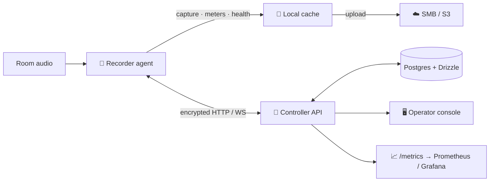

<div align="center">

# 🎙️ Rakkr

### Reliable room recording for Linux — that proves it actually worked.

Rakkr is a centrally managed Linux audio recording platform built on one stubborn
idea: **a recording failure should surface while the session can still be saved**,
not the morning after.

<br>

[](https://github.com/yashau/Rakkr/actions/workflows/ci.yml)
&nbsp;
&nbsp;
&nbsp;
&nbsp;

**[Documentation](docs/index.md)** · [Quick start](docs/getting-started/quick-start.md) · [Architecture](docs/architecture/overview.md) · [Reference](docs/reference/configuration.md)

</div>

---

## What it is

Rakkr records audio on managed Linux nodes, **watches the audio while it captures**,
and gives operators one console to start, schedule, monitor, and ship every
recording — with an audit trail behind every privileged action.

It is four parts working together:

- 🧠 a **controller API** (Hono/Node) for auth, RBAC, audit, inventory, recordings,
  jobs, schedules, settings, health, uploads, and metrics;
- 🖥️ a **React operator console** for day-to-day operations;
- 🦀 a **Rust recorder agent** on each node that captures audio, samples meters,
  scores quality, manages a local cache, and syncs with the controller;
- 🗄️ **Postgres + Drizzle** for persistence — with JSON/in-memory fallback so the
  controller runs without a database.

An optional Dockerized **Ansible runner** provisions and updates recorder nodes
over SSH.

## Why it exists

Most room recording setups fail silently — a muted channel, a stuck flatline, a
full disk — and nobody finds out until playback. Rakkr treats the recording as
something to be **measured and proven**:

| Concern | How Rakkr answers it |
| ------- | -------------------- |
| Is the node alive? | Heartbeats, runtime inventory, automatic offline detection |
| Is the audio path trustworthy? | ALSA-first capture, PipeWire/JACK presets, pinned command templates |
| Is the input any good? | Live clipping, flatline, low-signal, channel-correlation, noise, speech & SNR scoring |
| Can we recover with evidence? | Local health logs, synced health events, full audit trail, job-state transitions |
| Can we test without a room? | Fake-controller smokes, ALSA loopback, a golden speech fixture, deterministic fault lanes |
| Do outputs keep moving? | Local cache, retry queue, stub/SMB/S3 providers, retention after confirmed upload |

## Architecture



Read the [architecture overview](docs/architecture/overview.md) for how the
control loop, RBAC, and evidence channels fit together.

## Quick start

Rakkr uses [`mise`](https://mise.jdx.dev/) as its toolchain and task runner.

```powershell
mise trust
mise run setup          # install pinned toolchains + dependencies
Copy-Item .env.example .env
mise run services:up    # local Postgres in Docker
mise run dev            # controller API + web console
```

| Surface | URL |
| ------- | --- |
| Web console | <http://localhost:5173> |
| API health | <http://localhost:8787/healthz> |
| Metrics | <http://localhost:8787/metrics> |

Sign in with `admin@rakkr.local` / `rakkr-local-dev-password`. Prefer containers?
`docker compose up --build` brings up the whole stack. Full walkthrough:
[Quick start](docs/getting-started/quick-start.md).

## Documentation

Complete docs live in [`docs/`](docs/index.md):

| Section | Start here |
| ------- | ---------- |
| 🚀 Getting started | [Introduction](docs/getting-started/introduction.md) · [Quick start](docs/getting-started/quick-start.md) · [Core concepts](docs/getting-started/concepts.md) |
| 🏗️ Architecture | [Overview](docs/architecture/overview.md) · [Controller API](docs/architecture/controller-api.md) · [Recorder agent](docs/architecture/recorder-agent.md) · [Web console](docs/architecture/web-console.md) · [Data model](docs/architecture/data-model.md) |
| 📖 Guides | [Auth & RBAC](docs/guides/authentication-and-rbac.md) · [Nodes](docs/guides/nodes-and-inventory.md) · [Recording](docs/guides/recording.md) · [Scheduling](docs/guides/scheduling.md) · [Health watchdog](docs/guides/health-watchdog.md) · [Storage & uploads](docs/guides/storage-and-uploads.md) · [Transport security](docs/guides/transport-security.md) · [Node lifecycle](docs/guides/node-lifecycle.md) |
| 🔧 Reference | [Configuration](docs/reference/configuration.md) · [Recorder agent CLI](docs/reference/recorder-agent.md) · [API endpoints](docs/reference/api.md) · [Permissions](docs/reference/permissions.md) · [Metrics](docs/reference/metrics.md) · [Tasks](docs/reference/tasks.md) |
| 🛠️ Operations | [Deployment](docs/operations/deployment.md) · [Observability](docs/observability/README.md) |
| 🤝 Contributing | [Development](docs/contributing/development.md) · [Testing](docs/contributing/testing.md) · [Baselines](docs/contributing/baselines.md) |

## Repository layout

```text
apps/api/                 Hono controller API and API tests
apps/web/                 React/Vite operator console and UI tests
packages/shared/          Shared TypeScript schemas / contracts
packages/db/              Drizzle schema, migrations, migration verifier
crates/recorder-agent/    Rust recorder node agent
deploy/                   Ansible runner, nginx, Helm chart
docs/                     Documentation (+ internal verification baselines)
fixtures/audio/           Golden speech fixture and metadata
scripts/                  Gate scripts, smokes, baseline verifiers
```

## Development

```powershell
mise run check        # full gate: docs verifiers, Drizzle replay, TS, lint, format, Cargo, Clippy, Miri, smokes
mise run build        # build TypeScript packages/apps + the Rust agent
```

See [Development](docs/contributing/development.md) and the
[tasks reference](docs/reference/tasks.md) for targeted gates and conventions.
Contributions are expected to ship as complete slices — **code, tests, docs, and
evidence travel together**.

---

<div align="center">

**Built evidence-first: capture · measure · explain · recover.**

The product contract and status ledger live in
[`docs/RAKKR_SOURCE_OF_TRUTH.md`](docs/RAKKR_SOURCE_OF_TRUTH.md).

</div>
