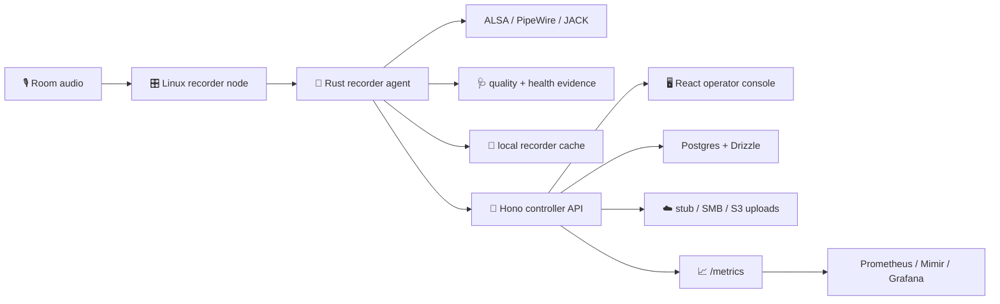

<h1 align="center">🎙️ Rakkr</h1>

<p align="center">
  <strong>Reliable room recording for Linux nodes, with controller-grade evidence.</strong>
</p>

<p align="center">
  <a href="https://github.com/yashau/Rakkr/actions/workflows/ci.yml"></a>
  
  
  
  
</p>

<p align="center">
  <a href="#-what-rakkr-is">What it is</a> ·
  <a href="#-current-flight-status">Status</a> ·
  <a href="#-quick-start">Quick start</a> ·
  <a href="#-recorder-agent">Agent</a> ·
  <a href="#-evidence-map">Evidence</a>
</p>

---

## ✨ What Rakkr Is

Rakkr is a centrally managed Linux audio recording platform for rooms where
"we probably got it" is not good enough.

It pairs a **Hono controller API**, **React operations console**, and **Rust
recorder agent** so operators can start, schedule, monitor, health-check,
cache, upload, and audit recordings from generic Linux audio interfaces.

> 📌 The project contract lives in
> [docs/RAKKR_SOURCE_OF_TRUTH.md](docs/RAKKR_SOURCE_OF_TRUTH.md). Treat it as
> the authoritative roadmap, status ledger, and promotion record.

## 🚦 Current Flight Status

| Area | State | What Is Real Today |
| ---- | ----- | ------------------ |
| 🧠 Controller API | ✅ Checked | Auth, OIDC, RBAC, audit, nodes, recordings, jobs, schedules, settings, health, uploads, metrics |
| 🖥️ Controller UI | 🟨 Focused | Useful operator workbench; polish is intentionally behind core workflow validation |
| 🎛️ Recorder agent | 🟨 Active | Inventory, ALSA/PipeWire/JACK capture, meters, local health log, cache, controller sync |
| 🧪 Test rig | 🟨 Active | Debian rig, X32 X-USB, onboard HDA, ALSA loopback, speech fixture replay, fake-controller smokes |
| 🩺 Health watchdog | 🟨 Active | Low signal, clipping, flatline, noise, speech, SNR, correlation, backend loss/recovery, disk/CPU pressure |
| 📈 Observability | ✅ Checked | Prometheus metrics, alert rules, Grafana dashboard, audit events, central health events, rotating JSONL logs |

## 🎚️ Core Loop



## 💎 Why It Exists

Rakkr is built around one stubborn idea: **recording failures should become
visible while the session can still be saved**.

| Need | Rakkr Response |
| ---- | -------------- |
| Know which node is alive | Heartbeats, runtime inventory, IP/runtime/backend reporting |
| Trust the audio path | ALSA-first capture, PipeWire/JACK presets, pinned command templates |
| Catch bad input | Clipping, flatline, low signal, channel correlation, noise, speech, SNR, intelligibility scoring |
| Recover with evidence | Local JSONL health logs, synced controller events, audit trails, job state transitions |
| Test without drama | Fake-controller smokes, ALSA loopback, golden speech fixture, deterministic fault lanes |
| Keep outputs moving | Local cache, upload queue, stub/SMB/S3 providers, recorder-cache cleanup evidence |

## 🧰 Stack

| Layer | Choice |
| ----- | ------ |
| 🪄 Workspace orchestration | `mise` |
| 🧠 Controller API | Node.js, Hono |
| 🖥️ Controller UI | React, TanStack Router, TanStack Query, shadcn/ui-style components |
| 🗄️ Database | Postgres, Drizzle |
| 🤝 Shared contracts | TypeScript schemas in `packages/shared` |
| 🦀 Recorder agent | Rust |
| 🔊 Audio backends | ALSA, PipeWire, JACK, synthetic/dev fallback |
| 📈 Observability | Prometheus, Mimir example config, Grafana example dashboard |

## 🚀 Quick Start

```powershell
mise trust
mise run setup
mise run services:up
mise run dev
```

| Surface | URL |
| ------- | --- |
| 🖥️ Web UI | <http://localhost:5173> |
| 🩺 API health | <http://localhost:8787/healthz> |
| 📈 Metrics | <http://localhost:8787/metrics> |

Local dev sign-in defaults come from `.env.example`:

| Field | Default |
| ----- | ------- |
| Email | `admin@rakkr.local` |
| Password | `rakkr-local-dev-password` |

Override local identity with `RAKKR_LOCAL_ADMIN_EMAIL`,
`RAKKR_LOCAL_ADMIN_ID`, `RAKKR_LOCAL_ADMIN_PASSWORD`, and
`RAKKR_LOCAL_ADMIN_NAME`.

To run the controller as a container stack instead of the local dev servers:

```powershell
docker compose up --build
```

The Compose stack builds the API and web images, starts Postgres, runs Drizzle
migrations, serves the web console at <http://localhost:5173>, and exposes the
API at <http://localhost:8787>. Kubernetes manifests live in the Helm chart at
`deploy/helm/rakkr-controller`; see
[docs/deployment/DEPLOYMENT.md](docs/deployment/DEPLOYMENT.md).

For non-admin local roles, scoped resource access can be seeded with
`RAKKR_LOCAL_RESOURCE_GRANTS`, for example:

```json
{"node":["node_x32_test"]}
```

## 🗺️ Workspace Map

```text
apps/
  api/                 Hono controller API
  web/                 React controller UI
packages/
  shared/              Shared TypeScript schemas and contracts
  db/                  Drizzle schema and database package
crates/
  recorder-agent/      Rust recorder node agent
fixtures/
  audio/               Speech fixture and derived fault inputs
docs/
  auth/                OIDC baseline
  devices/             Generic device baseline
  health/              Watchdog baseline
  observability/       Metrics, alerts, Grafana runbook
  operations/          Operator baseline
  recordings/          Recording library and reliability baselines
  scheduling/          Scheduler baseline
  security/            RBAC and transport baselines
  settings/            Settings/template baseline
  storage/             Upload provider baseline
```

## ⚡ Command Deck

```powershell
mise run setup        # toolchains + workspace dependencies
mise run dev          # API + web UI
mise run services:up  # local Postgres
mise run services:down
mise run build        # TypeScript packages/apps + Rust agent
mise run check        # docs, Drizzle replay, TS, lint, format, Cargo, Clippy, Miri, smokes
```

Database and formatting helpers:

```powershell
mise run db:generate
mise run db:migrate
mise run db:verify
mise run node:format
mise run rust:fmt
```

## 🎛️ Recorder Agent

The recorder agent authenticates with node credentials, samples PCM for live
meter frames, posts those frames to the controller, writes a rotating JSONL
health log, captures jobs, renders outputs, applies recorder-cache retention,
and syncs health events.

| Area | Useful Controls |
| ---- | --------------- |
| 🎙️ Capture | `RAKKR_CAPTURE_BACKEND`, `RAKKR_CAPTURE_COMMAND`, `RAKKR_CAPTURE_DEVICE`, `RAKKR_CAPTURE_FORMAT`, `RAKKR_CAPTURE_SAMPLE_RATE`, `RAKKR_CAPTURE_CHANNELS` |
| 📊 Metering | `RAKKR_METER_BACKEND`, `RAKKR_METER_SAMPLE_SECONDS`, `RAKKR_METER_CLIP_DBFS`, `RAKKR_METER_FLATLINE_DBFS`, `RAKKR_METER_LOW_SIGNAL_DBFS` |
| 📝 Health log | `RAKKR_AGENT_HEALTH_LOG_FILE`, `RAKKR_AGENT_HEALTH_LOG_MAX_BYTES`, `RAKKR_AGENT_HEALTH_LOG_RETAINED_FILES` |
| 🩺 System health | `RAKKR_SYSTEM_HEALTH_ENABLED`, `RAKKR_SYSTEM_HEALTH_DISK_PATH`, disk warning/critical percentages, load warning/critical per-core thresholds |
| 🔎 Inventory probes | `RAKKR_INVENTORY_ARECORD_COMMAND`, `RAKKR_INVENTORY_PROC_ASOUND_PCM_PATH` |

See [crates/recorder-agent/README.md](crates/recorder-agent/README.md) for
the agent-focused quick reference.

## 🧪 Loopback And Fault Fixtures

Rakkr has a checked multi-speaker speech fixture and Linux loopback scripts for
repeatable health validation. The clean fixture is replayed through ALSA
loopback, then derived into fault lanes such as clipping, low volume,
duplicated-channel correlation, and noisy speech.

```powershell
mise run agent:loopback-smoke
mise run agent:loopback-meter-smoke
mise run agent:loopback-render-smoke
mise run agent:loopback-fixture-smoke
mise run agent:loopback-job-smoke
```

The clean multi-speaker source fixture lives in
[fixtures/audio](fixtures/audio/README.md).

## 🔐 Security And Auth

Set `RAKKR_API_TLS_CERT_PATH` and `RAKKR_API_TLS_KEY_PATH` to run the
controller API over HTTPS. Recorder agents reject non-loopback `http://`
controller URLs unless `RAKKR_ALLOW_INSECURE_CONTROLLER=1` is set for an
explicit development exception. Use `RAKKR_CONTROLLER_CA_CERT_PATH` when
recorder nodes should trust an internal controller CA bundle.

OIDC is disabled by default. To test Azure AD sign-in:

1. In Microsoft Entra App registrations, create a Rakkr app and copy the
   Application client ID and Directory tenant ID.
2. Add a Web redirect URI matching `RAKKR_OIDC_REDIRECT_URI`, for example
   `http://localhost:8787/api/v1/auth/oidc/callback` in local dev or the HTTPS
   controller URL in production.
3. Set `RAKKR_OIDC_ENABLED=1`, `RAKKR_OIDC_AZURE_TENANT_ID`,
   `RAKKR_OIDC_CLIENT_ID`, and optionally `RAKKR_OIDC_CLIENT_SECRET`.
4. Keep scopes at `openid profile email` unless group or app-role claims are
   configured for RBAC sync.

References:
[Microsoft identity platform auth code flow](https://learn.microsoft.com/en-us/entra/identity-platform/v2-oauth2-auth-code-flow),
[redirect URI configuration](https://learn.microsoft.com/en-us/entra/identity-platform/how-to-add-redirect-uri).

## ☁️ Upload Providers

| Provider | Target |
| -------- | ------ |
| 🧪 Stub | `stub://queue-only` for dry-run queue processing |
| 🗂️ SMB | Mounted filesystem target such as `/mnt/rakkr-recordings` or `file:///mnt/rakkr-recordings` |
| 🪣 S3 | `s3://bucket/prefix`; AWS credentials and region come from the normal AWS SDK environment or instance configuration |

Local cached recording files are served from `RAKKR_RECORDING_CACHE_DIR`,
defaulting to `data/recordings`.

## 🧾 Evidence Map

| Area | Entry Point |
| ---- | ----------- |
| 📌 Source of truth | [docs/RAKKR_SOURCE_OF_TRUTH.md](docs/RAKKR_SOURCE_OF_TRUTH.md) |
| 🔊 Generic devices | [docs/devices/GENERIC_DEVICE_BASELINE.md](docs/devices/GENERIC_DEVICE_BASELINE.md) |
| 🩺 Health watchdog | [docs/health/HEALTH_WATCHDOG_BASELINE.md](docs/health/HEALTH_WATCHDOG_BASELINE.md) |
| 📈 Observability | [docs/observability/README.md](docs/observability/README.md) |
| 🎙️ Audio fixtures | [fixtures/audio/README.md](fixtures/audio/README.md) |
| 💾 Storage upload | [docs/storage/STORAGE_UPLOAD_BASELINE.md](docs/storage/STORAGE_UPLOAD_BASELINE.md) |
| 🔐 Transport security | [docs/security/TRANSPORT_SECURITY_BASELINE.md](docs/security/TRANSPORT_SECURITY_BASELINE.md) |

---

<p align="center">
  <strong>Rakkr is being built evidence-first: capture, measure, explain, recover.</strong>
</p>
