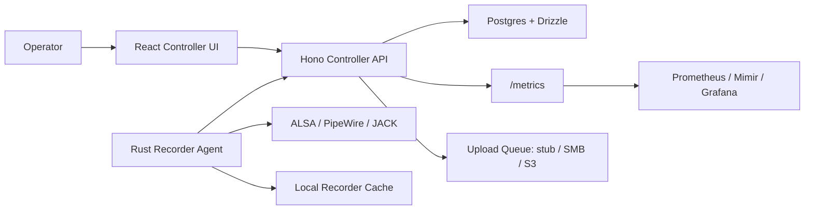

# Rakkr


Rakkr is a centrally managed Linux audio recording platform for reliable voice capture across recorder nodes. It pairs a Hono controller API, a React operations console, and a Rust recorder agent that can capture, meter, health-check, cache, and upload audio from generic Linux audio interfaces.

The project contract lives in [docs/RAKKR_SOURCE_OF_TRUTH.md](docs/RAKKR_SOURCE_OF_TRUTH.md). Treat that file as the authoritative roadmap and promotion ledger.

## At A Glance

| Surface | What It Does |
| ------- | ------------ |
| Controller API | Auth, RBAC, audit, node inventory, recordings, schedules, health, settings, upload queue, metrics |
| Controller UI | Operator workbench for nodes, recordings, jobs, schedules, settings, audit, health, and quick recording |
| Recorder agent | Rust node process for inventory, capture, meters, health logs, cache retention, and controller sync |
| Test rig | ALSA loopback, speech fixtures, X32 X-USB, onboard HDA, fake-controller smokes |
| Observability | Prometheus metrics, alert rules, Grafana dashboard, audit events, central health events, local agent JSONL logs |

## Why Rakkr Exists

Rakkr is built for recording rooms where failure should be visible before it costs a session. The core loop is simple:

1. Recorder nodes report identity, location, runtime audio backends, and capture interfaces.
2. Operators schedule or start recordings from the controller.
3. Agents capture through ALSA, PipeWire, JACK, or command templates.
4. Health checks catch low signal, clipping, flatline, channel correlation, xrun/device faults, stalled capture, upload failure, disk pressure, CPU pressure, backend loss, and recovery.
5. Recordings are cached, rendered, uploaded, audited, and made searchable.

## Architecture



## Stack

| Layer | Choice |
| ----- | ------ |
| Workspace orchestration | `mise` |
| Controller API | Node.js, Hono |
| Controller UI | React, TanStack Router, TanStack Query, shadcn/ui-style components |
| Database | Postgres, Drizzle |
| Shared contracts | TypeScript schemas in `packages/shared` |
| Recorder agent | Rust |
| Audio backends | ALSA, PipeWire, JACK, synthetic/dev fallback |
| Observability | Prometheus, Mimir example config, Grafana example dashboard |

## Quick Start

```powershell
mise trust
mise run setup
mise run services:up
mise run dev
```

Useful local URLs:

| Surface | URL |
| ------- | --- |
| Web UI | <http://localhost:5173> |
| API health | <http://localhost:8787/healthz> |
| Metrics | <http://localhost:8787/metrics> |

Local dev sign-in defaults come from `.env.example`:

| Field | Default |
| ----- | ------- |
| Email | `admin@rakkr.local` |
| Password | `rakkr-local-dev-password` |

Override local identity with `RAKKR_LOCAL_ADMIN_EMAIL`, `RAKKR_LOCAL_ADMIN_ID`, `RAKKR_LOCAL_ADMIN_PASSWORD`, and `RAKKR_LOCAL_ADMIN_NAME`.

For non-admin local roles, scoped resource access can be seeded with `RAKKR_LOCAL_RESOURCE_GRANTS`, for example:

```json
{"node":["node_x32_test"]}
```

## Workspace Map

```text
apps/
  api/                 Hono controller API
  web/                 React controller UI
packages/
  shared/              Shared TypeScript schemas and contracts
  db/                  Drizzle schema and database package
crates/
  recorder-agent/      Rust recorder node agent
fixtures/
  audio/               Speech fixture and derived fault inputs
docs/
  auth/                OIDC baseline
  devices/             Generic device baseline
  health/              Watchdog baseline
  observability/       Metrics, alerts, Grafana runbook
  operations/          Operator baseline
  recordings/          Recording library and reliability baselines
  scheduling/          Scheduler baseline
  security/            RBAC and transport baselines
  settings/            Settings/template baseline
  storage/             Upload provider baseline
```

## Core Commands

```powershell
mise run setup        # toolchains + workspace dependencies
mise run dev          # API + web UI
mise run services:up  # local Postgres
mise run services:down
mise run build        # TypeScript packages/apps + Rust agent
mise run check        # LOC, docs verifiers, Drizzle replay, TS, lint, format, Cargo, Clippy, Miri, smokes
```

Database and formatting commands:

```powershell
mise run db:generate
mise run db:migrate
mise run db:verify
mise run node:format
mise run rust:fmt
```

## Recorder Agent

The recorder agent authenticates with node credentials, samples PCM for live meter frames, posts those frames to the controller, writes a local rotating JSONL health log, captures jobs, renders outputs, applies recorder-cache retention, and syncs health events.

Useful agent controls:

| Area | Controls |
| ---- | -------- |
| Capture | `RAKKR_CAPTURE_BACKEND`, `RAKKR_CAPTURE_COMMAND`, `RAKKR_CAPTURE_DEVICE`, `RAKKR_CAPTURE_FORMAT`, `RAKKR_CAPTURE_SAMPLE_RATE`, `RAKKR_CAPTURE_CHANNELS` |
| Metering | `RAKKR_METER_BACKEND`, `RAKKR_METER_SAMPLE_SECONDS`, `RAKKR_METER_CLIP_DBFS`, `RAKKR_METER_FLATLINE_DBFS`, `RAKKR_METER_LOW_SIGNAL_DBFS` |
| Health log | `RAKKR_AGENT_HEALTH_LOG_FILE`, `RAKKR_AGENT_HEALTH_LOG_MAX_BYTES`, `RAKKR_AGENT_HEALTH_LOG_RETAINED_FILES` |
| System health | `RAKKR_SYSTEM_HEALTH_ENABLED`, `RAKKR_SYSTEM_HEALTH_DISK_PATH`, disk warning/critical percentages, load warning/critical per-core thresholds |
| Inventory probes | `RAKKR_INVENTORY_ARECORD_COMMAND`, `RAKKR_INVENTORY_PROC_ASOUND_PCM_PATH` |

See [crates/recorder-agent/README.md](crates/recorder-agent/README.md) for the agent-focused quick reference.

## Security And Auth

Set `RAKKR_API_TLS_CERT_PATH` and `RAKKR_API_TLS_KEY_PATH` to run the controller API over HTTPS. Recorder agents reject non-loopback `http://` controller URLs unless `RAKKR_ALLOW_INSECURE_CONTROLLER=1` is set for an explicit development exception. Use `RAKKR_CONTROLLER_CA_CERT_PATH` when recorder nodes should trust an internal controller CA bundle.

OIDC is disabled by default. To test Azure AD sign-in:

1. In Microsoft Entra App registrations, create a Rakkr app and copy the Application client ID and Directory tenant ID.
2. Add a Web redirect URI matching `RAKKR_OIDC_REDIRECT_URI`, for example `http://localhost:8787/api/v1/auth/oidc/callback` in local dev or the HTTPS controller URL in production.
3. Set `RAKKR_OIDC_ENABLED=1`, `RAKKR_OIDC_AZURE_TENANT_ID`, `RAKKR_OIDC_CLIENT_ID`, and optionally `RAKKR_OIDC_CLIENT_SECRET`.
4. Keep scopes at `openid profile email` unless group or app-role claims are configured for RBAC sync.

References: [Microsoft identity platform auth code flow](https://learn.microsoft.com/en-us/entra/identity-platform/v2-oauth2-auth-code-flow), [redirect URI configuration](https://learn.microsoft.com/en-us/entra/identity-platform/how-to-add-redirect-uri).

## Upload Providers

| Provider | Target |
| -------- | ------ |
| Stub | `stub://queue-only` for dry-run queue processing |
| SMB | Mounted filesystem target such as `/mnt/rakkr-recordings` or `file:///mnt/rakkr-recordings` |
| S3 | `s3://bucket/prefix`; AWS credentials and region come from the normal AWS SDK environment or instance configuration |

Local cached recording files are served from `RAKKR_RECORDING_CACHE_DIR`, defaulting to `data/recordings`.

## Hardware And Loopback

The current physical test rig is a Debian node with a Behringer X32 Rack connected over USB. The project also uses ALSA loopback and checked speech fixtures for deterministic recorder and watchdog validation.

```powershell
mise run agent:loopback-smoke
mise run agent:loopback-meter-smoke
mise run agent:loopback-render-smoke
mise run agent:loopback-fixture-smoke
mise run agent:loopback-job-smoke
```

The clean multi-speaker source fixture lives in [fixtures/audio](fixtures/audio/README.md).

## Evidence

| Area | Entry Point |
| ---- | ----------- |
| Source of truth | [docs/RAKKR_SOURCE_OF_TRUTH.md](docs/RAKKR_SOURCE_OF_TRUTH.md) |
| Generic devices | [docs/devices/GENERIC_DEVICE_BASELINE.md](docs/devices/GENERIC_DEVICE_BASELINE.md) |
| Health watchdog | [docs/health/HEALTH_WATCHDOG_BASELINE.md](docs/health/HEALTH_WATCHDOG_BASELINE.md) |
| Observability | [docs/observability/README.md](docs/observability/README.md) |
| Storage upload | [docs/storage/STORAGE_UPLOAD_BASELINE.md](docs/storage/STORAGE_UPLOAD_BASELINE.md) |
| Transport security | [docs/security/TRANSPORT_SECURITY_BASELINE.md](docs/security/TRANSPORT_SECURITY_BASELINE.md) |
