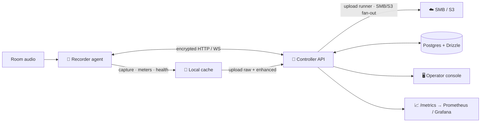

<div align="center">


# Rakkr

### Reliable room recording for Linux — that proves it actually worked.

Rakkr is a centrally managed Linux audio recording platform built on one stubborn
idea: **a recording failure should surface while the session can still be saved**,
not the morning after.

<br>

[](https://github.com/yashau/Rakkr/actions/workflows/ci.yml)
&nbsp;
&nbsp;
&nbsp;
&nbsp;

**[Website](https://rakkr.org)** · **[Documentation](https://docs.rakkr.org/)** · [Quick start](https://docs.rakkr.org/getting-started/quick-start/) · [Architecture](https://docs.rakkr.org/architecture/overview/) · [Reference](https://docs.rakkr.org/reference/configuration/)

</div>

---

## What it is

Rakkr records audio on managed Linux nodes, **watches the audio while it captures**,
and gives operators one console to start, schedule, monitor, and ship every
recording — with an audit trail behind every privileged action.

It is four parts working together:

- 🧠 a **controller API** (Hono/Node) for auth, RBAC, audit, inventory, recordings,
  jobs, schedules, settings, health, uploads, and metrics;
- 🖥️ a **React operator console** for day-to-day operations;
- 🦀 a **Rust recorder agent** on each node that captures audio, samples meters,
  scores quality, manages a local cache, and syncs with the controller;
- 🗄️ **Postgres + Drizzle** for persistence — with JSON/in-memory fallback so the
  controller runs without a database.

An optional Dockerized **Ansible runner** provisions and updates recorder nodes
over SSH.

## Why it exists

Most room recording setups fail silently — a muted channel, a stuck flatline, a
full disk — and nobody finds out until playback. Rakkr treats the recording as
something to be **measured and proven**:

| Concern                        | How Rakkr answers it                                                                      |
| ------------------------------ | ----------------------------------------------------------------------------------------- |
| Is the node alive?             | Heartbeats, runtime inventory, automatic offline detection                                |
| Is the audio path trustworthy? | ALSA-first capture, PipeWire/JACK presets, pinned command templates                       |
| Is the input any good?         | Live clipping, flatline, low-signal, channel-correlation, noise, speech & SNR scoring     |
| Can we make speech clearer?    | In-process DeepFilterNet3 / RNNoise enhancement for recordings and live listen, raw always kept |
| Can we recover with evidence?  | Local health logs, synced health events, full audit trail, job-state transitions          |
| Can we test without a room?    | Fake-controller smokes, ALSA loopback, a golden speech fixture, deterministic fault lanes |
| Do outputs keep moving?        | Local cache, controller upload runner, retry queue, multiple SMB/S3 destinations, retention after confirmed upload |

## Architecture



The agent uploads recordings to the **controller**; the controller's upload runner
is what pushes them out to one or more SMB/S3 destinations. Nodes never talk to
object storage directly.

Read the [architecture overview](https://docs.rakkr.org/architecture/overview/) for how the
control loop, RBAC, and evidence channels fit together.

## Quick start

Rakkr uses [`mise`](https://mise.jdx.dev/) as its toolchain and task runner.

```powershell
mise trust
mise run setup          # install pinned toolchains + dependencies
Copy-Item .env.example .env
mise run services:up    # local Postgres in Docker
mise run dev            # controller API + web console
```

| Surface     | URL                             |
| ----------- | ------------------------------- |
| Web console | <http://localhost:5173>         |
| API health  | <http://localhost:8787/healthz> |
| Metrics     | <http://localhost:8787/metrics> |

Sign in with `admin@rakkr.local` / `rakkr-local-dev-password`. Prefer containers?
`docker compose up --build` brings up the whole stack. Full walkthrough:
[Quick start](https://docs.rakkr.org/getting-started/quick-start/).

## Documentation

Complete docs live at [docs.rakkr.org](https://docs.rakkr.org/):

| Section            | Start here                                                                                                                                                                                                                                                                                                                                                                                                                                                                                                                                      |
| ------------------ | ----------------------------------------------------------------------------------------------------------------------------------------------------------------------------------------------------------------------------------------------------------------------------------------------------------------------------------------------------------------------------------------------------------------------------------------------------------------------------------------------------------------------------------------------- |
| 🚀 Getting started | [Introduction](https://docs.rakkr.org/getting-started/introduction/) · [Quick start](https://docs.rakkr.org/getting-started/quick-start/) · [Core concepts](https://docs.rakkr.org/getting-started/concepts/)                                                                                                                                                                                                                                                                                                                                   |
| 🏗️ Architecture    | [Overview](https://docs.rakkr.org/architecture/overview/) · [Controller API](https://docs.rakkr.org/architecture/controller-api/) · [Recorder agent](https://docs.rakkr.org/architecture/recorder-agent/) · [Web console](https://docs.rakkr.org/architecture/web-console/) · [Data model](https://docs.rakkr.org/architecture/data-model/)                                                                                                                                                                                                     |
| 📖 Guides          | [Auth & RBAC](https://docs.rakkr.org/guides/authentication-and-rbac/) · [Nodes](https://docs.rakkr.org/guides/nodes-and-inventory/) · [Recording](https://docs.rakkr.org/guides/recording/) · [Audio enhancement](https://docs.rakkr.org/guides/audio-enhancement/) · [Scheduling](https://docs.rakkr.org/guides/scheduling/) · [Health watchdog](https://docs.rakkr.org/guides/health-watchdog/) · [Storage & uploads](https://docs.rakkr.org/guides/storage-and-uploads/) · [Transport security](https://docs.rakkr.org/guides/transport-security/) · [Node lifecycle](https://docs.rakkr.org/guides/node-lifecycle/) |
| 🔧 Reference       | [Configuration](https://docs.rakkr.org/reference/configuration/) · [Recorder agent CLI](https://docs.rakkr.org/reference/recorder-agent/) · [API endpoints](https://docs.rakkr.org/reference/api/) · [Permissions](https://docs.rakkr.org/reference/permissions/) · [Metrics](https://docs.rakkr.org/reference/metrics/) · [Tasks](https://docs.rakkr.org/reference/tasks/)                                                                                                                                                                     |
| 🛠️ Operations      | [Deployment](https://docs.rakkr.org/operations/deployment/) · [Observability](https://docs.rakkr.org/observability/)                                                                                                                                                                                                                                                                                                                                                                                                                            |
| 🤝 Contributing    | [Development](https://docs.rakkr.org/contributing/development/) · [Testing](https://docs.rakkr.org/contributing/testing/) · [Baselines](https://docs.rakkr.org/contributing/baselines/)                                                                                                                                                                                                                                                                                                                                                         |

## Repository layout

```text
apps/api/                 Hono controller API and API tests
apps/web/                 React/Vite operator console and UI tests
packages/shared/          Shared TypeScript schemas / contracts
packages/db/              Drizzle schema, migrations, migration verifier
crates/recorder-agent/    Rust recorder node agent
deploy/                   Ansible runner, nginx, Helm chart
docs/                     Documentation (+ internal verification baselines)
fixtures/audio/           Golden speech fixture and metadata
scripts/                  Gate scripts, smokes, baseline verifiers
```

## Development

```powershell
mise run check        # full gate: docs verifiers, Drizzle replay, TS, lint, format, Cargo, Clippy, Miri, smokes
mise run build        # build TypeScript packages/apps + the Rust agent
```

See [Development](https://docs.rakkr.org/contributing/development/) and the
[tasks reference](https://docs.rakkr.org/reference/tasks/) for targeted gates and conventions.
Contributions are expected to ship as complete slices — **code, tests, docs, and
evidence travel together**.

---

<div align="center">

**Built evidence-first: capture · measure · explain · recover.**

The product contract and status ledger live in
[`docs/RAKKR_SOURCE_OF_TRUTH.md`](docs/RAKKR_SOURCE_OF_TRUTH.md).

</div>
