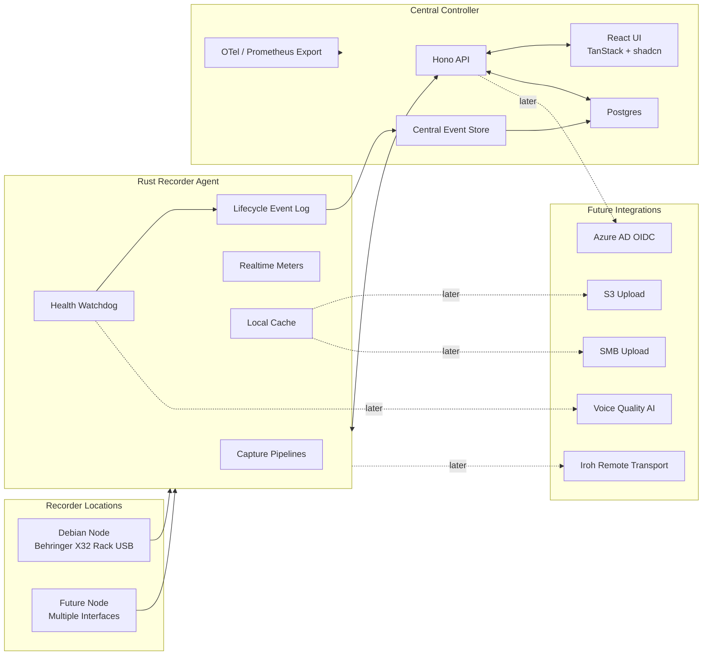

# Rakkr Source Of Truth


> Rakkr is a centrally managed, Linux/Docker based audio recorder platform for reliable voice recording across managed recorder nodes.

This document is the living source of truth for Rakkr. It combines executive status, product requirements, architecture decisions, implementation phases, and progress tracking.

---

## Executive Snapshot

| Area                       | Current Decision                                                               |
| -------------------------- | ------------------------------------------------------------------------------ |
| Primary use case           | Reliable voice recording for meetings and long-running room audio              |
| Deployment target          | Linux hosts, Dockerized controller services, Rust recorder agents              |
| First test rig             | Debian recorder node at `172.22.145.152`, Behringer X32 Rack via USB           |
| Hardware support stance    | X32 is only the first fixture; support generic Linux audio interfaces          |
| Controller UI              | Hono API, React, TanStack Router, TanStack Query, shadcn/ui                    |
| Auth                       | Local auth first, Azure AD OIDC-ready architecture                             |
| Database                   | Postgres                                                                       |
| ORM                        | Drizzle                                                                        |
| Access control             | Default-deny RBAC for every user, node, recording, listen, and admin action    |
| Recorder agent             | Rust                                                                           |
| Network model              | Trusted LAN first, with encrypted controller/node transport                    |
| Future remote connectivity | Iroh preferred over libp2p if NAT traversal is needed later                    |
| Default recording profile  | Voice, `128kbps MP3 VBR`, configurable                                         |
| Storage uploads            | Stubbed initially, future SMB/S3 providers                                     |
| Scheduler                  | Human-friendly scheduling, no cron exposed to users                            |
| Health monitoring          | First-class watchdog, local event log, central events, Prometheus/Mimir export |
| Date format rule           | ISO-style year-first display in browser timezone                               |

## Status Legend

| Emoji | Meaning                               |
| ----- | ------------------------------------- |
| ✅    | Complete and checked in               |
| 🟦    | Scaffolded and ready to build on      |
| 🟨    | Designed or partially implemented     |
| 🚧    | Current or next active focus          |
| ⏸️    | Paused or waiting on external state   |
| ⏳    | Not started                           |
| 🧊    | Deferred intentionally                |

## Progress Dashboard

| Workstream           | Status      | Notes                                                          |
| -------------------- | ----------- | -------------------------------------------------------------- |
| Product discovery    | ✅ Complete  | Initial scope, features, and technical direction captured      |
| Monorepo scaffold    | ✅ Complete  | `mise`-managed runtimes, workspace commands, Docker Compose, CI |
| Controller API       | 🟦 Scaffold  | Hono API with RBAC, audit, health events, Postgres-backed nodes/credentials/recordings/jobs/schedules/settings, pinned job channel maps, and assignment rollback |
| Controller UI        | 🟦 Scaffold  | Dashboard plus node enrollment, node health summaries/trends/drilldown, jobs, metadata editing, filters, settings profiles/policies, channel-map assignment rollback, schedule editing, execution detail, and quality timelines |
| Recorder agent       | 🟦 Scaffold  | Rust CLI with inventory, capture jobs, heartbeats, ALSA-backed meter sampling, disk/load/audio health sampling, controller meter sync, assignment fetch/apply foundation, and local health log |
| Test rig integration | 🟨 Partial   | Debian node reachable; ALSA loopback meter smoke validated; X32 validation waits for device check |
| Health watchdog      | 🟦 Scaffold  | Health event model, lifecycle actions, node meter ingest, clipping/flatline/xrun/device-unavailable/job/system health events, scheduled low-signal runner, quality timelines, and recording health sync exist |
| Scheduler            | 🟦 Scaffold  | Persistent store, create/edit/run-now/skip/delete UI, metadata ownership, recurrence editing, paused ranges, quick text helpers, previews, execution detail, timeline, and due runner |
| Storage upload       | 🧊 Deferred  | Interface/stubs only in early milestones                       |
| OIDC                 | 🧊 Deferred  | Local auth first, Azure AD ready later                         |
| RBAC                 | 🟦 Scaffold  | Durable grants, group memberships, allow-deny policies, scoped middleware |
| Audit trail          | 🟦 Scaffold  | Postgres-backed store, API/UI filters, metadata audit events     |
| Observability        | 🟦 Scaffold  | Local node health log, central store, store-backed Prometheus endpoint, OpenTelemetry/Mimir later |

## North Star

Rakkr should make audio recording boringly reliable. A user should know:

- which room/node/interface/channel is recording;
- whether meaningful audio is entering the system;
- whether a scheduled recording is healthy while it is happening;
- where every recording is stored;
- what metadata, tags, and schedule produced it;
- who accessed, controlled, listened to, or changed anything;
- whether anything suspicious happened during capture.

The system must favor reliability, observability, and recoverability over cleverness.

---

## System Overview



## Core Architecture

### Controller

- Provides the web UI, REST/RPC API, realtime streams, auth, settings, schedules, inventory, recording library, health events, and metrics export.
- Runs locally in Docker for development and production-friendly deployment.
- Uses Postgres as the central system of record.
- Uses local auth first while keeping an OIDC boundary ready for Azure AD.
- Enforces RBAC server-side for all routes, streams, and commands.
- Writes a proper audit trail for allowed and denied user, node, and service actions.

### Recorder Node Agent

- Runs on Linux recorder hosts.
- Captures audio from one or more audio interfaces.
- Supports many simultaneous recording jobs per node.
- Reports live meter data even when not recording.
- Executes scheduled and ad hoc recording jobs.
- Maintains a lifecycle-managed local event log.
- Caches completed recordings locally.
- Exposes health, recording, and device telemetry to the controller.

### Storage

- Initial implementation: local recorder-node cache and central metadata tracking.
- Upload providers are stubbed behind an interface.
- Future providers: SMB and S3.
- Uploads must be retryable, auditable, and checksum verified.

---

## Technology Decisions

| Decision             | Choice                          | Rationale                                                                             |
| -------------------- | ------------------------------- | ------------------------------------------------------------------------------------- |
| Monorepo setup       | `mise`                          | Canonical setup and command entrypoint for all developers and CI                      |
| Node workspace       | `mise` task-managed dependencies | Keep setup, checks, builds, and local development behind one canonical entrypoint      |
| API framework        | Hono                            | Small, fast, TypeScript-friendly, suitable for API + realtime endpoints               |
| UI framework         | React + Vite                    | Fast iteration and strong ecosystem                                                   |
| Routing              | TanStack Router                 | Typed routes and app-scale routing                                                    |
| Server state         | TanStack Query                  | Excellent async/cache model                                                           |
| UI components        | shadcn/ui                       | Components installed from the shadcn registry                                         |
| CSS engine           | Tailwind 4                      | Matches `oxlint-tailwindcss` canonical class rules                                    |
| Database             | Postgres                        | Strong relational model for schedules, events, recordings, and metadata               |
| ORM/query layer      | Drizzle                         | SQL-first schema ownership, migrations, and strong TypeScript ergonomics              |
| Recorder agent       | Rust                            | Good fit for audio IO, long-running agents, reliability, and native Linux integration |
| Initial transport    | Encrypted HTTP/WebSocket over trusted LAN | Simple, observable, debuggable, confidential                                |
| Future NAT traversal | Iroh                            | Better fit than libp2p for keyed device dialing and direct QUIC connections           |
| AI quality analysis  | Pluggable future provider       | Keep core recorder independent from AI availability                                   |

## Transport Decision

Start with direct LAN connectivity:

- node enrollment over encrypted trusted LAN;
- node-originated heartbeat/control channel where practical;
- controller commands over authenticated, encrypted HTTP/WebSocket;
- realtime meter streaming over encrypted WebSocket;
- live monitor stream with modest latency tolerance over encrypted transport.

Trusting the LAN only means Rakkr can assume direct routability during early development. It must not mean plaintext controller/node traffic. All controller-to-node and node-to-controller communication should use transport-layer encryption for confidentiality and integrity.

Required encrypted flows:

- node enrollment and credential bootstrap;
- heartbeats and node status;
- recorder commands and command acknowledgements;
- realtime meter frames;
- live monitor/listen audio;
- recording/job metadata;
- local event log sync;
- health events and alert updates.

Initial development can use locally trusted certificates or a development CA. Production should support managed controller/node certificates, certificate rotation, and a path toward mutual TLS or equivalent node identity.

Keep the transport boundary abstract:

- `NodeTransport`
- `CommandChannel`
- `MeterStream`
- `MonitorAudioStream`

Future remote mode should use Iroh before libp2p. libp2p is powerful, but Rakkr is a centrally managed recorder platform, not a decentralized mesh. Iroh better matches the later need: dial a known node by key, attempt direct QUIC, and fall back to relay if needed.

---

## Product Requirements

## Recorder Capabilities

- Multiple recorder nodes.
- Multiple well-supported Linux audio interfaces per node.
- Multiple simultaneous recording jobs per node.
- Configurable channel maps.
- Mono, stereo, mono-to-stereo-mix, and grouped-channel recordings.
- Audio meters available even when not recording.
- Recording controls from central UI.
- Ad hoc and scheduled recordings.
- Auto track/file splitting by length.
- Local node cache for recordings.
- Future upload to SMB/S3 after completion.
- Recording file health tracking while writing.
- Download and browser playback from recording library.

## Default Voice Profile

| Setting           | Default                           |
| ----------------- | --------------------------------- |
| Purpose           | Voice recording                   |
| Codec             | MP3                               |
| Mode              | VBR                               |
| Bitrate target    | `128kbps`                         |
| Silence skip      | Disabled                          |
| Silence detection | Available but disabled by default |
| Health policy     | Scheduled voice watchdog          |

Defaults must never be hard-coded into the recorder engine. They belong in configurable recording profiles/templates.

## Settings And Templates

Rakkr must support central settings for all recorders:

- recording profiles;
- channel map templates;
- watchdog policy templates;
- scheduler templates;
- cache/retention templates;
- upload policy templates later;
- node/interface/channel aliases;
- staged rollout and rollback;
- en-masse deployment to similar recorders.

Current scaffold status: recording profiles, watchdog policies, channel map templates, and channel-map assignments now have a central settings store with JSON fallback and Postgres support through the `recording_profiles`, `watchdog_policies`, `channel_map_templates`, and `template_assignments` tables. The default `voice-mp3-vbr` profile and `scheduled-voice-watchdog` policy are seeded from shared configuration, can be edited through RBAC-gated `settings:read` and `settings:manage` controller routes, and write before/after audit events for updates. The Settings UI exposes profile name, codec, bitrate, channel mode, VBR, silence detection, silence skip, watchdog active period, metric, threshold, window, grace, repeat cadence, minimum signal duration, severity, reusable channel-map entries, tags, node/interface assignment controls, assignment history counts, and rollback actions. The dashboard status reads the active profile and watchdog policy from the central store. Channel-map assignment history is persisted and audited, rollback is available through the controller and UI, and recorder agents can fetch node/interface assignment bundles from the controller. Recording jobs now pin the selected interface or node assignment into the command at creation time, including target identity, template identity, channel mode, and raw source-channel width, so ad hoc and scheduled jobs execute against the intended rollout even if settings change before claim. The agent prefers that pinned map, falls back to live node/interface assignments, derives raw capture width from the highest included source channel, and logs the applied map as a job health event. DSP remap/mixdown output and fuller staged rollout/version promotion workflows remain pending.

## Node Inventory

Nodes need rich identity, not just IDs.

| Field    | Requirement                                  |
| -------- | -------------------------------------------- |
| Node ID  | Stable generated identity                    |
| Alias    | Human-friendly display name                  |
| Location | Site, building, floor, room                  |
| Network  | IP addresses, hostname                       |
| Agent    | Version, uptime, last seen                   |
| OS       | Distribution, kernel, audio backend          |
| Devices  | Interfaces, serials/USB path where available |
| Channels | Channel aliases and mapping                  |
| Status   | Online/offline/recording/alerting            |
| Metadata | Tags and notes                               |

The UI should make it obvious which physical room and device a node represents.

The Behringer X32 Rack is the current physical test fixture, not a product-specific assumption. Recorder discovery should work with generic ALSA/JACK/PipeWire capture devices and expose enough raw identity to support per-device templates later. Before the X32 is ready, `mise run agent:loopback-smoke` can load Linux `snd-aloop`, play a sine tone into the loopback playback side, capture from the paired loopback recording side, and print the Rakkr agent meter settings for that fake interface. `mise run agent:loopback-meter-smoke` runs the same fake device flow through the Rakkr agent `--print-meter-frame` path.

Current scaffold status: nodes can be listed, enrolled, and issued rotated recorder credentials through RBAC-gated controller routes. Persisted node IDs now use varchar domain identifiers in Drizzle/Postgres instead of UUID-only columns, so future readable node IDs and existing seed IDs such as `node_x32_test` fit the same storage model as schedules, recordings, jobs, and health-event correlations. Dependent node credential, interface, and health-event foreign keys use the same string-compatible node ID type while credential IDs and interface IDs can still be generated UUIDs.

---

## Scheduler

Scheduler is a first-class domain feature. Users must never need to write cron syntax.

Supported concepts:

- one-off recordings;
- daily/weekly/monthly recurring schedules;
- specific days of week;
- intervals such as every 2 weeks;
- first/last weekday style rules;
- always-on schedules;
- start early / stop late buffers;
- exceptions and paused date ranges;
- timezone-aware schedule definitions;
- unlimited schedules in principle, with validation for impossible rules.

Example structured schedule:

```json
{
  "timezone": "Indian/Maldives",
  "recurrence": {
    "type": "weekly",
    "daysOfWeek": ["monday", "wednesday", "friday"],
    "interval": 1
  },
  "startTime": "09:00",
  "endTime": "11:30",
  "exceptions": [{ "date": "2026-07-01", "action": "skip" }]
}
```

## Schedule-Owned Metadata

If a recording is created by a schedule, the schedule owns its initial metadata:

- filename template;
- folder/path template;
- tags;
- target node/interface/channel map;
- recording profile;
- watchdog policy;
- retention/cache policy;
- upload policy later.

Example:

```json
{
  "name": "Council Meeting",
  "folderTemplate": "Meetings/{yyyy}/{MM}/{scheduleName}",
  "filenameTemplate": "{yyyy}-{MM}-{dd}_{HHmm}_{scheduleName}_{nodeName}",
  "tags": ["council", "scheduled", "voice"],
  "recordingProfileId": "voice-mp3-vbr",
  "watchdogPolicyId": "scheduled-voice-watchdog"
}
```

Ad hoc recordings can use ad hoc defaults or user-provided metadata.

Current scaffold status: schedules persist through a controller store that uses the Drizzle/Postgres `schedules` table when `DATABASE_URL` is configured and falls back to `RAKKR_SCHEDULE_STORE_PATH`, defaulting to `data/schedules.json`. Schedule IDs, recording profile IDs, watchdog policy IDs, recording schedule IDs, and health-event schedule IDs are varchar domain identifiers so the database accepts readable IDs such as `sched_council_weekly`, `voice-mp3-vbr`, and `scheduled-voice-watchdog`. `GET /api/v1/schedules`, `GET /api/v1/schedules/:scheduleId/occurrences`, `POST /api/v1/schedules`, `PATCH /api/v1/schedules/:scheduleId`, `POST /api/v1/schedules/:scheduleId/run-now`, `POST /api/v1/schedules/:scheduleId/skip-next`, and `DELETE /api/v1/schedules/:scheduleId` are RBAC-gated by `schedule:read` or `schedule:manage` and participate in resource-scope checks for schedule, room, and node targets. Create/update actions validate node targets, persist enabled state, structured recurrence, title/folder templates, tags, room, timezone, profile, watchdog policy, and computed next-run timestamps, and write before/after audit events. Run-now materializes schedule-owned title, folder, tags, recording profile, and watchdog policy before creating a persisted recording plus queued recording job. Skip-next adds a structured skip exception for the next scheduled local date, advances or disables the schedule, and writes an audit event. Delete removes the schedule through both the JSON fallback and Drizzle/Postgres stores and audits the deleted snapshot. Start-early and stop-late buffers are persisted in recurrence JSON, affect computed run times, and set recording job duration for scheduled jobs. Paused date ranges are stored as structured recurrence exceptions and skipped by the same recurrence engine used for due runs and previews. The occurrence preview endpoint returns upcoming recording windows, including start-early and stop-late effects. The background schedule runner scans due enabled schedules, honors skip and pause exceptions without creating recordings, materializes recordings and jobs under a `system:scheduler` actor, advances or disables schedules after a run, retries failed due executions after a configurable delay, and writes due-run audit events. The Schedules UI now supports create, edit, reset, Run Now, Skip Next, Delete, manual next-run, one-off, daily, weekly, monthly, always-on schedule rules, paused date ranges, and quick text helpers such as daily, weekday, weekly, monthly day, one-off, and always-on patterns with browser-local date entry and ISO UTC API timestamps. Each schedule card shows upcoming recording windows, a recent schedule audit timeline, and a Details link. The schedule execution detail route correlates upcoming windows, schedule-owned recordings, recording jobs, linked health events, and audit history in one operator view. 🧪 API recurrence coverage now exercises weekly interval previews with buffers, skip and pause exceptions, monthly day clamping, overnight duration math, and skip-next advancement. Deeper natural-language parsing beyond the current helper patterns is still pending.

---

## Health Watchdog

Health monitoring is a core product pillar.

Rakkr must detect likely failure modes before users discover bad recordings later:

- no meaningful signal;
- input too quiet;
- digital flatline;
- stuck samples;
- excessive noise;
- hum/static likelihood;
- clipping;
- device disconnects;
- ALSA/JACK/PipeWire xruns;
- encoder/file writer failure;
- recording file not growing;
- channel correlation and mapping issues;
- upload queue failures later.

## Scheduled Signal Activity Rule

Preflight checks are not enough because recorders may be started long before meetings begin. Scheduled watchdog rules should evaluate during the scheduled period.

Default scheduled voice rule:

```json
{
  "activeDuring": "scheduled_recording",
  "windowSeconds": 900,
  "thresholdDbfs": -45,
  "metric": "rms",
  "minCumulativeSecondsAboveThreshold": 10,
  "graceSeconds": 300,
  "severity": "critical",
  "repeatEverySeconds": 900
}
```

Meaning:

> During a scheduled recording, after the grace period, alert if the input has not produced at least 10 cumulative seconds above -45 dBFS in the last 15 minutes.

This is intentionally stronger than simple silence detection and less easily fooled by one short click or bump.

## Alert Lifecycle

Alerts should support:

- open;
- repeated/updated;
- acknowledged;
- suppressed;
- resolved automatically;
- resolved manually;
- attached to node, interface, channel, recording, and schedule where possible.

Recordings should show a quality timeline with:

- healthy regions;
- low-activity regions;
- clipping markers;
- flatline markers;
- device/dropout events;
- AI quality markers later.

Current scaffold status: health events have a shared lifecycle type, Drizzle/Postgres table, and RBAC-gated API. `GET /api/v1/health-events` reads and filters by node, recording, schedule, severity, lifecycle status, and result limit. `POST /api/v1/health-events` writes targeted health events, and `POST /api/v1/health-events/:eventId/acknowledge`, `/suppress`, `/resolve`, and `/reopen` manage alert lifecycle. Node-authenticated agents can post live meter frames to `POST /api/v1/nodes/:nodeId/meter-frame`; the controller validates the shared `MeterFrame` shape, checks that the credential owns the node, stores the latest frame, serves it through meter APIs, and feeds it to the watchdog runner. Node-authenticated agents can also sync local node health events to `POST /api/v1/nodes/:nodeId/health-events`; the controller validates severity/type/details, enforces node and recording ownership, creates central health events, syncs linked recording health, and writes node-actor audit events. Read routes require `health:read`; user writer and lifecycle routes require `health:acknowledge`; all returned or mutated events are checked against the same resource-scope model used by nodes, schedules, recordings, meters, and jobs, so a room or recorder denial also hides and blocks its health events. Lifecycle actions write audit events with before/after snapshots. Recording-linked events update the recording health status: unresolved warning/critical events mark the recording warning/critical, resolved events can return it to healthy, and reopened events restore the active health state. A background watchdog runner evaluates active scheduled recordings after the policy grace/window, opens `watchdog.scheduled_low_signal` events when the highest observed signal stays below threshold, updates the existing active event instead of duplicating alerts, emits repeat audit events on the policy cadence, and auto-resolves when signal recovers. The runner is controlled by `RAKKR_WATCHDOG_RUNNER_ENABLED`, `RAKKR_WATCHDOG_RUNNER_INTERVAL_SECONDS`, and `RAKKR_WATCHDOG_MAX_SAMPLE_SPAN_SECONDS`; deterministic demo-meter smoke tests can force a level with `RAKKR_DEMO_METER_DBFS`. The Rust recorder agent writes a size-rotated local JSONL health log via `RAKKR_AGENT_HEALTH_LOG_FILE` and `RAKKR_AGENT_HEALTH_LOG_MAX_BYTES`, samples ALSA S16_LE PCM through `arecord` by default for RMS/peak meter frames, keeps a synthetic fallback for non-Linux/dev hosts, exposes `--print-meter-frame` for one-shot validation, and syncs startup, meter `device_unavailable`/`xrun`/generic capture failure and recovery, meter-sync failure/recovery, clipping, flatline, recording-job capture/control-plane/cache-upload failures, disk pressure, CPU/load pressure, and audio-backend availability health events when a node token is configured. Controller cache-file attach failures now create recording-linked `controller.recording.cache_file_failed` events, sync recording health, and include the health event ID in the failure audit record. Meter sampling is controlled by `RAKKR_METER_BACKEND` (`alsa` or `synthetic`), `RAKKR_METER_SAMPLE_SECONDS`, `RAKKR_METER_CLIP_DBFS`, and `RAKKR_METER_FLATLINE_DBFS`. System health sampling is controlled by `RAKKR_SYSTEM_HEALTH_ENABLED`, `RAKKR_SYSTEM_HEALTH_DISK_PATH`, disk warning/critical percentages, and load warning/critical per-core thresholds. The Nodes UI now renders disk, CPU, and audio health summary tiles, a browser-local ISO-date seven-day health trend, and the three most recent node health events per node from RBAC-filtered health-event data. ALSA loopback meter smoke was validated on Debian node `zenith` on `2026-06-18` using `hw:1,0,0` playback and `hw:1,1,0` capture; Rakkr reported `interfaceId=alsa_hw_1_1`, channel 1 `rmsDbfs=-4.9`, and channel 1 `peakDbfs=-1.9`. JACK/PipeWire meter adapters and noise/speech classification remain pending. The recording library and Schedules execution detail page render health-event-backed quality timelines with warning/critical/resolved spans and watchdog dBFS threshold details. The schedule detail page also shows linked health events next to recordings, jobs, and audit history, and exposes acknowledge, suppress, resolve, and reopen controls for users with `health:acknowledge`.

---

## AI Voice Quality Analysis

AI/ML analysis is a future integration, not a dependency for core recording.

Desired future capability:

- sample chunks during or after scheduled recordings;
- estimate voice presence;
- estimate noise vs speech;
- estimate speech-to-noise ratio;
- detect static, hum, or broadband noise;
- estimate intelligibility;
- optionally produce transcription snippets for search.

Example chunk analysis:

```json
{
  "speechRatio": 0.72,
  "silenceRatio": 0.18,
  "noiseRatio": 0.1,
  "estimatedSnrDb": 21.4,
  "intelligibilityScore": 0.86,
  "clippingRatio": 0.002,
  "verdict": "good_voice"
}
```

Potential implementation path:

1. Basic DSP health metrics.
2. Local VAD such as WebRTC VAD or Silero VAD.
3. Noise classifier and SNR/quality estimator.
4. Optional cloud/commercial provider for deeper analysis.

Important policy:

- Preserve original raw/master recording.
- Use cleaned/enhanced audio only for monitoring, previews, or optional derived files.
- Never make AI required for recording correctness.

---

## Observability And Logs

Health events must be operational telemetry, not transient UI state.

## Local Node Event Log

Each recorder node should maintain a lifecycle-managed local log:

- durable local SQLite or append-only event store;
- survives controller outages;
- retains events by age and size policy;
- syncs to controller when available;
- records device, recording, watchdog, cache, and upload events.

Example event:

```json
{
  "type": "watchdog.signal_below_threshold",
  "severity": "warning",
  "nodeId": "x32-node-01",
  "inputId": "x32-usb-ch03",
  "scheduleId": "council-meeting",
  "recordingId": "rec_123",
  "openedAt": "2026-06-17T09:15:00Z",
  "resolvedAt": null,
  "details": {
    "windowSeconds": 900,
    "thresholdDbfs": -45,
    "secondsAboveThreshold": 2.4
  }
}
```

## Central Event Store

The controller stores normalized events in Postgres:

- node events;
- health alerts;
- recording events;
- schedule execution events;
- upload events later;
- audit events for user/admin actions.

## Metrics Export

Support OpenTelemetry-friendly metrics and Prometheus/Mimir export.

Candidate metrics:

- `rakkr_node_online`
- `rakkr_input_rms_dbfs`
- `rakkr_input_peak_dbfs`
- `rakkr_input_clipping_ratio`
- `rakkr_input_flatline_seconds`
- `rakkr_recording_active`
- `rakkr_recording_duration_seconds`
- `rakkr_recording_bytes_written`
- `rakkr_recording_watchdog_alerts_total`
- `rakkr_upload_queue_depth`
- `rakkr_upload_failures_total`
- `rakkr_device_xruns_total`

Current scaffold status: `/metrics` is protected by `metrics:read`, writes the same audit trail as other controller reads, and now renders Prometheus gauges from scoped controller stores instead of static demo data. The export includes process start time, visible node online state, active and cached recordings by node, recording jobs by node/status, latest RMS/peak/clipping channel values from stored meter frames, unresolved health events by severity/status, active watchdog alerts, and active xrun events. The controller status API also derives critical alert counts from visible unresolved health events. Full OpenTelemetry instrumentation and Mimir-oriented deployment guidance are still pending.

---

## Recording Library

The central server must track cached and uploaded recordings.

Required organization features:

- rename recordings;
- folder/path organization;
- tags;
- schedule relationship;
- node/interface/channel relationship;
- recording profile relationship;
- health timeline;
- playback controls;
- download;
- waveform preview;
- search and filtering;
- checksums;
- upload/cache status;
- derived preview/transcode assets later.

Current scaffold status: the recording library has UI controls, RBAC-gated controller actions, and protected cache-backed file endpoints for playback and download. Playback/download actions and file access write audit events for success and failure. Recording metadata now flows through a controller store that uses the Drizzle/Postgres `recordings` table when `DATABASE_URL` is configured and falls back to `RAKKR_RECORDING_METADATA_STORE_PATH`, defaulting to `data/recordings-metadata.json`. The recordings UI exposes permission-aware inline editing for name, folder, and tags; the controller validates `PATCH /api/v1/recordings/:recordingId/metadata`, requires `recording:edit`, persists the update, and writes before/after audit events for success and failure. Schedule run-now execution materializes year-first recording names, folders, tags, recording profile IDs, and watchdog policy IDs from schedule-owned templates before creating the recording row and queued job. The recording list now has RBAC-scoped API and UI filters for search text, folder, tag, node, schedule, status, and health, with invalid filter requests rejected before query execution. Recording cards render a health-event-backed quality timeline showing healthy baseline plus warning/critical/resolved spans and watchdog dBFS details. Schedule execution detail reuses the schedule filter and job list to show schedule-owned recordings, job state, recording health status, linked quality timelines, linked health events, and audit context together. Controller start creates a persisted recording metadata row and a queued recording job. Recorder agents can fetch/claim the next job for their node, run an ALSA `arecord` capture plan, poll for stop requests, and upload the resulting WAV artifact back to `PUT /api/v1/recordings/:recordingId/cache-file`. Recording jobs are modeled in Drizzle/Postgres via `recording_jobs` and `recording_job_status`; the controller uses Postgres as the primary job store and falls back to the JSON scaffold at `RAKKR_RECORDING_JOB_STORE_PATH`. Claims carry `claimedBy`, `lastHeartbeatAt`, and `leaseExpiresAt`, and the recordings UI surfaces each recording's job status, claimant, lease expiry, and terminal failure reason. Agents heartbeat active jobs while capture is running; the controller expires stale running jobs to `failed` and stale stop-requested jobs to `cancelled`. The upload completes the job and stores real bytes under `RAKKR_RECORDING_CACHE_DIR`; the controller only serves files that actually exist. Stopping a recording persists metadata `completed`, marks active jobs stop-requested, and the agent can terminate the running capture child process, report `cancelled`, and persist a small local job-state file.

---

## Date And Time Rules

Product-wide rule:

- Stored timestamps: UTC ISO 8601, for example `2026-06-17T10:45:00.000Z`.
- API timestamps: ISO 8601 strings.
- Displayed dates: browser/user timezone.
- Displayed date format: year-first ISO-style.
- Schedule definitions: explicit timezone.
- Filenames: year-first by default.

Display examples:

| Purpose                 | Format                     |
| ----------------------- | -------------------------- |
| Date                    | `2026-06-17`               |
| Date/time               | `2026-06-17 14:45`         |
| Date/time with seconds  | `2026-06-17 14:45:03`      |
| Exact timestamp tooltip | `2026-06-17T10:45:03.123Z` |

---

## Security And Auth

Initial:

- local auth with password hashing and session tokens;
- default-deny RBAC roles and permissions;
- trusted LAN for reachability only;
- encrypted transport for all controller/node communication;
- authenticated node enrollment;
- hashed node tokens/keys with credential rotation;
- permission-gated controller routes, streams, and commands;
- audit trail for security-sensitive allowed and denied actions.

Future:

- Azure AD OIDC;
- optional remote node mode using Iroh;
- stronger node identity and key rotation.

Current scaffold status:

- local admin login uses scrypt password hashing;
- persisted local users can be created from the Access UI and can log in with their own passwords;
- controller routes require bearer session tokens;
- login and logout are audited;
- auth sessions persist through Postgres when `DATABASE_URL` and migrations are available;
- user resource grants persist through Postgres and can be bootstrapped from local dev env;
- access groups, group memberships, and allow/deny access policies are modeled in Drizzle/Postgres;
- local development can bootstrap groups with `RAKKR_LOCAL_ADMIN_GROUPS` and policies with `RAKKR_LOCAL_ACCESS_POLICIES`;
- Access UI can edit local roles and resource scopes for the local account;
- Access UI can create local users with initial roles, groups, and scopes;
- Access UI can edit local group memberships and show known local groups;
- Access UI can reset local passwords, enable/disable local users, and delete local users;
- Access UI can edit global access policies for user, group, or everyone subjects;
- disabled local users cannot log in, and disable/delete/password-reset actions revoke active sessions;
- Nodes UI can enroll persisted recorder nodes and display one-time node tokens;
- node credentials persist as token hashes in Postgres and rotation revokes active credentials before issuing a new one-time token;
- recorder-agent job polling, job state updates, and cache-file upload endpoints require node bearer credentials and audit node actors;
- Drizzle migrations are replayed against a fresh throwaway Postgres database by `mise run db:verify`, which is now part of `mise run check` and CI;
- in-memory auth session fallback keeps local development usable before Postgres is ready;
- OIDC-backed user sync is still pending.

---

## RBAC And Audit Trail

RBAC is a product invariant, not just a UI feature. Hiding a button is useful, but the controller must enforce permissions server-side before any action runs.

Core rules:

- default deny unless a role grants the exact permission;
- targeted actions must also pass a resource-scope check;
- resource-scope policies support `allow` and `deny` effects;
- policy subjects can be a user, group, or everyone;
- explicit deny wins over allow, inherited grants, and broad admin/operator visibility for the targeted resource;
- every API route, realtime stream, live monitor stream, and node command requires authorization;
- every privileged read and write action records an audit event;
- denied authorization attempts are audit events too;
- UI state should mirror permissions, but never replace server checks;
- scheduled and automated node actions run under service identities and are audited.

## Permission Scope Model

Permissions should be scoped to the smallest practical resource:

| Scope     | Examples                                      |
| --------- | --------------------------------------------- |
| Global    | system settings, auth settings, role editing  |
| Site      | site-wide node inventory and policies         |
| Room      | listen to a room, view room health            |
| Node      | enroll, rename, control, restart, configure   |
| Interface | view meters, map channels, assign templates   |
| Channel   | listen, record, rename, include in profiles   |
| Schedule  | create, edit, pause, run now, delete          |
| Recording | playback, download, edit metadata, delete     |
| Alert     | acknowledge, suppress, resolve, comment       |

Scopes can be broad for administrators and narrow for operators. For example, a user may be allowed to listen to `Room A` but not `Room B`, or allowed to start scheduled recordings but not edit recording profiles.

Access policies must support:

- allow one user access to exactly one recorder, room, schedule, or recording;
- allow one group access to exactly one recorder, room, schedule, or recording;
- deny one user, one group, or everyone from a recorder;
- recorder-level deny inheritance so that blocked recorder recordings, meter streams, live listen, and control actions are also blocked;
- audit events that show `access_policy_denied` instead of a generic missing scope.

Current scaffold grant IDs:

- Site: `site:Main Office`
- Room: `room:Council Chamber` or `room:Main Office/Council Chamber`
- Node: `node:node_x32_test`
- Interface: `interface:iface_x32_usb`
- Channel: `channel:iface_x32_usb:1` or `channel:node_x32_test:iface_x32_usb:1`
- Schedule: `schedule:sched_council_weekly`
- Recording: `recording:rec_demo_001`

Current scaffold status: targeted controller actions evaluate both permission and resource scope. Owners/admins have global access unless an explicit access policy deny matches the target. Narrower local roles can use durable per-user resource grants, with `RAKKR_LOCAL_RESOURCE_GRANTS` as a local bootstrap path. Persisted local users can be created with independent password hashes, roles, groups, and scopes. Global access policies live in `access_policies`, support `allow` and `deny`, and target `user`, `group`, or `everyone` subjects. Access groups and memberships persist through `access_groups` and `user_access_groups`; local bootstrap can attach groups to the local admin with `RAKKR_LOCAL_ADMIN_GROUPS`, and Access UI can now edit local group membership alongside roles and scopes. Node, schedule, recording, health-event, status, and meter stream collections filter by the evaluated scope. Persisted schedules now participate in schedule, room, and node scope inheritance, including newly-created schedules from the Schedules UI. Persisted enrolled nodes participate in node, site, room, interface, and channel scope inheritance. Site, room, node, schedule, recording, interface, and channel targets inherit from their practical parent scopes where relationships exist, so a recorder-level deny also blocks its recordings, live streams, and linked health events. Access management endpoints and UI are RBAC-gated by `auth:manage` and audit local user/role/scope/policy/group/password/status/delete changes. Node enrollment and credential rotation are RBAC-gated by `node:manage`, write audit events, and store only hashed node tokens. Recorder-agent control-plane routes now authenticate with node credentials instead of user session RBAC, enforce that the credential can only touch its own node/jobs/recordings/meter frames/health events, and write node-actor audit events for denied, failed, and succeeded job/cache/health-event actions. Schedule read/occurrence-preview actions are guarded by `schedule:read`; create/edit/run-now/skip-next/delete actions are guarded by `schedule:manage` and scoped to the target schedule plus inherited room/node targets. Health event reads are guarded by `health:read`; health event create/acknowledge/suppress/resolve/reopen actions are guarded by `health:acknowledge`, accept schedule/recording/node targets, and apply resource-scope checks before mutation. Automatic due-schedule execution runs as the `system:scheduler` actor and audits succeeded/failed/skipped materialization with schedule, recording, and job correlation IDs as applicable. Recording metadata edits are guarded by `recording:edit` and scoped to the target recording and inherited node/schedule/room grants. Live Docker/Postgres smoke coverage verifies migration, multi-user local login, local user password reset/disable/enable/delete, node enrollment/credential rotation, access-policy deny behavior, group-policy membership behavior, recording metadata persistence, structured schedule recurrence create/edit/run-now persistence, start-early buffer computation, skip-next exceptions, paused date range handling, due-schedule skip handling, schedule deletion, schedule occurrence previews, schedule timeline audit filtering, due-schedule execution, recording job persistence, health event lifecycle persistence, node-authenticated meter ingest, and node health-event sync.

## Required Permission Families

| Family             | Example Actions                                                      |
| ------------------ | -------------------------------------------------------------------- |
| Node inventory     | view node, edit alias/location/IP notes, enroll, disable             |
| Metering           | view live meters, view channel details, view health timeline         |
| Live listening     | start monitor stream, stop monitor stream, list active listeners     |
| Recording control  | start, stop, pause, resume, cancel, retry failed job                 |
| Recording library  | browse, playback, download, rename, tag, move folder, delete         |
| Schedules          | create, edit, enable, disable, run now, skip occurrence, delete      |
| Templates/settings | create, edit, deploy, rollback, assign to nodes/interfaces/channels  |
| Alerts             | view, acknowledge, suppress, unsuppress, resolve, reopen             |
| Audit              | view audit log, export audit log, configure retention                |
| Administration     | manage users, roles, OIDC config, node credentials, system settings  |

Listening to a room is always privileged. It must require an explicit `listen` style permission for the target room/node/interface/channel and must never be treated as a harmless read-only action.

Recording controls are also privileged. Starting, stopping, pausing, resuming, or canceling a recording can affect legal, operational, and archival outcomes, so these actions require explicit permissions and audit events.

## Audit Event Requirements

The audit trail should answer who did what, to which resource, when, from where, whether it succeeded, and what changed.

Minimum audit fields:

| Field              | Requirement                                                 |
| ------------------ | ----------------------------------------------------------- |
| Event ID           | Stable unique ID                                            |
| Timestamp          | UTC ISO 8601                                                |
| Actor              | User ID or service identity                                 |
| Actor context      | Roles, session ID, IP address, user agent where available   |
| Permission checked | Permission string and evaluated scope                       |
| Action             | Canonical action name                                       |
| Target             | Resource type and ID, plus friendly alias/name when known   |
| Outcome            | allowed, denied, failed, partial, or succeeded              |
| Reason             | Denial reason or failure message when applicable            |
| Correlation IDs    | Request ID, command ID, schedule ID, recording ID as needed |
| Before/after       | For settings, templates, metadata, roles, and schedules     |

High-value audited actions:

- login, logout, failed login, password/auth changes;
- role and permission changes;
- node enrollment, node credential rotation, node disable/delete;
- live listening start, stop, failure, and denied attempts;
- recording start, stop, pause, resume, cancel, and denied attempts;
- schedule create, edit, enable, disable, skip, run-now, and delete;
- recording playback, download, delete, rename, folder move, and tag changes;
- template deployment and rollback;
- alert acknowledge, suppress, unsuppress, resolve, and reopen;
- export of recordings, metadata, logs, or audit records.

Live listen audit events should include listener, target room/node/channel, start time, end time, duration, outcome, and a reason field when the UI collects one.

Recording-control audit events should include actor, command, schedule/ad hoc source, target node/interface/channel map, profile, timestamp, and final command result.

Audit records must be queryable from the controller UI by actor, action, target, room, node, schedule, recording, outcome, and time range. Audit retention should be lifecycle managed, exportable, and eventually compatible with external SIEM/log pipelines.

Current scaffold status: controller audit events persist through Postgres when `DATABASE_URL` is available, with an in-memory fallback for local development before migrations or Postgres are running. Authorization decisions and follow-up controller actions carry actor/session context. Local user create/access/password/status/delete actions write audit events, and password reset, disable, and delete revoke active sessions. Node enrollment and node credential rotation write security audit events with node snapshots and credential prefixes only. Node-synced health events write node-actor audit entries with local event IDs and central health-event IDs. Schedule create/update writes target schedule audit events with before/after template, tag, profile, watchdog, room, recurrence, buffer, and next-run metadata. Schedule run-now writes before/after audit metadata showing schedule templates, materialized recording metadata, job ID, recording ID, recording profile, and watchdog policy. Schedule skip-next writes before/after schedule state plus the skipped local date. Schedule delete writes the deleted schedule snapshot. Automatic due-schedule skips are audited under the `system:scheduler` actor. Watchdog low-signal create, repeat, and auto-resolve actions are audited under the `system:watchdog` actor with health event, recording, schedule, and node correlation IDs. Recording metadata updates write before/after values for name, folder, and tags. The audit API and UI filter by actor, action, target, outcome, and time range.

---

## Backlog

## Must Have

- [x] ✅ `mise` monorepo scaffold.
- [x] ✅ Docker Compose for local controller stack.
- [x] ✅ Postgres schema baseline.
- [x] ✅ Hono API service.
- [x] ✅ React/TanStack/shadcn UI shell.
- [ ] 🟦 Local auth.
- [ ] 🟦 Default-deny RBAC permission enforcement.
- [ ] 🟦 User/group allow-deny access policies.
- [ ] 🟦 Audit event model and audit log UI.
- [ ] 🟦 Live listen permission checks and audit trail.
- [ ] 🟦 Recording control permission checks and audit trail.
- [ ] 🟦 Node enrollment model.
- [x] ✅ Rust recorder agent skeleton.
- [ ] 🟦 Generic Linux audio device discovery.
- [ ] ⏸️ X32 test-rig validation.
- [ ] 🟦 Realtime meters.
- [ ] 🟦 Recording job model.
- [ ] 🟦 Voice MP3 VBR default profile.
- [ ] 🟦 Local recording cache.
- [ ] 🟦 Recording library metadata.
- [ ] 🟦 Scheduler data model.
- [ ] 🟦 Human-friendly schedule UI.
- [ ] 🟦 Schedule-owned filename/folder/tag templates.
- [ ] 🟦 Watchdog event model.
- [ ] 🟦 Scheduled low-signal alert rule.
- [ ] 🟦 Local node event log.
- [ ] 🟦 Central event store.
- [ ] 🟦 Prometheus metrics endpoint.

## Should Have

- [ ] 🟨 Multiple simultaneous recording jobs per node.
- [ ] 🟦 Multiple interfaces per node.
- [ ] 🟦 Channel aliases and groups.
- [ ] 🟦 Mono-to-stereo-mix channel mode.
- [ ] ⏳ Auto file splitting by length.
- [ ] 🟦 Playback controls.
- [ ] 🟦 Download recordings.
- [x] ✅ Tags/folders/search filters.
- [ ] 🟦 Node health dashboard summaries, trends, and event drilldown.
- [ ] 🟦 Disk/CPU/audio backend health.
- [ ] 🟦 Meter xrun and device-unavailable tracking.
- [ ] 🧊 Failed upload retry queue skeleton.
- [ ] ⏳ Checksum verification.
- [ ] ⏳ Waveform previews.
- [ ] 🟨 Template rollback history, pinned job targeting, and agent assignment application foundation.

## Later

- [ ] 🧊 SMB upload provider.
- [ ] 🧊 S3 upload provider.
- [ ] 🧊 Azure AD OIDC.
- [ ] 🧊 Iroh remote transport.
- [ ] 🧊 Live monitor audio enhancement.
- [ ] 🧊 Local VAD.
- [ ] 🧊 Noise vs speech scoring.
- [ ] 🧊 AI voice quality analysis.
- [ ] 🧊 Transcription snippets.
- [ ] 🧊 Notification integrations.
- [ ] 🧊 Public holiday calendars.
- [ ] 🧊 Derived MP3/AAC browser playback assets.

---

## Milestones

## Milestone 0 - Project Foundation

Goal: create the monorepo and make local development pleasant.

Exit criteria:

- `mise` installs required runtimes.
- `mise`-managed Node workspace exists.
- Controller API starts locally.
- UI starts locally.
- Docker Compose starts Postgres.
- Shared config/types package exists.

## Milestone 1 - Test Rig Visibility

Goal: prove the Debian/X32 node can be discovered and monitored.

Exit criteria:

- 🟦 Rust agent runs on Debian test node.
- 🟦 Agent reports node identity and network details.
- ⏸️ Agent discovers X32 USB audio interface and channel count.
- 🟦 Controller shows node online/offline state.
- 🟦 Controller shows live meters while not recording.
- 🟦 ALSA loopback fake-interface meter smoke test passes on Debian node.
- 🟦 Basic local node event log exists.
- 🟦 Meter visibility is permission-gated.

## Milestone 2 - First Reliable Recording

Goal: create and retrieve recordings with metadata.

Exit criteria:

- Start/stop ad hoc recording from UI.
- Configurable channel mapping.
- Default voice MP3 VBR recording profile.
- Local cache stores output.
- Controller tracks cached recording metadata.
- Playback and download work.
- Recording file health events are captured.
- Ad hoc recording controls are RBAC-gated and audited.
- Playback and download are RBAC-gated and audited.

## Milestone 3 - Scheduling And Metadata Ownership

Goal: scheduled recordings become first-class.

Exit criteria:

- Human-friendly scheduler UI.
- Schedule creates recording jobs.
- Schedule owns filename/folder/tag defaults.
- Schedule exceptions and buffers work.
- Schedule execution events appear in timeline.
- Schedule create/edit/enable/disable/run-now/delete actions are RBAC-gated and audited.

## Milestone 4 - Watchdog Reliability

Goal: alert while recordings are happening, not after users complain.

Exit criteria:

- 🟦 Scheduled low-signal activity rule.
- 🟦 Clipping alerts.
- 🟦 Flatline alerts.
- 🟦 Device disconnect/xrun events.
- 🟦 Auto-resolving alert lifecycle.
- 🟦 Recording quality timeline in UI.
- 🟦 Prometheus metrics exported.
- 🟦 Alert acknowledge/suppress/resolve actions are RBAC-gated and audited.

## Milestone 5 - Organization And Operations

Goal: make Rakkr usable as a real archive and operations surface.

Exit criteria:

- Folder/tag/search organization.
- Waveform previews.
- Node inventory editing.
- Template deployment.
- Audit log search, filters, and export.
- Upload provider stubs ready for SMB/S3.

---

## Open Questions

| Question                             | Current Lean                                                       |
| ------------------------------------ | ------------------------------------------------------------------ |
| ALSA, JACK, or PipeWire first?       | Start with generic ALSA discovery; add JACK/PipeWire adapters next |
| MP3 encoder choice in Rust pipeline? | To evaluate during agent prototype                                 |
| Central live monitor protocol?       | Start simple; WebSocket/chunked stream, revisit if latency suffers |
| Node local log storage               | SQLite likely                                                      |
| Metrics path                         | OTel-friendly internals with Prometheus scrape endpoint            |

---

## Current Next Action

Continue controller trust and operations foundations while X32 validation is paused:

1. Add DSP remap/mixdown output and fuller rollout version promotion workflows.
2. Add OIDC-backed user sync when Azure AD work starts.
3. Return to the Debian recorder node when the X32 connection is confirmed.

Last updated: `2026-06-18`
