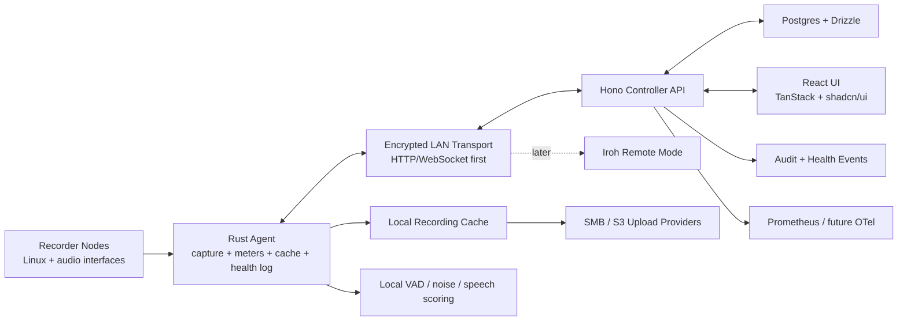

# Rakkr Source Of Truth

Rakkr is a centrally managed Linux/Docker audio recorder platform for reliable voice capture across managed recorder nodes.

This document is the short source of truth: product intent, non-negotiables, current status, and next work.

---

## Executive Snapshot

| Area | Decision |
| ---- | -------- |
| Primary use | Reliable voice recording for meetings and long-running rooms |
| Controller | Hono API, React, TanStack Router, TanStack Query, shadcn/ui |
| Agent | Rust recorder node service |
| Database | Postgres with Drizzle |
| Auth | Local auth first; Azure AD OIDC-ready |
| Access | Default-deny RBAC plus resource-scoped allow/deny policies |
| Audit | Required for privileged reads, writes, denied attempts, and service actions |
| Transport | Encrypted controller/node HTTP/WebSocket on trusted LAN |
| Future remote | Prefer Iroh over libp2p for known-node QUIC dialing and relay fallback |
| Audio devices | Generic Linux audio interfaces; X32 Rack is only the first test fixture |
| Default profile | Voice, MP3 VBR, 128kbps target, fully configurable |
| Scheduling | Human-friendly rules; no cron language exposed |
| Storage | Local node cache plus SMB/S3 upload providers |
| Observability | Local lifecycle log, central events, Prometheus/Mimir path |
| Dates | Store UTC ISO 8601; display browser timezone in year-first format |

## Work Discipline

- One active implementation area at a time.
- Finish the slice: code, tests/checks, docs, commit, push.
- Do not expand scope mid-slice unless the current task is blocked.
- Keep this document concise; move deep design notes into separate docs when needed.

## Status Legend

| Mark | Meaning |
| ---- | ------- |
| ✅ | Complete and checked in |
| 🟦 | Scaffold only; structure exists but the workflow is not useful yet |
| 🟨 | Partial; real behavior exists but required scope remains |
| 🚧 | Current focus |
| ⏸️ | Paused on external state |
| ⏳ | Not started |
| 🧊 | Deferred intentionally |

## Progress Dashboard

| Workstream | Status | Current State |
| ---------- | ------ | ------------- |
| Product scope | ✅ | Requirements and technical direction captured |
| Monorepo | ✅ | `mise`, Docker Compose, CI, LF normalization, LOC guard |
| Controller API | 🟨 | Auth, RBAC, audit, nodes, recordings, jobs, schedules, settings, metrics |
| Controller UI | 🟨 | Dashboard, access, nodes, recordings, schedules, settings, quality timelines |
| Recorder agent | 🟨 | Inventory, meters, jobs, capture growth guards, profile rendering, health log |
| Test rig | ⏸️ | Debian node reachable; X32 validation paused until hardware check |
| Generic devices | 🟨 | ALSA loopback path validates fake capture/rendering |
| Scheduler | 🟨 | Persistent schedules, recurrence, buffers, run-now, skip-next, metadata ownership |
| Recording library | 🟨 | Metadata, tags/folders/search, playback, download, checksum, waveform preview, encoded cache output |
| Health watchdog | 🟨 | Meter ingest, low-signal lifecycle alerts, speech/noise scores, timelines |
| Storage upload | 🟨 | Stub/SMB/S3 providers, policies, auto-queue, audited runner, API/UI control, metrics |
| OIDC | 🟨 | Azure AD login/callback with persistent PKCE state, logout cleanup, setup notes |
| Observability | 🟨 | Local node logs, central events, `/metrics`; OTel/Mimir later |

---

## Product Invariants

- Recording reliability beats cleverness.
- UI state never replaces server-side authorization.
- Every privileged action is RBAC-gated and audited.
- Live listening is privileged.
- Recording control is privileged.
- Recorder-level deny blocks node access, recordings, meters, live listen, and controls.
- Transport between controller and recorder nodes is encrypted.
- Defaults are profiles/templates, not hard-coded engine behavior.
- Nodes must be identifiable by alias, location, network, devices, channels, status, and notes.
- X32 support must not make Rakkr X32-specific.

## Core Architecture

## Technology Stack

| Layer | Choice |
| ----- | ------ |
| Workspace | `mise` is the canonical setup and task runner |
| Node | Node 24 in CI and local `mise` runtime |
| API | Hono |
| UI | React + Vite |
| Routing | TanStack Router |
| Server state | TanStack Query |
| Components | shadcn/ui components installed from the registry |
| Styling | Tailwind 4, oxlint-tailwindcss-compatible classes |
| TS lint/format | oxlint, oxlint-tailwindcss, oxfmt |
| Rust checks | clippy and miri via `mise` |
| Database | Postgres |
| ORM | Drizzle |
| Dev stack | Docker Compose |
| File limit | 1000 LOC per file enforced by `mise run check` |

---

## Recorder Requirements

- Multiple nodes.
- Multiple audio interfaces per node.
- Multiple simultaneous recordings per node.
- Configurable mono, stereo, grouped channel, and mono-to-stereo-mix output.
- Realtime meters even while idle.
- Central recording controls.
- Ad hoc and scheduled jobs.
- Auto file splitting by length.
- Local node cache with future upload.
- Playback, download, metadata editing, tags, folders, search.
- Silence detection/skip optional and disabled by default.

## Settings And Templates

Central settings must cover:

- recording profiles;
- channel maps;
- watchdog policies;
- schedule templates;
- cache/retention policies;
- future upload policies;
- node/interface/channel aliases;
- staged rollout and rollback;
- bulk deployment to similar recorders.

Current scaffold:

- Drizzle/Postgres plus JSON fallback stores.
- Profile, watchdog, channel map, and assignment APIs.
- Channel map revisions, promotion metadata, assignment history, rollback.
- Jobs pin target/template/channel entries at creation.
- Agent fetches pinned maps first, live assignments second.

## Node Inventory

Nodes need:

- stable ID;
- alias;
- site/building/floor/room;
- hostname and IP addresses;
- agent version, uptime, last seen;
- OS/kernel/audio backend;
- interfaces, USB paths, serials when available;
- channel aliases;
- tags and notes;
- online/offline/recording/alert status.

Current scaffold:

- RBAC-gated node list, enroll, credential rotation, status, and health routes.
- Node credentials scoped to their own node/jobs/recordings/meters/events.
- ALSA loopback tasks can fake capture/meter/render before X32 validation resumes.

---

## Scheduler

Scheduler rules:

- Human-friendly UI; no cron language.
- One-off, daily, weekly, monthly, interval, always-on, paused ranges, exceptions.
- Explicit timezone per schedule.
- Start-early and stop-late buffers.
- No arbitrary product limit on schedule count.
- Scheduled recordings inherit schedule-owned filename, folder, tags, profile, targets, watchdog, retention, and future upload policy.

Current scaffold:

- Drizzle/Postgres schedule store.
- Preview, create, edit, run-now, skip-next, delete.
- Recurrence tests for buffers, pauses, monthly clamping, overnight duration, and skip-next.
- Runner creates jobs under `system:scheduler` and audits outcomes.

## Health Watchdog

Health monitoring must catch bad recordings while they are happening.

Required signals:

- no meaningful signal during scheduled window;
- input too quiet;
- digital flatline or stuck samples;
- clipping;
- excessive noise, hum, static likelihood;
- device disconnects and audio backend xruns;
- encoder/file writer failure;
- recording file not growing;
- channel mapping/correlation issues;
- future upload failures.

Default scheduled voice rule:

- During the scheduled recording window, after a grace period, alert if the signal does not exceed a configurable dBFS threshold for enough cumulative time.
- This is not simple silence detection and not a preflight check.

Current scaffold:

- Lifecycle health events in Postgres plus local node JSONL logs.
- Scheduled low-signal alerts open, repeat, and auto-resolve.
- Local meter frames include speech/noise scores; speech-required policies can alert on loud non-speech audio.
- Agent capture jobs fail and log health events for too-small/stalled output, render failures, cache upload failures, and terminal recording state.
- Node health summaries, recent events, trends, and recording/schedule quality timelines.
- Prometheus export for node, meter, recording, job, health, watchdog, and xrun data.

## Future Voice Quality AI

Keep AI optional and pluggable.

Future analysis targets:

- voice presence;
- noise vs speech ratio;
- estimated SNR;
- static/hum/broadband noise;
- intelligibility score;
- optional transcription snippets for search.

Current path: local DSP/VAD scores first; optional AI/classifier second opinion later.

---

## RBAC And Audit

RBAC rules:

- Default deny.
- Exact permission plus resource-scope check for targeted actions.
- Allow and deny policies for user, group, and everyone subjects.
- Explicit deny wins over role grants and inherited visibility.
- UI mirrors permissions, but the API enforces them.
- Service identities, including scheduler actions, are audited.

Scope model:

| Scope | Examples |
| ----- | -------- |
| Global | auth settings, roles, system settings |
| Site | site-wide inventory and policies |
| Room | room health, live listen |
| Node | enroll, rename, configure, control |
| Interface | meters, channel maps, templates |
| Channel | listen, record, rename |
| Schedule | create, edit, pause, run-now, delete |
| Recording | playback, download, rename, tag, delete |
| Alert | acknowledge, suppress, resolve |

Required permission families:

- node inventory;
- metering;
- live listening;
- recording control;
- recording library;
- schedules;
- templates/settings;
- alerts;
- audit;
- administration.

Audit events must capture actor, permission, target, outcome, reason, timestamp, correlation IDs, and before/after values where relevant.

Current scaffold:

- Local users, groups, roles, scopes, access policies, passwords, status.
- Azure AD OIDC claims can sync users, groups, app roles, and scoped grants into RBAC.
- Access UI manages users, groups, policies, and scopes.
- Disabled/deleted/password-reset users lose active sessions.
- Audit API/UI filters by actor, action, target, outcome, and time.
- User, access, password, node credential, schedule, watchdog, health, and recording metadata actions are audited.

## Security And Transport

- Local auth uses hashed passwords and bearer sessions.
- Azure AD OIDC uses Authorization Code + PKCE; Azure AD config remains disabled by default.
- Node enrollment uses one-time tokens and stores only hashes.
- Controller/node traffic must be transport-layer encrypted.
- Development can use a local CA or trusted dev certificates.
- Production should support certificate rotation and a path to mutual TLS or equivalent node identity.

Required encrypted flows:

- enrollment;
- heartbeat/status;
- commands and acknowledgements;
- meter frames;
- live monitor audio;
- recording/job metadata;
- local event log sync;
- health and alert updates.

---

## Recording Library

Required features:

- rename;
- folders;
- tags;
- schedule relationship;
- node/interface/channel relationship;
- recording profile relationship;
- health timeline;
- playback controls;
- download;
- waveform preview;
- search/filtering;
- checksums;
- cache/upload status;
- future preview/transcode assets.

Current scaffold:

- Recording metadata and jobs persist through Drizzle/Postgres with JSON fallback.
- Scoped filters, metadata editing, playback, download, cache attach, and audit events.
- Schedule run-now materializes schedule-owned names, folders, tags, profile, watchdog policy.
- Agent job claim, capture, heartbeat, stop handling, cache upload, and leasing.
- Profile-driven jobs carry MP3/FLAC/WAV encoder targets; agent captures raw WAV then renders final cache output.
- Cache attach computes SHA-256 and WAV PCM waveform preview peaks.

## Storage Upload

Current rule:

- Local cache is the reliable source for now.
- SMB/S3 execution is scaffolded; retention waits for verified uploads.

Current scaffold:

- Failed upload retry queue for future SMB/S3 providers.
- Queue entries are auditable, visible, retryable, and metric-exported.
- Recording library can enqueue cached recordings and retry failed queue items.
- Upload providers expose enabled state, target, credential reference, readiness, and implementation status.
- Upload policy templates choose provider, target, trigger, and retry budget.
- Schedules and recordings carry `uploadPolicyId` for provider selection.
- Cache attach auto-queues recordings when enabled policy trigger is `on_recording_cached`.
- Executor processes due queue items through provider readiness and retry budgets.
- SMB copies cached files to mounted share targets; S3 sends cached files to `s3://` targets.
- Controller upload runner executes due items on an interval and audits summary/item outcomes.
- Controller API and Settings UI expose upload runner status and run-now control.

Later:

- checksum verification after upload.
- retention policy after confirmed upload.

## Observability

Telemetry surfaces:

- local node lifecycle log;
- central health events;
- central audit events;
- Prometheus `/metrics`;
- future OpenTelemetry/Mimir guidance.

Important metric names:

- `rakkr_node_online`
- `rakkr_input_rms_dbfs`
- `rakkr_input_peak_dbfs`
- `rakkr_input_clipping_ratio`
- `rakkr_input_speech_score`
- `rakkr_input_noise_score`
- `rakkr_recording_active`
- `rakkr_recording_duration_seconds`
- `rakkr_recording_bytes_written`
- `rakkr_recording_watchdog_alerts_total`
- `rakkr_upload_queue_depth`
- `rakkr_upload_failures_total`
- `rakkr_device_xruns_total`

## Date And Time Rules

- Store timestamps as UTC ISO 8601.
- API timestamps are ISO 8601 strings.
- Display in browser/user timezone.
- Display format is year-first.
- Schedule definitions include explicit timezone.
- Filenames default to year-first.

Examples:

- Date: `2026-06-18`
- Date/time: `2026-06-18 14:45`
- Exact timestamp: `2026-06-18T10:45:03.123Z`

---

## Milestones

| Milestone | Goal | Status |
| --------- | ---- | ------ |
| 0. Foundation | Monorepo, Docker, API/UI shells, shared types | ✅ |
| 1. Test rig visibility | Agent identity, meters, loopback validation, node UI | 🟨 |
| 2. First reliable recording | Start/stop, cache, metadata, playback, download, health | 🟨 |
| 3. Scheduling | Human scheduler, metadata ownership, execution events | 🟨 |
| 4. Watchdog reliability | Scheduled health alerts, timelines, metrics | 🟨 |
| 5. Operations | Organization, templates, audit search/export, upload stubs | 🚧 |
| 6. Integrations | SMB/S3, Azure AD OIDC, Iroh, AI quality | 🧊 |

## Focus Queue

1. ✅ Add local VAD and noise/speech scoring.
2. ✅ Harden recording file-growth and terminal failure transitions.
3. ✅ Add profile-driven encoder output for MP3 VBR/WAV/FLAC.
4. 🚧 Add waveform/metadata extraction for encoded cache files.
5. ⏸️ Return to X32 hardware validation after device is confirmed.

## Open Questions

| Question | Current Lean |
| -------- | ------------ |
| ALSA/JACK/PipeWire order | ALSA first, then JACK/PipeWire adapters |
| Rust MP3 encoder path | Evaluate during agent recording pipeline hardening |
| Live monitor protocol | Start with encrypted WebSocket/chunk stream |
| Node local log store | JSONL now; SQLite likely later |
| Metrics internals | Prometheus endpoint now; OTel-friendly structure later |

Last updated: `2026-06-18`
