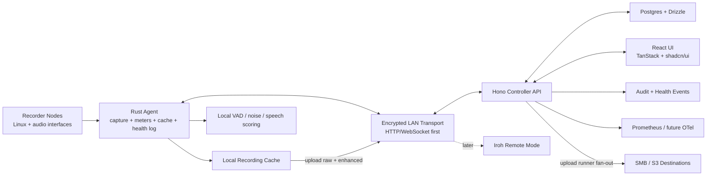

# Rakkr Source Of Truth

Rakkr is a centrally managed Linux/Docker audio recorder platform for reliable voice capture across managed recorder nodes.

This document is the **short** source of truth: product intent, non-negotiables, current status, and next work. Granular, machine-checked detail lives in the baseline docs under `docs/internal/baselines/` (each verified by a `scripts/verify-*-baseline.mjs`); deep design notes live in `docs/internal/design/`; operator/architecture docs live under `docs/`. When this document, the code, and a baseline disagree, **the code wins** — fix the docs.

## Executive Snapshot

| Area | Decision |
| ---- | -------- |
| Primary use | Reliable voice recording for meetings and long-running rooms |
| Controller | Hono API, React, TanStack Router, TanStack Query, shadcn/ui |
| Agent | Rust recorder node service |
| Node lifecycle | Optional Dockerized Ansible runner for recorder host provisioning and updates |
| Database | Postgres with Drizzle (JSON/in-memory fallback when `DATABASE_URL` is unset) |
| Auth | Local auth first (scrypt password hashing); Azure AD OIDC-ready |
| Access | Default-deny RBAC plus resource-scoped allow/deny policies |
| Audit | Required for privileged reads, writes, denied attempts, and service actions |
| Transport | Encrypted controller/node HTTP/WebSocket on trusted LAN; optional mTLS |
| Future remote | Prefer Iroh over libp2p for known-node QUIC dialing and relay fallback |
| Audio devices | Generic Linux audio interfaces; ALSA direct is the reliability default, PipeWire is the modern routed backend, X32 Rack is only the first test fixture |
| Default profile | Voice, MP3 VBR, 128 kbps target, fully configurable |
| Enhancement | Optional in-process voice enhancement (DeepFilterNet3 / RNNoise) per profile; raw is always preserved |
| Scheduling | Human-friendly rules; no cron language exposed |
| Storage | Local node cache plus multiple named SMB/S3 upload destinations; **all external uploads run on the controller** |
| Observability | Local lifecycle log, central events, Prometheus/Mimir path |
| Dates | Store UTC ISO 8601; display browser timezone in year-first format |

## Work Discipline

- One active implementation area at a time.
- Finish the slice: code, tests/checks, docs, commit, push.
- Do not expand scope mid-slice unless the current task is blocked.
- Keep this document concise; the detail belongs in baseline/design docs.

## Status Legend

| Mark | Meaning |
| ---- | ------- |
| ✅ | Complete and checked in |
| 🟦 | Scaffold only; structure exists but the workflow is not useful yet |
| 🟨 | Partial; real behavior exists but required scope remains |
| 🚧 | Current focus |
| ⏸️ | Paused on external state |
| ⏳ | Not started |
| 🧊 | Deferred intentionally |

## Progress Dashboard

| Workstream | Status | Current State |
| ---------- | ------ | ------------- |
| Product scope | ✅ | Requirements and technical direction captured |
| Monorepo | ✅ | `mise`, Docker Compose, CI, LF normalization, LOC guard |
| RBAC/Audit | ✅ | Default-deny permissions, resource policies, UI mirroring, checked baseline matrix |
| Controller API | ✅ | Audited route families across auth/OIDC, audit, nodes/inventory/meters, recordings, recording-jobs, schedules, settings, health, uploads, status, and metrics — each with permission checks, scoped visibility, action summaries, and denied-attempt coverage (`CONTROLLER_API` route-family baseline) |
| Controller UI | 🟨 | Dashboard (selectable meter source, incidents, quick-record), access, audit, nodes, capacity, recordings, jobs, schedules, settings, central health workbench, and quality timelines — all permission-aware with server-backed filters/exports |
| Node lifecycle | 🚧 | Optional Dockerized Ansible runner: SSH package install/update, recorder binary deployment, systemd management, CA-trust rotation, smoke checks, distro vars, idempotent + serial rollout, controller-triggered node-card actions |
| Recorder agent | 🟨 | Inventory probes, S16/S32 meters, capacity polling, bounded concurrent jobs, capture guards with structured evidence, profile/channel-map rendering, in-process enhancement, controller-terminal job handoff, recorder-cache sweeps, and rich meter/system/job health events |
| Test rig | 🟨 | Debian rig + X32 X-USB stable-name ALSA capture; loopback + X32/PCH hardware job and meter/health smokes pass with fake-controller sync; long real-room validation remains |
| Generic devices | 🟨 | Checked generic-device baseline: pinned ALSA probes, controller-managed defaults, ad-hoc/schedule backend+interface selection, PipeWire/JACK presets, loopback + generic/X32/PCH hardware jobs; broader physical-device coverage remains |
| Settings/templates | ✅ | Profiles (incl. enhancement chain), watchdog policies, channel maps + staged rollout, retention, multi-policy assignment; checked baseline |
| Scheduler | ✅ | Human-friendly recurrence, buffers, exceptions, run-now, chunked recording, backend/interface/channel selection with channel-conflict defer; checked baseline |
| Recording library | ✅ | Metadata, organization, playback (raw/enhanced), download, manifest, waveform, cache/upload status; checked baseline |
| Health watchdog | 🟨 | Agent per-frame + controller sustained quality events (low-signal, clipping, flatline, correlation, speech/noise/SNR/intelligibility/hum/static/broadband), system/job/cache/connectivity evidence, central workbench, metrics, timelines; long real-room validation remains |
| Audio enhancement | ✅ | In-process DeepFilterNet3/RNNoise, per-profile voice chain, dual raw+enhanced renditions, raw always preserved, raw/enhanced playback + on-demand live listen; documented in the audio-enhancement guide (no dedicated verifier script yet) |
| Storage upload | ✅ | Multiple named direct SMB/S3 destinations (no mounts), UI-managed encrypted secrets, policies selecting a destination + subfolder, multi-policy fan-out with partial/uploaded reconciliation, auto-queue, audited controller runner, metrics; checked baseline |
| Switcher routing | 🟨 | Modular audio-matrix driver (AVPro AC-MAX, live-validated on an AC-MAX-24), UI-managed encrypted switcher config + input→room/output→user mappings, and an interval reconcile runner that auto-routes live meetings to listener desks (disabled/observe/enforce, owned-outputs-only, leave-idle-alone); checked baseline. Full multi-desk live enforce sign-off remains |
| OIDC | ✅ | Azure AD-ready PKCE flow, persistent state, user sync, logout cleanup; checked setup |
| Transport security | ✅ | HTTPS controller mode, agent plaintext guard + controller-CA trust, cert-rotation scaffold, optional/required mTLS; checked baseline |
| Observability | ✅ | Local JSONL/SQLite logs, central events, metrics, alerts, Mimir config, Grafana baseline |

---

## Product Invariants

- Recording reliability beats cleverness.
- UI state never replaces server-side authorization.
- Every privileged action is RBAC-gated and audited.
- Live listening is privileged. Recording control is privileged.
- Recorder-level deny blocks node access, recordings, meters, live listen, and controls.
- Transport between controller and recorder nodes is encrypted.
- Defaults are profiles/templates, not hard-coded engine behavior.
- The **raw** capture is always preserved; enhancement is an additional rendition, never a replacement.
- **External uploads run only on the controller.** The agent uploads renditions to the controller cache; nodes never touch SMB/S3.
- Nodes must be identifiable by alias, location, network, devices, channels, status, and notes.
- X32 support must not make Rakkr X32-specific.
- ALSA direct capture is the default dependable hardware path; PipeWire remains first-class for modern routed audio graphs.

## Core Architecture

The recording control loop is a lease-based job queue: a schedule due-run or ad-hoc start creates a job; the agent claims and leases it, captures, heartbeats, renders raw (+ enhanced) renditions, and uploads them to the controller cache; the controller finalizes the job, syncs health, and auto-queues uploads for its runner to fan out to each configured destination. A job-lease runner fails orphaned jobs so a crashed agent never strands a recording.

## Technology Stack

| Layer | Choice |
| ----- | ------ |
| Workspace | `mise` is the canonical setup and task runner |
| Node | Node pinned by `.mise.toml` in CI and local runtime |
| API | Hono |
| UI | React + Vite |
| Routing / state | TanStack Router + TanStack Query |
| Components | shadcn/ui components installed from the registry |
| Styling | Tailwind 4, oxlint-tailwindcss-compatible classes |
| TS lint/format | oxlint, oxlint-tailwindcss, oxfmt |
| Rust checks | clippy and Miri via `mise` |
| Database / ORM | Postgres + Drizzle |
| Dev stack | Docker Compose |
| File limit | 1000 LOC per file enforced by `mise run check` |

---

## Capability Areas

Each area is summarized here; the linked baseline holds the checked detail.

### Recorder requirements

Multiple nodes, multiple interfaces per node, and multiple simultaneous recordings per node. Configurable mono / stereo / grouped-channel / mono-to-stereo-mix output, realtime meters even while idle, central controls, ad-hoc and scheduled jobs, configurable time-based chunking (chunks transferred and uploaded as they record), a local node cache, and a recording library (playback, download, metadata, tags, folders, search). Silence detection/skip is optional and disabled by default.

### Settings and templates — `SETTINGS_TEMPLATES_BASELINE`

Postgres + JSON-fallback stores for recording profiles (codec/bitrate/channel mode, max-track length, and the voice-enhancement chain), watchdog policies, channel-map templates (with revisions, staged rollout requiring explicit apply, bulk assignment, and rollback), and retention policies. Jobs pin target/template/channel entries at creation; the agent fetches pinned maps first, live assignments second.

### Node inventory — `GENERIC_DEVICE_BASELINE`

RBAC-gated node/interface/channel identity edits with audit history. Node-authenticated heartbeat updates status/last-seen/runtime/IPs/backends; startup inventory reconcile (`POST /nodes/:id/inventory`) makes the agent the source of hardware truth — interfaces matched by stable system ref so ids and channel-map assignments survive, operator aliases preserved, absent devices flagged (not deleted). Inventory UI/API filter and search by status, last-seen, location, backend, identity, and channel aliases, with CSV export. Node onboarding, SSH credentials, and day-0 bootstrap are one controller-owned subsystem — see `docs/guides/node-onboarding.md` and `docs/internal/design/recorder-node-onboarding-and-secrets.md`.

### Rooms — `RBAC_AUDIT_BASELINE`

Rooms are a first-class entity (stable `roomId`, unique per site+name) that recorder nodes and schedules belong to; the console has a Rooms page listing all rooms and a room detail view with editable name/location/notes, the room's node inventory, upcoming scheduled occurrences (with who booked them), and the room's recent recordings. Access to a room is granted per-room via a roster of users/groups with independently-toggled per-action capabilities (see RBAC), organized so the average operator gets room-scoped listen/operate/view rights without any node or settings management. Existing free-text node/schedule locations backfill into rooms on migration. External calendar ingestion (Microsoft 365 room mailboxes → Rakkr schedules) is the planned next phase.

### Scheduler — `SCHEDULER_BASELINE`

Human-friendly recurrence (`manual` / `once` / `daily` / `weekly` / `monthly` / `always_on`) with explicit per-schedule timezone, start-early/stop-late buffers, and exceptions (`skip` a date or `pause` a range) — no cron language. The runner creates one recording + one job per occurrence under `system:scheduler` and audits outcomes; when the recording profile sets a chunk length, the continuous capture is segmented into chunks that transfer and upload to storage as they record. Schedules own the metadata of the recordings they create (name, folder, tags, profile, targets, watchdog, retention, and a **list** of upload policies). Schedules can also pin a per-channel selection + output mode on their interface; a due run whose channels are already in use is deferred with a `schedule.capture_channels_busy` health alert instead of failing, leaving the in-progress recording untouched. Each schedule is bound to a first-class room; an interactive calendar view (with a configurable week-start controller setting) renders windowed occurrences and supports per-occurrence drag-to-reschedule (a recurring instance is moved by skipping it and cloning a duration-preserving one-off). A schedule's assigned users/groups auto-populate that room's roster (see RBAC).

### Health watchdog — `HEALTH_WATCHDOG_BASELINE`

Catches bad recordings while they happen. Required signals: no meaningful signal during a scheduled window, too quiet, digital flatline/stuck samples, clipping, excessive noise/hum/static, device disconnects/xruns, encoder/writer failure, file not growing, channel-mapping/correlation issues, and upload failures. The default scheduled voice rule alerts (after a grace period) if the signal does not exceed a configurable dBFS threshold for enough cumulative time — not simple silence detection. Both layers raise events: the **agent** scores per-frame meter health (`agent.meter.*`) and the **controller watchdog** raises sustained, policy-tuned alerts and auto-resolves on recovery. Long-duration real-room validation remains.

### Voice quality AI (future)

Local DSP/VAD scores first (speech presence, noise/speech ratio, estimated SNR, hum/static/broadband, intelligibility); an optional AI/classifier second opinion and transcription snippets for search come later. Keep it optional and pluggable.

### RBAC and audit — `RBAC_AUDIT_BASELINE`, `AZURE_AD_OIDC_BASELINE`

Default deny; exact permission + resource-scope check per action; allow/deny policies for user/group/everyone subjects with explicit-deny precedence; UI mirrors permissions but the API enforces them; service identities (including the scheduler) are audited. Scope hierarchy spans global → site → room → node → interface → channel → schedule → recording → alert, keyed on a stable `roomId` (rooms are a first-class entity). Beyond role permissions, a per-room **roster** grants a user or access group an independently-toggled set of per-action **capabilities** (`view`, `listen`, `download`, `operate`, `book`, `edit`, `delete`) over that room's nodes/recordings/schedules — each mapping onto existing catalog permissions (no new global permissions; node/settings/onboarding stay role-based). An explicit deny still wins, and a capability only authorizes when the target resolves to that room. A calendar meeting-assignment is one roster source (auto-granting the meeting's room, default view+operate). Access **groups** are first-party, managed under `auth:manage` (create with a name-derived immutable slug, rename/describe, membership, delete) and assignable to schedules, room rosters, and access policies from one searchable user/group picker; deleting a group cascade-cleans it from all three. The 21-permission catalog and 5 roles are the shared source of truth (`packages/shared`); audit events capture actor, permission, target, outcome, reason, timestamp, correlation IDs, and before/after values. Azure AD OIDC (Auth-Code + PKCE, disabled by default) can sync users/groups/roles/scoped grants.

### Security and transport — `TRANSPORT_SECURITY_BASELINE`

Local auth uses scrypt-hashed passwords and bearer sessions; node enrollment uses one-time tokens stored as hashes. The controller can serve HTTPS with planned cert rotation and optional/required mTLS via a client CA. The agent rejects non-loopback `http://` controllers unless explicitly allowed for dev, and can trust an internal controller CA bundle. All controller/node flows (enrollment, heartbeat, commands, meters, live monitor, recording/job metadata, log sync, health/alerts) are encrypted in production.

### Recording library — `RECORDING_LIBRARY_BASELINE`, `FIRST_RELIABLE_RECORDING_BASELINE`

Rename, folders, tags, schedule/node/interface/channel/profile relationships, health timeline, playback (raw/enhanced toggle), download, waveform preview, search/filtering, checksums, and cache/upload status. Scoped reads/detail/action-summaries, server-side sort/pagination/facets, bulk organize/delete/upload-queue, and CSV manifest export — all RBAC-mirrored. Cache attach computes SHA-256 and WAV waveform peaks; profile-driven jobs render MP3/FLAC/WAV from a raw WAV capture. Ad-hoc and scheduled lifecycles are covered end to end (start → claim → heartbeat → cache attach → auto-queue → playback/download), including stop-request survival and terminal health sync. Ad-hoc starts and schedules can pin a per-channel selection (an ordered subset of the interface's channels) plus an output mode, rendered into the job channel map; the controller rejects starts whose channels are already in use on the interface (`capture_channels_busy`) and bounds concurrent capture sessions per node — distinct interfaces (`node_capture_capacity_reached`). Disjoint jobs that share an interface and capture window form one capture group; the agent claims the group (`claim-next-group`), captures the device once at the group's full channel span, and renders each job's channel subset from that single raw (capture-once, split-many) — e.g. 16 stereo pairs recorded from one 32-channel device without contention.

### Audio enhancement — guide: `docs/guides/audio-enhancement.md`

Optional, in-process noise suppression + voice chain on the recorder agent (`enhance.rs` engines; `enhanced_render::render_enhanced_output` pipeline): ffmpeg channel-map/downmix to 48 kHz mono → DeepFilterNet3 or RNNoise denoise → ffmpeg voice chain (high-pass, de-esser, compressor, EBU R128 loudnorm, low-pass, gate) → encode to the profile codec. Configured per recording profile and persisted in `recording_profiles.settings`. The agent uploads both renditions to the controller — enhanced as the primary that completes the job, raw as a supplementary master gated by `keepRaw`. Raw and enhanced are independently streamable (`?rendition=`), and live listen denoises on demand only while a listener requests enhanced audio. No dedicated verifier script yet.

### Storage upload — `STORAGE_UPLOAD_BASELINE`, `OPERATIONS_BASELINE`

Local cache is the reliable source of record; uploads and cleanup are downstream and never block capture. The controller executes uploads **directly** (SMB 2.1/3.x and S3/S3-compatible, no mounts or external binaries, checksum-verified). Operators define multiple named **destinations** (encrypted secrets keyed from `RAKKR_SECRET_KEY`); **upload policies** select a destination + optional subfolder, trigger, and retry budget. Schedules/recordings carry a list of policy ids, so one cached recording enqueues one independent item per enabled policy and fans out; the recording reconciles to `uploaded` (all ok) or `partial` (some failed). The controller runner executes due items on an interval and audits outcomes; controller-cache retention deletes only after a confirmed upload. (`upload_providers`, and the singular `uploadPolicyId`/`provider`/`target` columns, are legacy and retained only for backfill.)

### Audio matrix switcher routing — `SWITCHER_ROUTING_BASELINE`, guide: `docs/guides/switcher-routing.md`

An optional integration that drives an external audio matrix switcher so a room's live scheduled meeting is auto-routed to the assigned user's listener desk — an alternative to listening in Rakkr directly. The driver layer is modular (`apps/api/src/switchers`): a reusable TCP line transport plus per-model drivers; the first is the AVPro Edge AC-MAX (`SET OUTx AS INy`, validated against a live AC-MAX-24). Switcher connection config lives in Settings/DB (never `.env`) with the control-channel password encrypted via secret-box; operators assign switcher **inputs → rooms** and **outputs → users** (`switcher:map`). An interval reconcile runner computes the routes each enabled switcher should hold from currently-live schedule occurrences and applies only the diffs. Safety invariants: per-switcher `disabled`/`observe`/`enforce` mode (new switchers default to observe), the controller writes **only outputs mapped to a user** and only while that user's meeting is live (idle desks are left as-is), and an unreachable switcher opens a single `switcher.unreachable` health event that resolves on recovery. RBAC: `switcher:read`/`switcher:map`/`switcher:manage`; every action is audited, including `system:switcher-router` reconcile passes.

### Observability — guide: `docs/observability/README.md`

Local node lifecycle log (rotating JSONL or SQLite), central health + audit events, Prometheus `/metrics`, checked alert rules, a checked Prometheus/Mimir remote-write example, and a checked Grafana dashboard. Metrics cover controller availability, node status, per-channel audio quality, listen-monitor freshness, recording duration/cache bytes/jobs, watchdog alerts, xruns, audit/health totals + active counts, and upload queue depth/overdue/failures. See `docs/reference/metrics.md` for the full list. OpenTelemetry collector integration is future.

### Date and time

Store timestamps as UTC ISO 8601; API timestamps are ISO 8601 strings; display in the browser/user timezone, year-first; schedule definitions include an explicit timezone; filenames default to year-first. Covered by `DATE_TIME_BASELINE`.

---

## Milestones

| Milestone | Goal | Status |
| --------- | ---- | ------ |
| 0. Foundation | Monorepo, Docker, API/UI shells, shared types | ✅ |
| 1. Test rig visibility | Agent identity, meters, loopback validation, node UI | 🟨 |
| 2. First reliable recording | Start/stop, cache, metadata, playback, download, health | ✅ |
| 3. Scheduling | Human scheduler, metadata ownership, execution events | ✅ |
| 4. Watchdog reliability | Scheduled health alerts, timelines, metrics | 🚧 |
| 5. Operations | Organization, templates, audit search/export, uploads | ✅ |
| 6. Integrations | SMB/S3, Azure AD OIDC, enhancement, Iroh, AI quality | 🟨 |

## Shipped & Next

- **Shipped (through 2026-06):** The focus-queue's items 1–345 are essentially all complete (one X32 hardware-validation item, #51, is ⏸️ paused on hardware) — the granular history lives in git and the checked baseline docs. Highlights: full RBAC/audit + Azure AD OIDC, scheduler, recording library, controller-side multi-destination SMB/S3 uploads with fan-out, in-process voice enhancement (DeepFilterNet3/RNNoise), transport security + mTLS scaffold, observability (metrics/alerts/dashboard), node onboarding + encrypted SSH credential store + day-0 bootstrap, and the generic-device/X32/PCH validation lanes.
- **Now (🚧):** Node lifecycle (Ansible runner provisioning/updates) and Health Watchdog signal-quality hardening toward MVP promotion.
- **Next:** Long-duration real-room watchdog validation; broader physical-device coverage; a checked enhancement baseline; deferred integrations (Iroh remote mode, AI quality second opinion).

## Open Questions

| Question | Current Lean |
| -------- | ------------ |
| JACK role | Supported for pro-audio graph setups; PipeWire is the preferred modern routed path |
| Rust MP3 encoder path | External renderer covers controller-managed and direct MP3 VBR; native Rust encoder evaluation remains later if deployment warrants |
| Live monitor protocol | Agent audio-chunk polling now; encrypted WebSocket session control later |
| Node local log store | JSONL and SQLite health-event stores now; long-term compaction policy can wait |
| Metrics internals | Prometheus endpoint now; OTel-friendly structure later |

Last updated: `2026-06-30`
