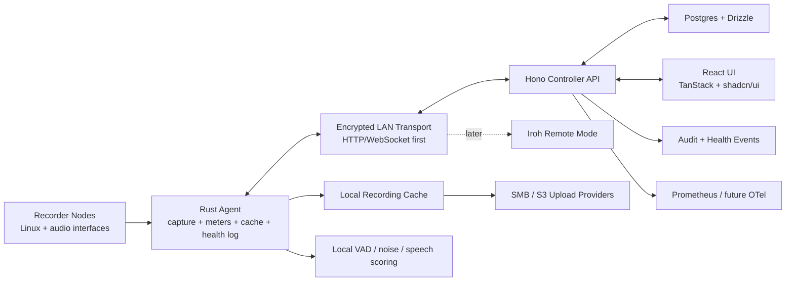

# Rakkr Source Of Truth

Rakkr is a centrally managed Linux/Docker audio recorder platform for reliable voice capture across managed recorder nodes.

This document is the short source of truth: product intent, non-negotiables, current status, and next work.

---

## Executive Snapshot

| Area | Decision |
| ---- | -------- |
| Primary use | Reliable voice recording for meetings and long-running rooms |
| Controller | Hono API, React, TanStack Router, TanStack Query, shadcn/ui |
| Agent | Rust recorder node service |
| Database | Postgres with Drizzle |
| Auth | Local auth first; Azure AD OIDC-ready |
| Access | Default-deny RBAC plus resource-scoped allow/deny policies |
| Audit | Required for privileged reads, writes, denied attempts, and service actions |
| Transport | Encrypted controller/node HTTP/WebSocket on trusted LAN |
| Future remote | Prefer Iroh over libp2p for known-node QUIC dialing and relay fallback |
| Audio devices | Generic Linux audio interfaces; ALSA direct is the reliability default, PipeWire is the modern routed backend, X32 Rack is only the first test fixture |
| Default profile | Voice, MP3 VBR, 128kbps target, fully configurable |
| Scheduling | Human-friendly rules; no cron language exposed |
| Storage | Local node cache plus SMB/S3 upload providers |
| Observability | Local lifecycle log, central events, Prometheus/Mimir path |
| Dates | Store UTC ISO 8601; display browser timezone in year-first format |

## Work Discipline

- One active implementation area at a time.
- Finish the slice: code, tests/checks, docs, commit, push.
- Do not expand scope mid-slice unless the current task is blocked.
- Keep this document concise; move deep design notes into separate docs when needed.

## Status Legend

| Mark | Meaning |
| ---- | ------- |
| ✅ | Complete and checked in |
| 🟦 | Scaffold only; structure exists but the workflow is not useful yet |
| 🟨 | Partial; real behavior exists but required scope remains |
| 🚧 | Current focus |
| ⏸️ | Paused on external state |
| ⏳ | Not started |
| 🧊 | Deferred intentionally |

Promotion rule: 🟦 scaffold, 🟨 useful checked workflow, ✅ full required scope.

## Progress Dashboard

| Workstream | Status | Current State |
| ---------- | ------ | ------------- |
| Product scope | ✅ | Requirements and technical direction captured |
| Monorepo | ✅ | `mise`, Docker Compose, CI, LF normalization, LOC guard |
| RBAC/Audit | ✅ | Default-deny permissions, resource policies, UI mirroring, checked baseline matrix |
| Controller API | 🟨 | Auth/OIDC detail/action summaries, RBAC, audited audit list/detail/action summaries/exports/facets, audited node detail/list/action summaries with location/backend/last-seen filters/exports, capacity, scoped audited aggregate status and metrics reads, audited recording detail/context/list/facets/action summaries/actions, ad-hoc and scheduled backend/interface selection, audited schedule list/detail/occurrence reads and filters/action summaries/exports, jobs, lifecycle coverage, audited settings and retention list/detail/action summaries/update, searchable audited health filters/detail/action summaries/bulk lifecycle controls/exports, audited recording-job detail/list/action summaries/date/relationship/capture filters and controls/exports, scoped audited upload queue reads/action summaries and runner status/actions |
| Controller UI | 🟨 | Dashboard with selectable meter source, active incidents, selected-node recording controls, and global quick-record start, access, audit filters/exports/active chips, nodes with location/backend/last-seen filters/exports/active chips, capacity, recordings with ad-hoc backend/interface selection, jobs, schedules with list filters/active chips/backend/interface selection, settings, searchable central health workbench with active filter chips, bulk health lifecycle controls/exports, recording-job date/relationship/capture filters/active chips and controls/exports, quality timelines |
| Recorder agent | 🟨 | Inventory, meters, controller capacity polling, bounded concurrent jobs, capture growth guards, profile rendering, channel correlation, concurrent-safe health log |
| Test rig | 🟨 | Debian node reachable; X32 X-USB visible and stable-name ALSA capture passed as `hw:XUSB,0` with non-silent 32-channel 48 kHz audio; ALSA loopback capture/render smoke passed; long-run/full-agent validation remains |
| Generic devices | 🟨 | Checked generic ALSA config/inventory, controller-managed node audio defaults, node backend filters, ad-hoc and schedule-level backend/interface selection, template-driven capture/meter args, ALSA device matching, PipeWire/JACK capture/meter presets, backend availability reporting, Linux loopback capture/render execution, and X32 stable-name ALSA capture smoke; broader Linux capture validation remains |
| Settings/templates | ✅ | Profiles, watchdog policies, channel maps, upload retention, schedule retention assignment, controller retention execution, recorder delete-after-upload/max-age/max-bytes/min-free execution, bulk assignment, staged apply, checked baseline |
| Scheduler | ✅ | Human-friendly recurrence, buffers, exceptions, run-now, track splitting, schedule backend/interface selection, checked baseline |
| Recording library | ✅ | Metadata, organization, playback, download, manifest, waveform, cache/upload status, checked baseline |
| Health watchdog | 🟨 | Checked low-signal, speech/noise, SNR, intelligibility, hum/static/broadband/correlation telemetry, policy-tuned broadband quality alerts, synthetic calibration, field calibration helper, offline, local-log, metrics, timeline, central health workbench, and node health lifecycle controls; long-duration real-room validation remains |
| Storage upload | ✅ | Stub/SMB/S3 providers, policies, auto-queue, audited runner, UI, metrics, checked baseline |
| OIDC | ✅ | Azure AD-ready PKCE flow, persistent state, user sync, logout cleanup, checked setup |
| Transport security | ✅ | HTTPS controller mode, agent plaintext guard, agent controller-CA trust, checked baseline |
| Observability | ✅ | Local logs, central events, metrics, alerts, Mimir config, Grafana baseline |

---

## Product Invariants

- Recording reliability beats cleverness.
- UI state never replaces server-side authorization.
- Every privileged action is RBAC-gated and audited.
- Live listening is privileged.
- Recording control is privileged.
- Recorder-level deny blocks node access, recordings, meters, live listen, and controls.
- Transport between controller and recorder nodes is encrypted.
- Defaults are profiles/templates, not hard-coded engine behavior.
- Nodes must be identifiable by alias, location, network, devices, channels, status, and notes.
- X32 support must not make Rakkr X32-specific.
- ALSA direct capture is the default dependable hardware path; PipeWire remains first-class for modern routed audio graphs.

## Core Architecture

## Technology Stack

| Layer | Choice |
| ----- | ------ |
| Workspace | `mise` is the canonical setup and task runner |
| Node | Node 24 in CI and local `mise` runtime |
| API | Hono |
| UI | React + Vite |
| Routing | TanStack Router |
| Server state | TanStack Query |
| Components | shadcn/ui components installed from the registry |
| Styling | Tailwind 4, oxlint-tailwindcss-compatible classes |
| TS lint/format | oxlint, oxlint-tailwindcss, oxfmt |
| Rust checks | clippy and miri via `mise` |
| Database | Postgres |
| ORM | Drizzle |
| Dev stack | Docker Compose |
| File limit | 1000 LOC per file enforced by `mise run check` |

---

## Recorder Requirements

- Multiple nodes.
- Multiple audio interfaces per node.
- Multiple simultaneous recordings per node.
- Configurable mono, stereo, grouped channel, and mono-to-stereo-mix output.
- Realtime meters even while idle.
- Central recording controls.
- Ad hoc and scheduled jobs.
- Auto file splitting by length.
- Local node cache with future upload.
- Playback, download, metadata editing, tags, folders, search.
- Silence detection/skip optional and disabled by default.

## Settings And Templates

Central settings must cover:

- recording profiles;
- channel maps;
- watchdog policies;
- schedule templates;
- cache/retention policies;
- future upload policies;
- node/interface/channel aliases;
- staged rollout and rollback;
- bulk deployment to similar recorders.

Current checked baseline:

- Drizzle/Postgres plus JSON fallback stores.
- Profile, watchdog, channel map, and assignment APIs.
- Channel map revisions, promotion metadata, assignment history, rollback.
- Channel map templates can be bulk-assigned to many node/interface targets in one audited operation.
- Channel map staged rollout plans require an explicit apply step before assignments change.
- Upload policies cover provider selection, retry budget, trigger, and confirmed-upload cache retention.
- Retention policy templates cover controller and recorder cache cleanup intent.
- Settings resources expose detail and action-summary APIs for profiles, watchdog policies, channel maps, rollout plans, upload providers, upload policies, and retention policies.
- Schedules and recordings carry retention policy assignment.
- Retention runner executes controller-cache max-age and max-bytes cleanup with audit events.
- Recorder-cache delete-after-upload policies are pinned to jobs and executed by the agent after successful controller attach.
- Recorder-cache max-age and max-bytes sweep policies are sent through node config and executed by idle agents from a local uploaded-cache manifest.
- Recorder-cache min-free-disk sweep policies are sent through node config and executed by idle agents using system disk pressure and the local uploaded-cache manifest.
- Jobs pin target/template/channel entries at creation.
- Agent fetches pinned maps first, live assignments second.
- Recording profiles can cap max track length for scheduled auto-splitting.
- `docs/settings/SETTINGS_TEMPLATES_BASELINE.md` defines the checked settings/templates baseline.

## Node Inventory

Nodes need:

- stable ID;
- alias;
- site/building/floor/room;
- hostname and IP addresses;
- agent version, uptime, last seen;
- OS/kernel/audio backend;
- interfaces, USB paths, serials when available;
- channel aliases;
- tags and notes;
- online/offline/recording/alert status.

Current partial implementation:

- RBAC-gated node detail/list, enroll, credential rotation, status, and health routes.
- RBAC-gated node alias, site/building/floor/room, network, tag, and note edits with audit history.
- RBAC-gated interface aliases, hardware paths, serials, system refs, sample rates, and channel aliases with audit history.
- Node-authenticated heartbeat updates status, last seen, OS/kernel/runtime, IPs, and audio backends.
- Agent service routes audit missing node credentials with route-specific permission families.
- Persisted nodes derive offline status after missed heartbeat threshold.
- Watchdog creates and resolves central health events when node heartbeats go stale/recover.
- Node UI summarizes connectivity/offline health alongside disk, CPU, and audio.
- Node and dashboard UI color-code online/offline/recording/degraded/alerting status.
- Node API and inventory UI can filter visible nodes by status.
- Node API and inventory UI can filter visible nodes by last-seen date range.
- Node API and inventory UI can filter visible nodes by site/building/floor/room.
- Node API and inventory UI can filter visible nodes by audio backend.
- Node API and inventory UI can search node identity, location, network, tags, runtime, interfaces, and channel aliases.
- Node API and inventory UI can export visible filtered and selected inventory as audited CSV, with active filter chips for applied inventory filters.
- Node detail API returns only scoped visible nodes for detail contexts.
- Node detail API exposes scoped action summaries for live listen, meters, inventory edits, token rotation, health, and ad-hoc recording start readiness.
- Node management, meter, and live-listen action APIs operate only on scoped visible nodes.
- Nodes page direct access mirrors `node:read`; node health panels mirror `health:read` and expose lifecycle actions only with `health:acknowledge`.
- Agent interface inventory prefers Linux sysfs device paths and serials when exposed.
- Agent interface inventory falls back to ALSA hw-params metadata when stream metadata is unavailable.
- Agent capture and meter sampling can use operator-provided argument templates for non-`arecord` commands while preserving the default `arecord` path.
- Nodes UI and API can persist per-node audio command defaults, and node config sends those defaults to agents for queued captures and idle metering.
- Ad-hoc recording starts can pin capture backend and target audio interface, or inherit node defaults.
- Fake-controller agent smoke coverage exercises template-driven capture and meter arguments without audio hardware.
- Agent meter targeting maps numeric, named, and `CARD=`/`DEV=` ALSA `hw:`/`plughw:` capture devices to collected inventory interfaces when possible.
- Agent runtime inventory reports detected PipeWire and JACK command availability, and both have managed capture/meter backend presets.
- Node credentials scoped to their own node/jobs/recordings/meters/events.
- Agent listen-monitor chunk ingress is node-scoped and audited for accepted and rejected chunks.
- ALSA loopback capture and channel-map render smokes passed on the Debian test rig using `hw:1,1,0`, stereo `S16_LE`, and 48 kHz capture.
- ALSA loopback and fake-controller tasks can validate capture/meter/render and agent job lifecycle before X32 validation resumes.
- `docs/devices/GENERIC_DEVICE_BASELINE.md` defines the checked generic-device baseline and remaining Linux-run gaps.
- RBAC-gated listen monitor start/stream/stop uses server-side sessions, prefers fresh agent-provided audio chunks, falls back to a controller meter-preview WAV, and refreshes the browser monitor session on the session latency target.
- Dashboard direct access mirrors `node:read` before status, node, and meter reads.
- Dashboard meter bank can select any visible recorder node and shows RMS, peak, clipping, speech, and noise cues with dBFS scaling coverage.
- Dashboard shows a compact RBAC-gated active incident panel from central health events with acknowledge/resolve controls, and can queue/stop selected-node ad-hoc recording work through existing recording RBAC.
- Nodes UI mirrors RBAC for enrollment, token rotation, live listen, and inventory edits.

---

## Scheduler

Scheduler rules:

- Human-friendly UI; no cron language.
- One-off, daily, weekly, monthly, interval, always-on, paused ranges, exceptions.
- Explicit timezone per schedule.
- Start-early and stop-late buffers.
- No arbitrary product limit on schedule count.
- Scheduled recordings inherit schedule-owned filename, folder, tags, profile, targets, watchdog, retention, and future upload policy.

Current implementation baseline:

- Drizzle/Postgres schedule store.
- Preview, create, edit, run-now, skip-next, delete.
- `docs/scheduling/SCHEDULER_BASELINE.md` defines the checked MVP scheduler baseline.
- Recurrence tests for buffers, pauses, monthly clamping, overnight duration, and skip-next.
- Runner creates jobs under `system:scheduler` and audits outcomes.
- Scheduled run-now and due runs split long windows into ordered track jobs when profile limits require it.
- Schedules can pin ALSA, JACK, or PipeWire capture backend selection and target audio interfaces for run-now and due-run jobs, or inherit node defaults.
- Schedule list API and UI filter visible schedules by search, enabled state, node, backend, and interface with removable active chips.
- Schedule detail, occurrence preview, and lifecycle control APIs operate only on scoped visible schedules.
- Schedule create, update, and run-now APIs operate only on scoped visible nodes.
- Schedule detail API exposes scoped action summaries with permission, node, enabled-state, next-occurrence, and lifecycle readiness.
- Schedule detail can play and download linked cached recordings with RBAC-mirrored controls.
- Schedules UI mirrors RBAC for create, edit, run-now, skip-next, and delete actions.
- Schedules page reads, occurrences, audit timeline, and node lookup mirror granular RBAC.
- Schedule detail reads recordings, jobs, health, audit, occurrences, and node context only with matching RBAC permissions.

## Health Watchdog

Health monitoring must catch bad recordings while they are happening.

Required signals:

- no meaningful signal during scheduled window;
- input too quiet;
- digital flatline or stuck samples;
- clipping;
- excessive noise, hum, static likelihood;
- device disconnects and audio backend xruns;
- encoder/file writer failure;
- recording file not growing;
- channel mapping/correlation issues;
- controller upload failures.

Default scheduled voice rule:

- During the scheduled recording window, after a grace period, alert if the signal does not exceed a configurable dBFS threshold for enough cumulative time.
- This is not simple silence detection and not a preflight check.

Current partial implementation:

- Lifecycle health events in Postgres plus local node JSONL logs.
- Scheduled low-signal alerts open, repeat, and auto-resolve.
- Local meter frames include speech/noise, estimated SNR, first-pass intelligibility, and hum/static/broadband-noise scores; speech-required policies can alert on loud non-speech audio.
- Local meter frames include first-pass same/inverted channel correlation scoring for suspicious channel mapping.
- Agent telemetry includes synthetic PCM calibration fixtures for voice, silence, hum, broadband noise, static, and independent channels.
- Watchdog policies can alert and auto-resolve when scheduled recordings show sustained high channel correlation.
- Watchdog policies can alert and auto-resolve when scheduled recordings show sustained clipping.
- Watchdog policies can alert and auto-resolve when scheduled recordings show sustained digital flatline.
- Watchdog policies can alert and auto-resolve when scheduled recordings show sustained high broadband-noise, noise, hum, or static likelihood.
- Agent capture jobs fail and log health events for too-small/stalled output, render failures, cache upload failures, and terminal recording state.
- Upload runner terminal queue failures create controller health events and sync recording health.
- Health event APIs can search, filter, and detail by scoped incident, opened/resolved date range, event type, node, recording, schedule, severity, and status, and export scoped filtered CSV incident lists.
- Health event lifecycle APIs target exact incidents for RBAC and operate only on scoped visible events.
- Node health summaries, central health workbench with active filter chips, recent events, trends, scoped and selected CSV exports, RBAC-mirrored single and bulk lifecycle actions, scoped action summaries, and recording/schedule quality timelines.
- Quality timelines show event-specific signal, speech, channel-correlation, clipping, flatline, quality anomaly, and upload-failure evidence.
- RBAC/audited watchdog calibration route recommends and can apply thresholds from recent room meter history.
- Settings UI can apply watchdog calibration from visible node meter history with RBAC-mirrored controls.
- Disk pressure sampling can use an explicit `df` command path for constrained recorder environments and deterministic smoke coverage.
- Fake-controller smoke coverage exercises controller-synced meter xrun, device-unavailable, and recovery health with synthetic fallback without audio hardware.
- Fake-controller smoke coverage exercises controller-synced agent disk-pressure, stalled-capture, and render-failure health without audio hardware.
- Prometheus export for node, meter, recording, job, health, watchdog, and xrun data.
- `docs/health/HEALTH_WATCHDOG_BASELINE.md` defines the checked partial watchdog baseline and remaining gaps.

## Future Voice Quality AI

Keep AI optional and pluggable.

Future analysis targets:

- voice presence;
- noise vs speech ratio;
- estimated SNR;
- static/hum/broadband noise;
- intelligibility score;
- optional generated transcription snippets for search.

Current path: local DSP/VAD scores first; optional AI/classifier second opinion later.

---

## RBAC And Audit

RBAC rules:

- Default deny.
- Exact permission plus resource-scope check for targeted actions.
- Allow and deny policies for user, group, and everyone subjects.
- Explicit deny wins over role grants and inherited visibility.
- UI mirrors permissions, but the API enforces them.
- Service identities, including scheduler actions, are audited.

Scope model:

| Scope | Examples |
| ----- | -------- |
| Global | auth settings, roles, system settings |
| Site | site-wide inventory and policies |
| Room | room health, live listen |
| Node | enroll, rename, configure, control |
| Interface | meters, channel maps, templates |
| Channel | listen, record, rename |
| Schedule | create, edit, pause, run-now, delete |
| Recording | playback, download, rename, tag, delete |
| Alert | acknowledge, suppress, resolve |

Required permission families:

- node inventory;
- metering;
- live listening;
- recording control;
- recording library;
- schedules;
- templates/settings;
- alerts;
- audit;
- administration.

Audit events must capture actor, permission, target, outcome, reason, timestamp, correlation IDs, and before/after values where relevant.

Current implementation baseline:

- Local users, groups, roles, scopes, access policies, passwords, status.
- Azure AD OIDC claims can sync users, groups, app roles, and scoped grants into RBAC.
- `docs/auth/AZURE_AD_OIDC_BASELINE.md` defines a checked Azure AD OIDC setup and behavior baseline.
- Access UI manages users, groups, policies, and scopes.
- `docs/security/RBAC_AUDIT_BASELINE.md` defines a checked permission matrix for the MVP RBAC/audit baseline.
- Access page management is hidden unless the user has `auth:manage`.
- Access UI includes a structured allow/deny policy composer for user, group, and everyone subjects.
- Access UI includes a structured resource-scope composer for local user grants.
- Access policy decisions enforce explicit deny precedence across user, group, and everyone subjects.
- Access policy update routes have regression coverage for before/after audit snapshots.
- Auth management routes have missing-permission deny coverage, user detail, and action summaries.
- OIDC discovery read/action-summary routes are RBAC-gated and audited for success/failure.
- Access policy denies have route coverage for protected recording metadata writes and bulk organization.
- Access policy denies have route coverage for live-listen monitor starts.
- Access policy denies have route coverage for recording stop controls.
- Access policy denies have route coverage for recording playback, download, and upload queue actions, including bulk upload queueing and retry.
- Access policy denies have route coverage for recording delete and bulk delete actions.
- Recording read, playback, download, edit, delete, start, stop, and upload-queue routes have missing-permission deny coverage.
- Recorder-level denies have route coverage for hiding attached recordings and blocking recording edit/control/delete actions.
- Schedule-level denies have route coverage for hiding schedules and blocking run-now control.
- Schedule read/manage routes have missing-permission deny coverage.
- Schedule action-summary routes are scoped and audited for success/failure.
- Node-level denies have route coverage for hiding health events and blocking alert acknowledgement.
- Health read and lifecycle routes have missing-permission deny coverage.
- Health event action-summary routes are scoped and audited for success/failure.
- Node inventory, meter, live-listen, and node-management routes have missing-permission deny coverage.
- Node action-summary routes are scoped and audited for success/failure.
- Status, Prometheus metrics, and OIDC discovery routes have missing-permission deny coverage.
- Aggregate status includes scoped node, recording, and unresolved health-event counts behind node read; embedded settings summaries require settings read.
- Upload runner read and run-now controls have route coverage for missing-permission denial.
- Recording profile, watchdog policy, channel map, upload provider, and upload policy Settings UI controls mirror `settings:manage`.
- Settings UI read queries and page access mirror `settings:read`.
- Settings page permission decisions have focused helper coverage for read, manage, and node lookup access.
- Settings shell navigation mirrors `settings:read`.
- Root shell navigation and header shortcut permission decisions have focused helper coverage.
- Root shell navigation item visibility is derived through tested RBAC helpers.
- UI pages and components have regression coverage preventing inline RBAC permission checks.
- Settings channel-map assignment target lookup mirrors `node:read`.
- Shell navigation mirrors page-level read/manage permissions.
- Header recording shortcut mirrors `recording:create`, requires node/settings lookup access, and opens the audited global quick-record start workflow.
- Settings read routes have missing-permission deny coverage for `settings:read`.
- Settings write routes have missing-permission deny coverage for `settings:manage`.
- Settings action-summary routes are RBAC-gated and audited for success/failure.
- Disabled/deleted/password-reset users lose active sessions.
- Audit API/UI filters by id, actor, action, target, outcome, time, and result limit with removable active chips; filtered/selected CSV export and server-side filter facets are RBAC-gated.
- Audit API/UI can filter by permission and reason for denial investigations.
- Audit page reads and exports are hidden unless the user has `audit:read`.
- Audit read/detail/action/export routes have missing-permission deny coverage.
- Audit UI exposes event reasons, correlation IDs, details, and before/after snapshots.
- User, access, password, node credential, schedule, watchdog, health, and recording metadata actions are audited.
- Recording delete is RBAC-gated and audited, with active-recording protection.
- Upload queue retry audits scoped-hidden retry attempts without exposing the queue item.

## Security And Transport

- Local auth uses hashed passwords and bearer sessions.
- Azure AD OIDC uses Authorization Code + PKCE; Azure AD config remains disabled by default.
- Node enrollment uses one-time tokens and stores only hashes.
- Controller/node traffic must be transport-layer encrypted.
- Development can use a local CA or trusted dev certificates.
- Production should support certificate rotation and a path to mutual TLS or equivalent node identity.

Required encrypted flows:

- enrollment;
- heartbeat/status;
- commands and acknowledgements;
- meter frames;
- live monitor audio;
- recording/job metadata;
- local event log sync;
- health and alert updates.

Current implementation baseline:

- Controller can start HTTPS when TLS cert/key paths are configured.
- Agent rejects non-loopback `http://` controller URLs unless explicitly allowed for development.
- Agent can trust an internal controller CA bundle for all controller requests.
- Localhost HTTP remains available for local development.
- `docs/security/TRANSPORT_SECURITY_BASELINE.md` defines the checked MVP transport baseline.

---

## Recording Library

Required features:

- rename;
- folders;
- tags;
- schedule relationship;
- node/interface/channel relationship;
- recording profile relationship;
- health timeline;
- playback controls;
- download;
- waveform preview;
- search/filtering;
- checksums;
- cache/upload status;
- MVP waveform preview assets; optional generated transcode derivatives remain deferred.

Current implementation baseline:

- `docs/recordings/RECORDING_LIBRARY_BASELINE.md` defines the checked MVP recording-library baseline.
- Recording metadata and jobs persist through Drizzle/Postgres with JSON fallback.
- Scoped filters, metadata editing, playback, download, cache attach, and audit events.
- Recording library exposes scoped folder/tag facets with clickable UI filters.
- Recording library exposes relationship facets for nodes, profiles, upload policies, and split-track groups.
- Recording library supports browser-local date-range filters backed by UTC ISO query bounds.
- Recording library shows removable active filter chips for applied organization/search filters.
- Recording cards display node, schedule, profile, upload policy, and track relationship badges.
- Recording cards resolve relationship badges to friendly names when RBAC allows reference lookups.
- Recording library can filter/search by recording profile and upload policy relationships.
- Recording job rows display capture interface, channel-map template, mode, and source channels.
- Recording library can display, search, and filter scheduled split recordings by track group.
- Recording library supports explicit server-side sorting with UI controls.
- Recording library supports paginated result sets with page-size and previous/next controls.
- Recording library can filter recordings by cached versus missing local cache state.
- Recording library summarizes visible upload queue item counts by status.
- Recording library action controls mirror RBAC for edit, stop, playback, download, and upload queue actions.
- Recordings page read queries mirror granular RBAC for library, health, settings, and node context.
- Recording library can export a scoped, filtered CSV manifest with audit coverage.
- Recording library can export selected visible recordings as a scoped, audited CSV manifest.
- Recording metadata supports searchable operator notes with audit snapshots and manifest export.
- Recording metadata supports searchable transcript snippets with audit snapshots and manifest export; generation remains deferred.
- Recording card action readiness uses tested cached/terminal recording predicates.
- Recording library API exposes scoped detail reads for visible recordings.
- Single-recording playback, download, file, metadata, stop, and delete APIs operate only on scoped visible recordings.
- Recording library API exposes scoped and audited action summaries with job, cache, permission, upload queue, and lifecycle readiness.
- Recording library API supports audited bulk folder/tag organization for scoped recordings.
- Recording library UI supports selecting visible recordings and bulk folder/tag organization.
- Recording library API deletes terminal recordings and cached files with audit snapshots.
- Recording library UI exposes RBAC-mirrored delete controls for terminal recordings.
- Recording library UI can bulk-delete selected terminal recordings.
- Recording library API supports audited bulk delete with scoped visibility checks.
- Single-recording upload queue APIs operate only on scoped visible recordings.
- Recording library can bulk-queue selected cached recordings for upload with scoped visibility checks.
- Recording library playback panel shows browser audio controls with session metadata and explicit close/cleanup.
- Recording card waveform previews show peak bars plus sample/channel/source metadata.
- Schedule run-now materializes schedule-owned names, folders, tags, profile, watchdog policy.
- Ad-hoc starts accept target node, profile, upload policy, and optional metadata.
- Ad-hoc recording start APIs operate only on scoped visible nodes.
- Ad-hoc start UI shows node room/status/IP context before queueing a recording.
- Ad-hoc controller lifecycle coverage verifies start, node job claim, heartbeat, cache attach, auto-upload queue, playback, download, and file streaming.
- Scheduled lifecycle coverage verifies due-run metadata ownership through node claim, cache attach, auto-upload queue, playback, download, and file streaming.
- Stop-request lifecycle coverage verifies controller stop requests survive agent cancellation as completed recordings.
- Recording jobs workbench shows server-scoped status/search/created-date/node/backend/interface filters with removable active chips, job status, node/recording relationships, capture settings, leases, heartbeats, and failures, plus filtered and selected-job CSV export, scoped audited action summaries, RBAC-mirrored stop controls for active jobs, audited retry controls for failed/cancelled jobs, and audited selected-job bulk stop/retry controls.
- Terminal health sync coverage verifies failed jobs become critical, unexpected cancellations become warning, controller-requested stops remain healthy, and cached recordings refresh health.
- `mise run check` includes fake-controller agent smoke coverage for job heartbeat/status polling, controller capacity override, bounded concurrent jobs, concurrent-safe local health log output, rendered MP3/VBR, recorder-cache delete-after-upload, recorder-cache max-bytes idle sweep, cache-upload failure handling, and controller stop requests without audio hardware.
- `mise run check` includes fake-controller agent smoke coverage for recorder-cache min-free-disk idle sweep using deterministic disk-pressure input.
- `mise run check` includes fake-controller agent smoke coverage for agent monitor chunk sync, failure, and recovery without audio hardware.
- Agent job claim-next, controller-polled capacity, bounded concurrency, capture, heartbeat, stop handling, cache upload, and leasing.
- Profile-driven jobs carry MP3/FLAC/WAV encoder targets; agent captures raw WAV then renders final cache output.
- Cache attach computes SHA-256 and WAV PCM waveform preview peaks.

## Storage Upload

Current rule:

- Local cache is the reliable source for now.
- SMB/S3 execution is early but functional; cache retention only runs after confirmed upload.

Current implementation baseline:

- `docs/storage/STORAGE_UPLOAD_BASELINE.md` defines the checked MVP storage-upload baseline.
- Failed upload retry queue for future SMB/S3 providers.
- Queue entries are auditable, visible, retryable, and metric-exported.
- Recording library can enqueue cached recordings individually or in bulk and retry failed queue items.
- Upload providers expose enabled state, target, credential reference, readiness, and implementation status.
- Upload policy templates choose provider, target, trigger, and retry budget.
- Schedules and recordings carry `uploadPolicyId` for provider selection.
- Cache attach auto-queues recordings when enabled policy trigger is `on_recording_cached`.
- Executor processes due queue items through provider readiness and retry budgets.
- SMB copies cached files to mounted share targets; S3 sends cached files to `s3://` targets.
- SMB verifies copied bytes with SHA-256; S3 uploads send `ChecksumSHA256`.
- Controller upload runner executes due items on an interval and audits summary/item outcomes.
- Controller API and Settings UI mirror upload runner status/read/run-now/action summaries to recording RBAC.
- Upload provider and upload policy Settings UI reads/actions mirror `settings:read` and `settings:manage`.
- Upload policies can delete controller cache after confirmed non-stub upload.
- Upload queue reads can filter visible items by status, provider, and recording, and expose scoped item detail/action summaries.
- Settings exposes an upload queue workbench with status/provider/recording filters, active chips, and scoped retry controls.
- Upload provider, policy, and queue persistence is Postgres-backed with JSON fallback.

## Observability

Telemetry surfaces:

- local node lifecycle log;
- central health events;
- central audit events;
- Prometheus `/metrics`;
- checked Prometheus alert rules;
- checked Prometheus scrape and Mimir remote-write example;
- checked Grafana operations dashboard example;
- concise checked runbook;
- future OpenTelemetry collector integration.

Important metric names:

- `rakkr_node_online`
- `rakkr_node_offline_alerts_active`
- `rakkr_input_rms_dbfs`
- `rakkr_input_peak_dbfs`
- `rakkr_input_clipping_ratio`
- `rakkr_input_speech_score`
- `rakkr_input_noise_score`
- `rakkr_input_broadband_noise_score`
- `rakkr_input_estimated_snr_db`
- `rakkr_input_intelligibility_score`
- `rakkr_listen_monitor_chunk_age_seconds`
- `rakkr_listen_monitor_chunk_duration_seconds`
- `rakkr_audit_events_total`
- `rakkr_health_events_total`
- `rakkr_recording_active`
- `rakkr_recording_duration_seconds`
- `rakkr_recording_bytes_written`
- `rakkr_recording_watchdog_alerts_total`
- `rakkr_upload_queue_depth`
- `rakkr_upload_queue_oldest_due_seconds`
- `rakkr_upload_failures_total`
- `rakkr_device_xruns_total`

Current implementation:

- Prometheus export covers controller, node, recording duration/cache bytes, meter, listen-monitor freshness, audit totals, health totals/active counts, watchdog, upload queue depth/failures, and upload overdue age.
- `docs/observability/rakkr-alerts.yml` defines checked Prometheus alerts for offline nodes, watchdog criticals, upload stalls/failures, XRUNs, and denied-action spikes.
- `docs/observability/prometheus-mimir.example.yml` defines a checked HTTPS controller scrape and Mimir `remote_write` path using a secret file.
- `docs/observability/grafana-dashboard.example.json` defines a checked operations dashboard for node status, audio levels, recordings, uploads, XRUNs, and denied actions.
- `docs/observability/README.md` documents the operator path and checked observability artifacts.
- Recorder agent local JSONL health logs rotate by size and keep a configured number of retained files.
- Fake-controller agent smoke coverage verifies local JSONL health events for rendered output metadata and cache-upload failures.

## Date And Time Rules

- Store timestamps as UTC ISO 8601.
- API timestamps are ISO 8601 strings.
- Display in browser/user timezone.
- Display format is year-first.
- Schedule definitions include explicit timezone.
- Filenames default to year-first.

Examples:

- Date: `2026-06-18`
- Date/time: `2026-06-18 14:45`
- Exact timestamp: `2026-06-18T10:45:03.123Z`

Current implementation baseline:

- Web date helpers centralize browser-timezone, year-first display and local date-to-UTC conversion with regression coverage.
- Schedule timezone rendering, recording names, local date filters, and generated export filenames are covered by `docs/time/DATE_TIME_BASELINE.md`.

---

## Milestones

| Milestone | Goal | Status |
| --------- | ---- | ------ |
| 0. Foundation | Monorepo, Docker, API/UI shells, shared types | ✅ |
| 1. Test rig visibility | Agent identity, meters, loopback validation, node UI | 🟨 |
| 2. First reliable recording | Start/stop, cache, metadata, playback, download, health | ✅ |
| 3. Scheduling | Human scheduler, metadata ownership, execution events | ✅ |
| 4. Watchdog reliability | Scheduled health alerts, timelines, metrics | 🚧 |
| 5. Operations | Organization, templates, audit search/export, upload stubs | ✅ |
| 6. Integrations | SMB/S3, Azure AD OIDC, Iroh, AI quality | 🧊 |

## Focus Queue

1. ✅ Add local VAD and noise/speech scoring.
2. ✅ Harden recording file-growth and terminal failure transitions.
3. ✅ Add profile-driven encoder output for MP3 VBR/WAV/FLAC.
4. ✅ Add waveform/metadata extraction for encoded cache files.
5. ✅ Add RBAC-gated audit CSV export.
6. ✅ Add policy-controlled cache deletion after confirmed upload.
7. ✅ Add request-driven ad-hoc recording start.
8. ✅ Add checksum verification for confirmed uploads.
9. ✅ Add RBAC-gated controller meter-preview listen stream.
10. ✅ Add controller TLS bootstrap and agent plaintext transport guard.
11. ✅ Add schedule profile max-track splitting.
12. ✅ Add RBAC/audited node identity edits.
13. ✅ Add RBAC/audited interface and channel identity edits.
14. ✅ Add agent runtime heartbeat and node runtime display.
15. ✅ Add full node location hierarchy editing and display.
16. ✅ Add stale heartbeat offline status derivation.
17. ✅ Add stale node heartbeat health-event lifecycle.
18. ✅ Add node-offline Prometheus alert metric.
19. ✅ Add event-type health filtering.
20. ✅ Add node connectivity health summary UI.
21. ✅ Add explicit interface hardware path and serial inventory fields.
22. ✅ Prefer sysfs device paths and serials in agent inventory.
23. ✅ Add status-aware node badges across dashboard and inventory.
24. ✅ Add node inventory status filtering.
25. ✅ Add node inventory identity search.
26. ✅ Add recording library folder/tag facets.
27. ✅ Add recording library date-range filters.
28. ✅ Add recording relationship badges.
29. ✅ Add removable active recording filter chips.
30. ✅ Add recording profile and upload policy filters.
31. ✅ Add recording job interface and channel-map details.
32. ✅ Add split-track group display and filtering.
33. ✅ Add recording library sorting controls.
34. ✅ Add recording library pagination controls.
35. ✅ Add recording relationship facet groups.
36. ✅ Add RBAC deny-precedence regression coverage.
37. ✅ Mirror recording library action controls against RBAC permissions.
38. ✅ Add expandable audit event details.
39. ✅ Add audit permission and reason filters.
40. ✅ Add structured access policy composer.
41. ✅ Add structured user scope composer.
42. ✅ Add access policy audit snapshot route coverage.
43. ✅ Add recording metadata deny audit route coverage.
44. ✅ Add live-listen deny audit route coverage.
45. ✅ Add recording stop deny audit route coverage.
46. ✅ Add recorder-level deny inheritance coverage for recordings.
47. ✅ Add schedule run-now deny audit route coverage.
48. ✅ Add alert acknowledgement deny audit route coverage.
49. ✅ Add playback, download, and upload queue deny audit route coverage.
50. ✅ Add browser-timezone year-first date helper coverage.
51. ⏸️ Return to X32 hardware validation after device is confirmed.
52. ✅ Add controller-side ad-hoc recording lifecycle regression coverage.
53. ✅ Add fake-device agent CLI lifecycle smoke test.
54. ✅ Add scheduled recording lifecycle coverage through agent cache attach.
55. ✅ Add stop-request lifecycle coverage from controller stop to agent cancellation.
56. ✅ Add recording health sync coverage for failed/cancelled/cache terminal transitions.
57. ✅ Add RBAC-gated bulk recording folder/tag organization API.
58. ✅ Add bulk recording organization UI for visible library results.
59. ✅ Add RBAC-gated recording delete API with cache cleanup and active-recording guard.
60. ✅ Add recording delete UI controls for permitted terminal recordings.
61. ✅ Add access-policy deny coverage for recording delete.
62. ✅ Add selected-recording bulk delete UI for terminal recordings.
63. ✅ Add RBAC-gated bulk recording delete API and wire UI to it.
64. ✅ Add access-policy deny coverage for bulk recording delete.
65. ✅ Add access-policy deny coverage for bulk recording organization.
66. ✅ Add RBAC-gated bulk upload queueing for selected cached recordings.
67. ✅ Add access-policy deny coverage for upload queue retry.
68. ✅ Add denied audit coverage for scoped-hidden upload queue retry attempts.
69. ✅ Add recorder-level deny inheritance coverage for attached recording actions.
70. ✅ Add upload runner run-now missing-permission coverage.
71. ✅ Mirror upload runner run-now UI against RBAC permissions.
72. ✅ Mirror upload provider and policy Settings UI against RBAC permissions.
73. ✅ Mirror watchdog policy Settings UI against RBAC permissions.
74. ✅ Mirror recording profile and channel map Settings UI against RBAC permissions.
75. ✅ Add Settings write route missing-permission coverage.
76. ✅ Correct Settings channel-map assignment deny coverage to the PUT route.
77. ✅ Complete Settings write route deny coverage for update endpoints.
78. ✅ Add Settings read route missing-permission coverage.
79. ✅ Mirror Settings page reads against RBAC permissions.
80. ✅ Mirror Settings shell navigation against RBAC permissions.
81. ✅ Mirror Settings channel-map target lookup against node read permission.
82. ✅ Mirror primary shell navigation against RBAC permissions.
83. ✅ Mirror header recording shortcut against RBAC permissions.
84. ✅ Add node route missing-permission coverage.
85. ✅ Add schedule route missing-permission coverage.
86. ✅ Add audit route missing-permission coverage.
87. ✅ Add rendered MP3/VBR fake-controller agent smoke coverage.
88. ✅ Add recording UI action-readiness helper coverage.
89. ✅ Add health route missing-permission coverage.
90. ✅ Add recording route missing-permission coverage.
91. ✅ Add ops route missing-permission coverage.
92. ✅ Add auth management route missing-permission coverage.
93. ✅ Add upload runner read route missing-permission coverage.
94. ✅ Add agent service-route missing credential audit coverage.
95. ✅ Add fake-controller job heartbeat/status smoke coverage.
96. ✅ Add fake-controller local health-log smoke coverage.
97. ✅ Add fake-controller cache-upload failure smoke coverage.
98. ✅ Add fake-controller controller-stop smoke coverage.
99. ✅ Add recording playback panel session and cleanup coverage.
100. ✅ Add ad-hoc start node context and metadata helper coverage.
101. ✅ Add recording waveform metadata and scaling coverage.
102. ✅ Add schedule-detail playback/download controls for cached recordings.
103. ✅ Add dashboard meter bank dBFS and voice/noise display coverage.
104. ✅ Mirror Nodes page privileged actions against RBAC permissions.
105. ✅ Mirror Schedules page write/control actions against RBAC permissions.
106. ✅ Mirror Access page management against RBAC permissions.
107. ✅ Mirror Audit page reads and export against RBAC permissions.
108. ✅ Mirror Dashboard reads and meters against RBAC permissions.
109. ✅ Mirror Nodes page reads and health panels against RBAC permissions.
110. ✅ Mirror Schedules page reads and related lookups against RBAC permissions.
111. ✅ Mirror Schedule detail reads against granular RBAC permissions.
112. ✅ Mirror Recordings page reads against granular RBAC permissions.
113. ✅ Mirror Upload runner panel status and run-now against RBAC permissions.
114. ✅ Mirror Upload policy panel reads against Settings RBAC permissions.
115. ✅ Add Settings page permission helper coverage.
116. ✅ Add root shell permission helper coverage.
117. ✅ Add root shell nav item derivation coverage.
118. ✅ Add UI RBAC helper boundary coverage.
119. ✅ Add RBAC/audited recording manifest CSV export.
120. ✅ Add searchable operator notes to recording metadata.
121. ✅ Add RBAC-aware friendly relationship labels to recording cards.
122. ✅ Add selected-recording manifest CSV export.
123. ✅ Add recording cache-state filter.
124. ✅ Add visible upload queue status summary.
125. ✅ Add upload queue read filters.
126. ✅ Add upload queue overdue Prometheus metric.
127. ✅ Add recording duration and cache-byte Prometheus metrics.
128. ✅ Add watchdog and xrun total Prometheus counters.
129. ✅ Add configurable local health-log retention.
130. ✅ Add central health-event total Prometheus metric.
131. ✅ Add audit-event total Prometheus metric.
132. ✅ Add checked Prometheus alert rules.
133. ✅ Add checked Prometheus scrape and Mimir remote-write example.
134. ✅ Add checked Grafana operations dashboard example.
135. ✅ Promote Observability MVP with checked runbook.
136. ✅ Add checked RBAC/audit MVP baseline matrix.
137. ✅ Add checked Azure AD OIDC MVP baseline setup.
138. ✅ Add checked transport security MVP baseline.
139. ✅ Promote Scheduler MVP with checked human-friendly baseline.
140. ✅ Promote Recording Library MVP with checked organization/playback baseline.
141. ✅ Promote Storage Upload MVP with checked provider/queue/runner baseline.
142. ✅ Add checked Health Watchdog partial baseline with explicit signal-quality gaps.
143. ✅ Promote Operations MVP with checked organization/templates/audit/upload baseline.
144. ✅ Promote First Reliable Recording MVP with checked ad-hoc/scheduled lifecycle baseline.
145. ✅ Add first-pass hum/static quality telemetry, UI display, and Prometheus metrics.
146. ✅ Promote Scheduling MVP with checked operator route controls and audit coverage.
147. ✅ Add first-pass channel correlation telemetry, health event, UI cue, and Prometheus metric.
148. ✅ Add policy-tuned scheduled channel correlation watchdog alerts.
149. ✅ Add synthetic PCM calibration fixtures for local quality scoring.
150. ✅ Add checked generic-device partial baseline.
151. ✅ Add bounded simultaneous recording jobs in the recorder agent.
152. ✅ Add controller-visible node recording capacity and agent capacity polling.
153. ✅ Serialize concurrent agent health-log appends.
154. ✅ Add policy-tuned scheduled clipping watchdog alerts.
155. ✅ Tighten health watchdog baseline verifier for clipping lifecycle evidence.
156. ✅ Add quality timeline event-specific watchdog evidence display.
157. ✅ Add checked browser-timezone and ISO date/time baseline.
158. ✅ Add checked settings/templates partial baseline.
159. ✅ Add audited bulk channel-map template assignment.
160. ✅ Add staged channel-map rollout plans with explicit apply.
161. ✅ Tie settings/templates baseline to upload-policy cache retention.
162. ✅ Add audited retention policy templates to settings.
163. ✅ Add audited controller-cache retention runner.
164. ✅ Add schedule-owned retention policy assignment.
165. ✅ Add job-pinned recorder-cache delete-after-upload execution.
166. ✅ Add idle recorder-cache max-age/max-bytes sweep execution.
167. ✅ Add idle recorder-cache min-free-disk sweep execution.
168. ✅ Add agent-provided live monitor audio chunk ingest and streaming.
169. ✅ Add refreshing browser listen-monitor sessions.
170. ✅ Add stale monitor-chunk fallback to meter preview.
171. ✅ Add scoped monitor-chunk freshness Prometheus metrics.
172. ✅ Add RBAC/audited live-listen session stop lifecycle.
173. ✅ Add RBAC/audited watchdog field calibration from meter history.
174. ✅ Add Settings UI watchdog calibration controls.
175. ✅ Add Postgres-backed upload provider config store.
176. ✅ Add Postgres-backed upload policy and queue stores.
177. ✅ Add ALSA hw-params metadata fallback for generic device inventory.
178. ✅ Map named ALSA hw capture devices to inventory meter targets.
179. ✅ Map ALSA plughw capture devices to inventory meter targets.
180. ✅ Map ALSA CARD/DEV capture-device strings to inventory meter targets.
181. ✅ Report PipeWire and JACK availability in agent runtime inventory.
182. ✅ Add template-driven capture command arguments.
183. ✅ Add template-driven meter command arguments.
184. ✅ Add fake-controller smoke coverage for template-driven capture arguments.
185. ✅ Add fake-controller smoke coverage for agent system-health sync.
186. ✅ Add fake-controller smoke coverage for stalled-capture health sync.
187. ✅ Add fake-controller smoke coverage for render-failure health sync.
188. ✅ Add fake-controller smoke coverage for meter xrun health sync.
189. ✅ Add fake-controller smoke coverage for meter device-unavailable health sync.
190. ✅ Add fake-controller smoke coverage for meter recovery health sync.
191. ✅ Add fake-controller smoke coverage for listen-monitor chunk sync recovery.
192. ✅ Add upload runner terminal-failure health event coverage.
193. ✅ Add quality timeline upload-failure evidence display.
194. ✅ Add fake-controller smoke coverage for template-driven meter arguments.
195. ✅ Add controller-managed per-node audio command defaults.
196. ✅ Add node health lifecycle controls.
197. ✅ Add central health events workbench.
198. ✅ Add bulk health event lifecycle controls.
199. ✅ Add recording jobs workbench.
200. ✅ Add recording jobs stop controls.
201. ✅ Add scoped health-event CSV export.
202. ✅ Add scoped recording-job CSV export.
203. ✅ Add recording job retry controls.
204. ✅ Add policy-tuned scheduled flatline watchdog alerts.
205. ✅ Add policy-tuned scheduled quality anomaly watchdog alerts.
206. ✅ Add first-pass estimated SNR telemetry, UI display, and Prometheus metric.
207. ✅ Add first-pass intelligibility score telemetry, UI display, and Prometheus metric.
208. ✅ Add first-pass broadband-noise telemetry, UI display, and Prometheus metric.
209. ✅ Add searchable transcript snippet recording metadata.
210. ✅ Add agent controller CA bundle trust for HTTPS.
211. ✅ Add PipeWire capture and meter backend presets.
212. ✅ Add selected recording-job bulk stop and retry controls.
213. ✅ Add selected recording-job CSV export.
214. ✅ Add JACK capture and meter backend presets.
215. ✅ Add server-backed recording-job backend filters.
216. ✅ Add schedule-level capture backend selection.
217. ✅ Add schedule-level capture interface selection.
218. ✅ Add ad-hoc capture backend/interface selection.
219. ✅ Add server-backed recording-job interface filters.
220. ✅ Add policy-tuned broadband-noise quality anomaly alerts.
221. ✅ Add server-backed node inventory backend filters.
222. ✅ Add filtered node inventory CSV export.
223. ✅ Add selected health-event CSV export.
224. ✅ Add health-event opened date range filters.
225. ✅ Add server-backed recording-job node filters.
226. ✅ Add selected node inventory CSV export.
227. ✅ Add server-backed node inventory location filters.
228. ✅ Add recording-job created date filters.
229. ✅ Add node inventory last-seen date filters.
230. ✅ Add health-event resolved date range filters.
231. ✅ Add searchable health-event workbench filters.
232. ✅ Add active health-event filter chips.
233. ✅ Add active node inventory filter chips.
234. ✅ Add active recording-job filter chips.
235. ✅ Add server-backed schedule list filters.
236. ✅ Add active audit trail filter chips.
237. ✅ Add upload queue workbench filters and retry controls.
238. ✅ Add selectable dashboard meter source.
239. ✅ Add dashboard active incident panel.
240. ✅ Add dashboard incident lifecycle controls.
241. ✅ Add dashboard selected-node recording controls.
242. ✅ Add global quick-record start workflow.
243. ✅ Scope aggregate status settings summaries to settings read.
244. ✅ Add scoped schedule detail API.
245. ✅ Add scoped node detail API.
246. ✅ Add scoped recording detail API.
247. ✅ Add scoped health event detail API.
248. ✅ Add scoped recording job detail API.
249. ✅ Add scoped recording context API.
250. ✅ Add scoped schedule export API.
251. ✅ Add Settings detail APIs.
252. ✅ Add scoped recording action summary API.
253. ✅ Add scoped schedule action summary API.
254. ✅ Add scoped node action summary API.
255. ✅ Add scoped health event action summary API.
256. ✅ Add scoped recording-job action summary API.
257. ✅ Add settings resource action summary APIs.
258. ✅ Add upload queue item and runner action summary APIs.
259. ✅ Add auth management detail and action summary APIs.
260. ✅ Add audit event detail and action summary APIs.
261. ✅ Add OIDC login and discovery action summary APIs.
262. ✅ Add selected audit event CSV export API.
263. ✅ Add audit event facet summary API.
264. ✅ Add expanded scoped aggregate status API.
265. ✅ Scope schedule occurrence and lifecycle APIs.
266. ✅ Scope single-recording action APIs.
267. ✅ Scope node management, meter, and live-listen action APIs.
268. ✅ Scope health lifecycle action APIs.
269. ✅ Scope single-recording upload queue API.
270. ✅ Scope ad-hoc recording start API.
271. ✅ Scope schedule work creation APIs.
272. ✅ Scope schedule action node readiness.
273. ✅ Scope upload queue recording context APIs.
274. ✅ Scope recording action summary context APIs.
275. ✅ Scope recording-job action summary context APIs.
276. ✅ Scope recording-job metrics to visible recordings.
277. ✅ Scope recording-job control recording context.
278. ✅ Scope bulk recording metadata context.
279. ✅ Scope bulk recording delete context.
280. ✅ Honor aggregate health-event resource denies.
281. ✅ Scope aggregate health metrics and status to health-event denies.
282. ✅ Scope recording-profile settings routes to resource denies.
283. ✅ Scope watchdog-policy settings routes to resource denies.
284. ✅ Scope channel-map template settings routes to resource denies.
285. ✅ Scope upload-provider settings routes to resource denies.
286. ✅ Scope upload-policy settings routes to resource denies.
287. ✅ Scope retention-policy settings routes to resource denies.
288. ✅ Scope channel-map assignment targets to resource denies.
289. ✅ Scope watchdog calibration meter-history node access.
290. ✅ Scope manual upload-runner passes to visible recordings.
291. ✅ Scope upload-runner status summaries to visible recordings.
292. ✅ Scope ad-hoc recording profile selection.
293. ✅ Scope ad-hoc recording policy selection.
294. ✅ Scope schedule settings resource selection.
295. ✅ Scope aggregate status settings summaries.
296. ✅ Scope health-event audit metrics.
297. ✅ Scope settings-resource audit metrics.
298. ✅ Scope audit event reads and exports.
299. ✅ Scope agent health-event schedule sync.
300. ✅ Scope agent job recording mutations.
301. ✅ Scope agent cache-file job completion.
302. ✅ Scope recording-job audit targets.
303. ✅ Confirm X32 USB ALSA visibility on Debian test rig.
304. ✅ Set ALSA/PipeWire backend direction.
305. ✅ Add generic ALSA capture smoke and validate X32 short capture.
306. ✅ Audit node-scoped agent listen-monitor chunk ingress.
307. ✅ Validate ALSA loopback capture and render on Debian test rig.
308. ✅ Validate stable X32 32-channel ALSA capture on Debian test rig.
309. ✅ Audit OIDC discovery read and action-summary routes.
310. ✅ Audit settings action-summary routes.
311. ✅ Audit node action-summary routes.
312. ✅ Audit schedule action-summary routes.
313. ✅ Audit health event action-summary routes.
314. ✅ Audit recording action-summary routes.
315. ✅ Audit recording-job action-summary routes.
316. ✅ Audit upload queue and runner action-summary routes.
317. ✅ Audit upload queue and runner read routes.
318. ✅ Audit aggregate status read route.
319. ✅ Audit metrics read route.
320. ✅ Audit schedule read routes.
321. ✅ Audit node inventory read routes.
322. ✅ Audit recording-job read routes.
323. ✅ Audit recording library read routes.
324. ✅ Audit health event read routes.
325. ✅ Audit settings resource read routes.
326. ✅ Audit retention policy read routes.
327. ✅ Audit audit-event read routes.

## Open Questions

| Question | Current Lean |
| -------- | ------------ |
| JACK role | Supported for pro-audio graph setups; PipeWire is the preferred modern routed path |
| Rust MP3 encoder path | Evaluate during agent recording pipeline hardening |
| Live monitor protocol | Agent audio chunk polling now; encrypted WebSocket session control later |
| Node local log store | JSONL now; SQLite likely later |
| Metrics internals | Prometheus endpoint now; OTel-friendly structure later |

Last updated: `2026-06-23`
