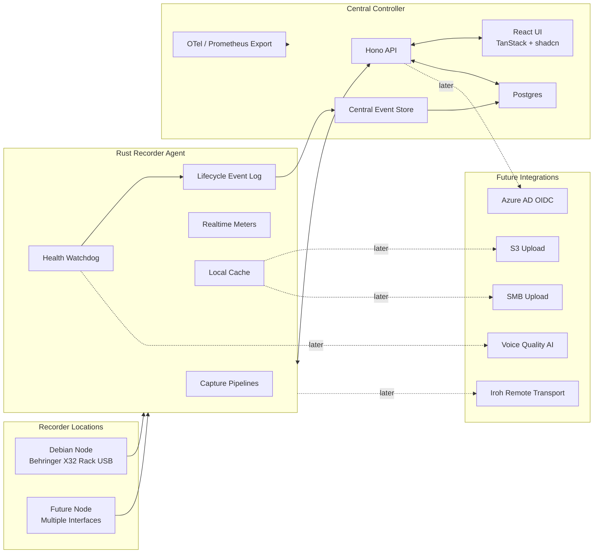

# Rakkr Source Of Truth


> Rakkr is a centrally managed, Linux/Docker based audio recorder platform for reliable voice recording across managed recorder nodes.

This document is the living source of truth for Rakkr. It combines executive status, product requirements, architecture decisions, implementation phases, and progress tracking.

---

## Executive Snapshot

| Area                       | Current Decision                                                               |
| -------------------------- | ------------------------------------------------------------------------------ |
| Primary use case           | Reliable voice recording for meetings and long-running room audio              |
| Deployment target          | Linux hosts, Dockerized controller services, Rust recorder agents              |
| First test rig             | Debian recorder node at `172.22.145.152`, Behringer X32 Rack via USB           |
| Hardware support stance    | X32 is only the first fixture; support generic Linux audio interfaces          |
| Controller UI              | Hono API, React, TanStack Router, TanStack Query, shadcn/ui                    |
| Auth                       | Local auth first, Azure AD OIDC-ready architecture                             |
| Database                   | Postgres                                                                       |
| ORM                        | Drizzle                                                                        |
| Access control             | Default-deny RBAC for every user, node, recording, listen, and admin action    |
| Recorder agent             | Rust                                                                           |
| Network model              | Trusted LAN first, with encrypted controller/node transport                    |
| Future remote connectivity | Iroh preferred over libp2p if NAT traversal is needed later                    |
| Default recording profile  | Voice, `128kbps MP3 VBR`, configurable                                         |
| Storage uploads            | Stubbed initially, future SMB/S3 providers                                     |
| Scheduler                  | Human-friendly scheduling, no cron exposed to users                            |
| Health monitoring          | First-class watchdog, local event log, central events, Prometheus/Mimir export |
| Date format rule           | ISO-style year-first display in browser timezone                               |

## Status Legend

| Emoji | Meaning                               |
| ----- | ------------------------------------- |
| ✅    | Complete and checked in               |
| 🟦    | Scaffolded and ready to build on      |
| 🟨    | Designed or partially implemented     |
| 🚧    | Current or next active focus          |
| ⏸️    | Paused or waiting on external state   |
| ⏳    | Not started                           |
| 🧊    | Deferred intentionally                |

## Progress Dashboard

| Workstream           | Status      | Notes                                                          |
| -------------------- | ----------- | -------------------------------------------------------------- |
| Product discovery    | ✅ Complete  | Initial scope, features, and technical direction captured      |
| Monorepo scaffold    | ✅ Complete  | `mise`-managed Node.js, pnpm, Rust/Cargo, Docker Compose, CI   |
| Controller API       | 🟦 Scaffold  | Hono API with status, nodes, schedules, recordings, meters     |
| Controller UI        | 🟦 Scaffold  | TanStack/shadcn operations dashboard on Tailwind 4              |
| Recorder agent       | 🟦 Scaffold  | Rust CLI with generic Linux inventory and telemetry scaffold    |
| Test rig integration | ⏸️ Paused    | Debian node reachable; X32 validation waits for device check    |
| Health watchdog      | 🟨 Designed  | Core non-AI checks first, AI quality analysis later            |
| Scheduler            | 🟨 Designed  | Human-friendly rules, metadata ownership, watchdog integration |
| Storage upload       | 🧊 Deferred  | Interface/stubs only in early milestones                       |
| OIDC                 | 🧊 Deferred  | Local auth first, Azure AD ready later                         |
| RBAC                 | 🟦 Scaffold  | Shared permissions and API middleware gate controller actions  |
| Audit trail          | 🟦 Scaffold  | Postgres-backed audit store, API events, and audit view started |
| Observability        | 🟨 Designed  | Local logs, central store, OpenTelemetry/Prometheus/Mimir      |

## North Star

Rakkr should make audio recording boringly reliable. A user should know:

- which room/node/interface/channel is recording;
- whether meaningful audio is entering the system;
- whether a scheduled recording is healthy while it is happening;
- where every recording is stored;
- what metadata, tags, and schedule produced it;
- who accessed, controlled, listened to, or changed anything;
- whether anything suspicious happened during capture.

The system must favor reliability, observability, and recoverability over cleverness.

---

## System Overview



## Core Architecture

### Controller

- Provides the web UI, REST/RPC API, realtime streams, auth, settings, schedules, inventory, recording library, health events, and metrics export.
- Runs locally in Docker for development and production-friendly deployment.
- Uses Postgres as the central system of record.
- Uses local auth first while keeping an OIDC boundary ready for Azure AD.
- Enforces RBAC server-side for all routes, streams, and commands.
- Writes a proper audit trail for allowed and denied user, node, and service actions.

### Recorder Node Agent

- Runs on Linux recorder hosts.
- Captures audio from one or more audio interfaces.
- Supports many simultaneous recording jobs per node.
- Reports live meter data even when not recording.
- Executes scheduled and ad hoc recording jobs.
- Maintains a lifecycle-managed local event log.
- Caches completed recordings locally.
- Exposes health, recording, and device telemetry to the controller.

### Storage

- Initial implementation: local recorder-node cache and central metadata tracking.
- Upload providers are stubbed behind an interface.
- Future providers: SMB and S3.
- Uploads must be retryable, auditable, and checksum verified.

---

## Technology Decisions

| Decision             | Choice                          | Rationale                                                                             |
| -------------------- | ------------------------------- | ------------------------------------------------------------------------------------- |
| Monorepo setup       | `mise`                          | Canonical setup and command entrypoint for all developers and CI                      |
| JS package manager   | `pnpm` through `mise`           | Good monorepo ergonomics while keeping `mise` as the user-facing tool                 |
| API framework        | Hono                            | Small, fast, TypeScript-friendly, suitable for API + realtime endpoints               |
| UI framework         | React + Vite                    | Fast iteration and strong ecosystem                                                   |
| Routing              | TanStack Router                 | Typed routes and app-scale routing                                                    |
| Server state         | TanStack Query                  | Excellent async/cache model                                                           |
| UI components        | shadcn/ui                       | Components installed from the shadcn registry                                         |
| CSS engine           | Tailwind 4                      | Matches `oxlint-tailwindcss` canonical class rules                                    |
| Database             | Postgres                        | Strong relational model for schedules, events, recordings, and metadata               |
| ORM/query layer      | Drizzle                         | SQL-first schema ownership, migrations, and strong TypeScript ergonomics              |
| Recorder agent       | Rust                            | Good fit for audio IO, long-running agents, reliability, and native Linux integration |
| Initial transport    | Encrypted HTTP/WebSocket over trusted LAN | Simple, observable, debuggable, confidential                                |
| Future NAT traversal | Iroh                            | Better fit than libp2p for keyed device dialing and direct QUIC connections           |
| AI quality analysis  | Pluggable future provider       | Keep core recorder independent from AI availability                                   |

## Transport Decision

Start with direct LAN connectivity:

- node enrollment over encrypted trusted LAN;
- node-originated heartbeat/control channel where practical;
- controller commands over authenticated, encrypted HTTP/WebSocket;
- realtime meter streaming over encrypted WebSocket;
- live monitor stream with modest latency tolerance over encrypted transport.

Trusting the LAN only means Rakkr can assume direct routability during early development. It must not mean plaintext controller/node traffic. All controller-to-node and node-to-controller communication should use transport-layer encryption for confidentiality and integrity.

Required encrypted flows:

- node enrollment and credential bootstrap;
- heartbeats and node status;
- recorder commands and command acknowledgements;
- realtime meter frames;
- live monitor/listen audio;
- recording/job metadata;
- local event log sync;
- health events and alert updates.

Initial development can use locally trusted certificates or a development CA. Production should support managed controller/node certificates, certificate rotation, and a path toward mutual TLS or equivalent node identity.

Keep the transport boundary abstract:

- `NodeTransport`
- `CommandChannel`
- `MeterStream`
- `MonitorAudioStream`

Future remote mode should use Iroh before libp2p. libp2p is powerful, but Rakkr is a centrally managed recorder platform, not a decentralized mesh. Iroh better matches the later need: dial a known node by key, attempt direct QUIC, and fall back to relay if needed.

---

## Product Requirements

## Recorder Capabilities

- Multiple recorder nodes.
- Multiple well-supported Linux audio interfaces per node.
- Multiple simultaneous recording jobs per node.
- Configurable channel maps.
- Mono, stereo, mono-to-stereo-mix, and grouped-channel recordings.
- Audio meters available even when not recording.
- Recording controls from central UI.
- Ad hoc and scheduled recordings.
- Auto track/file splitting by length.
- Local node cache for recordings.
- Future upload to SMB/S3 after completion.
- Recording file health tracking while writing.
- Download and browser playback from recording library.

## Default Voice Profile

| Setting           | Default                           |
| ----------------- | --------------------------------- |
| Purpose           | Voice recording                   |
| Codec             | MP3                               |
| Mode              | VBR                               |
| Bitrate target    | `128kbps`                         |
| Silence skip      | Disabled                          |
| Silence detection | Available but disabled by default |
| Health policy     | Scheduled voice watchdog          |

Defaults must never be hard-coded into the recorder engine. They belong in configurable recording profiles/templates.

## Settings And Templates

Rakkr must support central settings for all recorders:

- recording profiles;
- channel map templates;
- watchdog policy templates;
- scheduler templates;
- cache/retention templates;
- upload policy templates later;
- node/interface/channel aliases;
- staged rollout and rollback;
- en-masse deployment to similar recorders.

## Node Inventory

Nodes need rich identity, not just IDs.

| Field    | Requirement                                  |
| -------- | -------------------------------------------- |
| Node ID  | Stable generated identity                    |
| Alias    | Human-friendly display name                  |
| Location | Site, building, floor, room                  |
| Network  | IP addresses, hostname                       |
| Agent    | Version, uptime, last seen                   |
| OS       | Distribution, kernel, audio backend          |
| Devices  | Interfaces, serials/USB path where available |
| Channels | Channel aliases and mapping                  |
| Status   | Online/offline/recording/alerting            |
| Metadata | Tags and notes                               |

The UI should make it obvious which physical room and device a node represents.

The Behringer X32 Rack is the current physical test fixture, not a product-specific assumption. Recorder discovery should work with generic ALSA/JACK/PipeWire capture devices and expose enough raw identity to support per-device templates later.

---

## Scheduler

Scheduler is a first-class domain feature. Users must never need to write cron syntax.

Supported concepts:

- one-off recordings;
- daily/weekly/monthly recurring schedules;
- specific days of week;
- intervals such as every 2 weeks;
- first/last weekday style rules;
- always-on schedules;
- start early / stop late buffers;
- exceptions and paused date ranges;
- timezone-aware schedule definitions;
- unlimited schedules in principle, with validation for impossible rules.

Example structured schedule:

```json
{
  "timezone": "Indian/Maldives",
  "recurrence": {
    "type": "weekly",
    "daysOfWeek": ["monday", "wednesday", "friday"],
    "interval": 1
  },
  "startTime": "09:00",
  "endTime": "11:30",
  "exceptions": [{ "date": "2026-07-01", "action": "skip" }]
}
```

## Schedule-Owned Metadata

If a recording is created by a schedule, the schedule owns its initial metadata:

- filename template;
- folder/path template;
- tags;
- target node/interface/channel map;
- recording profile;
- watchdog policy;
- retention/cache policy;
- upload policy later.

Example:

```json
{
  "name": "Council Meeting",
  "folderTemplate": "Meetings/{yyyy}/{MM}/{scheduleName}",
  "filenameTemplate": "{yyyy}-{MM}-{dd}_{HHmm}_{scheduleName}_{nodeName}",
  "tags": ["council", "scheduled", "voice"],
  "recordingProfileId": "voice-mp3-vbr",
  "watchdogPolicyId": "scheduled-voice-watchdog"
}
```

Ad hoc recordings can use ad hoc defaults or user-provided metadata.

---

## Health Watchdog

Health monitoring is a core product pillar.

Rakkr must detect likely failure modes before users discover bad recordings later:

- no meaningful signal;
- input too quiet;
- digital flatline;
- stuck samples;
- excessive noise;
- hum/static likelihood;
- clipping;
- device disconnects;
- ALSA/JACK/PipeWire xruns;
- encoder/file writer failure;
- recording file not growing;
- channel correlation and mapping issues;
- upload queue failures later.

## Scheduled Signal Activity Rule

Preflight checks are not enough because recorders may be started long before meetings begin. Scheduled watchdog rules should evaluate during the scheduled period.

Default scheduled voice rule:

```json
{
  "activeDuring": "scheduled_recording",
  "windowSeconds": 900,
  "thresholdDbfs": -45,
  "metric": "rms",
  "minCumulativeSecondsAboveThreshold": 10,
  "graceSeconds": 300,
  "severity": "critical",
  "repeatEverySeconds": 900
}
```

Meaning:

> During a scheduled recording, after the grace period, alert if the input has not produced at least 10 cumulative seconds above -45 dBFS in the last 15 minutes.

This is intentionally stronger than simple silence detection and less easily fooled by one short click or bump.

## Alert Lifecycle

Alerts should support:

- open;
- repeated/updated;
- acknowledged;
- suppressed;
- resolved automatically;
- resolved manually;
- attached to node, interface, channel, recording, and schedule where possible.

Recordings should show a quality timeline with:

- healthy regions;
- low-activity regions;
- clipping markers;
- flatline markers;
- device/dropout events;
- AI quality markers later.

---

## AI Voice Quality Analysis

AI/ML analysis is a future integration, not a dependency for core recording.

Desired future capability:

- sample chunks during or after scheduled recordings;
- estimate voice presence;
- estimate noise vs speech;
- estimate speech-to-noise ratio;
- detect static, hum, or broadband noise;
- estimate intelligibility;
- optionally produce transcription snippets for search.

Example chunk analysis:

```json
{
  "speechRatio": 0.72,
  "silenceRatio": 0.18,
  "noiseRatio": 0.1,
  "estimatedSnrDb": 21.4,
  "intelligibilityScore": 0.86,
  "clippingRatio": 0.002,
  "verdict": "good_voice"
}
```

Potential implementation path:

1. Basic DSP health metrics.
2. Local VAD such as WebRTC VAD or Silero VAD.
3. Noise classifier and SNR/quality estimator.
4. Optional cloud/commercial provider for deeper analysis.

Important policy:

- Preserve original raw/master recording.
- Use cleaned/enhanced audio only for monitoring, previews, or optional derived files.
- Never make AI required for recording correctness.

---

## Observability And Logs

Health events must be operational telemetry, not transient UI state.

## Local Node Event Log

Each recorder node should maintain a lifecycle-managed local log:

- durable local SQLite or append-only event store;
- survives controller outages;
- retains events by age and size policy;
- syncs to controller when available;
- records device, recording, watchdog, cache, and upload events.

Example event:

```json
{
  "type": "watchdog.signal_below_threshold",
  "severity": "warning",
  "nodeId": "x32-node-01",
  "inputId": "x32-usb-ch03",
  "scheduleId": "council-meeting",
  "recordingId": "rec_123",
  "openedAt": "2026-06-17T09:15:00Z",
  "resolvedAt": null,
  "details": {
    "windowSeconds": 900,
    "thresholdDbfs": -45,
    "secondsAboveThreshold": 2.4
  }
}
```

## Central Event Store

The controller stores normalized events in Postgres:

- node events;
- health alerts;
- recording events;
- schedule execution events;
- upload events later;
- audit events for user/admin actions.

## Metrics Export

Support OpenTelemetry-friendly metrics and Prometheus/Mimir export.

Candidate metrics:

- `rakkr_node_online`
- `rakkr_input_rms_dbfs`
- `rakkr_input_peak_dbfs`
- `rakkr_input_clipping_ratio`
- `rakkr_input_flatline_seconds`
- `rakkr_recording_active`
- `rakkr_recording_duration_seconds`
- `rakkr_recording_bytes_written`
- `rakkr_recording_watchdog_alerts_total`
- `rakkr_upload_queue_depth`
- `rakkr_upload_failures_total`
- `rakkr_device_xruns_total`

---

## Recording Library

The central server must track cached and uploaded recordings.

Required organization features:

- rename recordings;
- folder/path organization;
- tags;
- schedule relationship;
- node/interface/channel relationship;
- recording profile relationship;
- health timeline;
- playback controls;
- download;
- waveform preview;
- search and filtering;
- checksums;
- upload/cache status;
- derived preview/transcode assets later.

---

## Date And Time Rules

Product-wide rule:

- Stored timestamps: UTC ISO 8601, for example `2026-06-17T10:45:00.000Z`.
- API timestamps: ISO 8601 strings.
- Displayed dates: browser/user timezone.
- Displayed date format: year-first ISO-style.
- Schedule definitions: explicit timezone.
- Filenames: year-first by default.

Display examples:

| Purpose                 | Format                     |
| ----------------------- | -------------------------- |
| Date                    | `2026-06-17`               |
| Date/time               | `2026-06-17 14:45`         |
| Date/time with seconds  | `2026-06-17 14:45:03`      |
| Exact timestamp tooltip | `2026-06-17T10:45:03.123Z` |

---

## Security And Auth

Initial:

- local auth with password hashing and session tokens;
- default-deny RBAC roles and permissions;
- trusted LAN for reachability only;
- encrypted transport for all controller/node communication;
- authenticated node enrollment;
- node tokens/keys;
- permission-gated controller routes, streams, and commands;
- audit trail for security-sensitive allowed and denied actions.

Future:

- Azure AD OIDC;
- optional remote node mode using Iroh;
- stronger node identity and key rotation.

Current scaffold status:

- local admin login uses scrypt password hashing;
- controller routes require bearer session tokens;
- login and logout are audited;
- auth session table exists in the Postgres schema;
- durable session persistence and user management UI are still pending.

---

## RBAC And Audit Trail

RBAC is a product invariant, not just a UI feature. Hiding a button is useful, but the controller must enforce permissions server-side before any action runs.

Core rules:

- default deny unless a role grants the exact permission;
- every API route, realtime stream, live monitor stream, and node command requires authorization;
- every privileged read and write action records an audit event;
- denied authorization attempts are audit events too;
- UI state should mirror permissions, but never replace server checks;
- scheduled and automated node actions run under service identities and are audited.

## Permission Scope Model

Permissions should be scoped to the smallest practical resource:

| Scope     | Examples                                      |
| --------- | --------------------------------------------- |
| Global    | system settings, auth settings, role editing  |
| Site      | site-wide node inventory and policies         |
| Room      | listen to a room, view room health            |
| Node      | enroll, rename, control, restart, configure   |
| Interface | view meters, map channels, assign templates   |
| Channel   | listen, record, rename, include in profiles   |
| Schedule  | create, edit, pause, run now, delete          |
| Recording | playback, download, edit metadata, delete     |
| Alert     | acknowledge, suppress, resolve, comment       |

Scopes can be broad for administrators and narrow for operators. For example, a user may be allowed to listen to `Room A` but not `Room B`, or allowed to start scheduled recordings but not edit recording profiles.

## Required Permission Families

| Family             | Example Actions                                                      |
| ------------------ | -------------------------------------------------------------------- |
| Node inventory     | view node, edit alias/location/IP notes, enroll, disable             |
| Metering           | view live meters, view channel details, view health timeline         |
| Live listening     | start monitor stream, stop monitor stream, list active listeners     |
| Recording control  | start, stop, pause, resume, cancel, retry failed job                 |
| Recording library  | browse, playback, download, rename, tag, move folder, delete         |
| Schedules          | create, edit, enable, disable, run now, skip occurrence, delete      |
| Templates/settings | create, edit, deploy, rollback, assign to nodes/interfaces/channels  |
| Alerts             | view, acknowledge, suppress, unsuppress, resolve, reopen             |
| Audit              | view audit log, export audit log, configure retention                |
| Administration     | manage users, roles, OIDC config, node credentials, system settings  |

Listening to a room is always privileged. It must require an explicit `listen` style permission for the target room/node/interface/channel and must never be treated as a harmless read-only action.

Recording controls are also privileged. Starting, stopping, pausing, resuming, or canceling a recording can affect legal, operational, and archival outcomes, so these actions require explicit permissions and audit events.

## Audit Event Requirements

The audit trail should answer who did what, to which resource, when, from where, whether it succeeded, and what changed.

Minimum audit fields:

| Field              | Requirement                                                 |
| ------------------ | ----------------------------------------------------------- |
| Event ID           | Stable unique ID                                            |
| Timestamp          | UTC ISO 8601                                                |
| Actor              | User ID or service identity                                 |
| Actor context      | Roles, session ID, IP address, user agent where available   |
| Permission checked | Permission string and evaluated scope                       |
| Action             | Canonical action name                                       |
| Target             | Resource type and ID, plus friendly alias/name when known   |
| Outcome            | allowed, denied, failed, partial, or succeeded              |
| Reason             | Denial reason or failure message when applicable            |
| Correlation IDs    | Request ID, command ID, schedule ID, recording ID as needed |
| Before/after       | For settings, templates, metadata, roles, and schedules     |

High-value audited actions:

- login, logout, failed login, password/auth changes;
- role and permission changes;
- node enrollment, node credential rotation, node disable/delete;
- live listening start, stop, failure, and denied attempts;
- recording start, stop, pause, resume, cancel, and denied attempts;
- schedule create, edit, enable, disable, skip, run-now, and delete;
- recording playback, download, delete, rename, folder move, and tag changes;
- template deployment and rollback;
- alert acknowledge, suppress, unsuppress, resolve, and reopen;
- export of recordings, metadata, logs, or audit records.

Live listen audit events should include listener, target room/node/channel, start time, end time, duration, outcome, and a reason field when the UI collects one.

Recording-control audit events should include actor, command, schedule/ad hoc source, target node/interface/channel map, profile, timestamp, and final command result.

Audit records must be queryable from the controller UI by actor, action, target, room, node, schedule, recording, outcome, and time range. Audit retention should be lifecycle managed, exportable, and eventually compatible with external SIEM/log pipelines.

Current scaffold status: controller audit events persist through Postgres when `DATABASE_URL` is available, with an in-memory fallback for local development before migrations or Postgres are running.

---

## Backlog

## Must Have

- [x] ✅ `mise` monorepo scaffold.
- [x] ✅ Docker Compose for local controller stack.
- [x] ✅ Postgres schema baseline.
- [x] ✅ Hono API service.
- [x] ✅ React/TanStack/shadcn UI shell.
- [ ] 🟦 Local auth.
- [ ] 🟦 Default-deny RBAC permission enforcement.
- [ ] 🟦 Audit event model and audit log UI.
- [ ] 🟦 Live listen permission checks and audit trail.
- [ ] 🟦 Recording control permission checks and audit trail.
- [ ] ⏳ Node enrollment model.
- [x] ✅ Rust recorder agent skeleton.
- [ ] 🟦 Generic Linux audio device discovery.
- [ ] ⏸️ X32 test-rig validation.
- [ ] 🟦 Realtime meters.
- [ ] ⏳ Recording job model.
- [ ] 🟦 Voice MP3 VBR default profile.
- [ ] ⏳ Local recording cache.
- [ ] 🟦 Recording library metadata.
- [ ] 🟨 Scheduler data model.
- [ ] ⏳ Human-friendly schedule UI.
- [ ] 🟨 Schedule-owned filename/folder/tag templates.
- [ ] 🟨 Watchdog event model.
- [ ] 🟨 Scheduled low-signal alert rule.
- [ ] ⏳ Local node event log.
- [ ] 🟦 Central event store.
- [ ] 🟦 Prometheus metrics endpoint.

## Should Have

- [ ] ⏳ Multiple simultaneous recording jobs per node.
- [ ] 🟦 Multiple interfaces per node.
- [ ] 🟦 Channel aliases and groups.
- [ ] 🟦 Mono-to-stereo-mix channel mode.
- [ ] ⏳ Auto file splitting by length.
- [ ] ⏳ Playback controls.
- [ ] ⏳ Download recordings.
- [ ] 🟦 Tags/folders/search filters.
- [ ] 🟦 Node health dashboard.
- [ ] ⏳ Disk/CPU/audio backend health.
- [ ] ⏳ Xrun and device disconnect tracking.
- [ ] 🧊 Failed upload retry queue skeleton.
- [ ] ⏳ Checksum verification.
- [ ] ⏳ Waveform previews.
- [ ] ⏳ Template rollout and rollback.

## Later

- [ ] 🧊 SMB upload provider.
- [ ] 🧊 S3 upload provider.
- [ ] 🧊 Azure AD OIDC.
- [ ] 🧊 Iroh remote transport.
- [ ] 🧊 Live monitor audio enhancement.
- [ ] 🧊 Local VAD.
- [ ] 🧊 Noise vs speech scoring.
- [ ] 🧊 AI voice quality analysis.
- [ ] 🧊 Transcription snippets.
- [ ] 🧊 Notification integrations.
- [ ] 🧊 Public holiday calendars.
- [ ] 🧊 Derived MP3/AAC browser playback assets.

---

## Milestones

## Milestone 0 - Project Foundation

Goal: create the monorepo and make local development pleasant.

Exit criteria:

- `mise` installs required runtimes.
- `mise`-managed pnpm workspace exists.
- Controller API starts locally.
- UI starts locally.
- Docker Compose starts Postgres.
- Shared config/types package exists.

## Milestone 1 - Test Rig Visibility

Goal: prove the Debian/X32 node can be discovered and monitored.

Exit criteria:

- Rust agent runs on Debian test node.
- Agent reports node identity and network details.
- Agent discovers X32 USB audio interface and channel count.
- Controller shows node online/offline state.
- Controller shows live meters while not recording.
- Basic local node event log exists.
- Meter visibility is permission-gated.

## Milestone 2 - First Reliable Recording

Goal: create and retrieve recordings with metadata.

Exit criteria:

- Start/stop ad hoc recording from UI.
- Configurable channel mapping.
- Default voice MP3 VBR recording profile.
- Local cache stores output.
- Controller tracks cached recording metadata.
- Playback and download work.
- Recording file health events are captured.
- Ad hoc recording controls are RBAC-gated and audited.
- Playback and download are RBAC-gated and audited.

## Milestone 3 - Scheduling And Metadata Ownership

Goal: scheduled recordings become first-class.

Exit criteria:

- Human-friendly scheduler UI.
- Schedule creates recording jobs.
- Schedule owns filename/folder/tag defaults.
- Schedule exceptions and buffers work.
- Schedule execution events appear in timeline.
- Schedule create/edit/enable/disable/run-now/delete actions are RBAC-gated and audited.

## Milestone 4 - Watchdog Reliability

Goal: alert while recordings are happening, not after users complain.

Exit criteria:

- Scheduled low-signal activity rule.
- Clipping alerts.
- Flatline alerts.
- Device disconnect/xrun events.
- Auto-resolving alert lifecycle.
- Recording quality timeline in UI.
- Prometheus metrics exported.
- Alert acknowledge/suppress/resolve actions are RBAC-gated and audited.

## Milestone 5 - Organization And Operations

Goal: make Rakkr usable as a real archive and operations surface.

Exit criteria:

- Folder/tag/search organization.
- Waveform previews.
- Node inventory editing.
- Template deployment.
- Audit log search, filters, and export.
- Upload provider stubs ready for SMB/S3.

---

## Open Questions

| Question                             | Current Lean                                                       |
| ------------------------------------ | ------------------------------------------------------------------ |
| ALSA, JACK, or PipeWire first?       | Start with generic ALSA discovery; add JACK/PipeWire adapters next |
| MP3 encoder choice in Rust pipeline? | To evaluate during agent prototype                                 |
| Central live monitor protocol?       | Start simple; WebSocket/chunked stream, revisit if latency suffers |
| Node local log storage               | SQLite likely                                                      |
| Metrics path                         | OTel-friendly internals with Prometheus scrape endpoint            |

---

## Current Next Action

Continue controller trust and operations foundations while X32 validation is paused:

1. Persist auth sessions through Postgres instead of the in-memory runtime store.
2. Add resource-scoped RBAC checks for rooms, nodes, channels, schedules, and recordings.
3. Add audit filtering by actor, action, target, outcome, and time range.
4. Return to the Debian recorder node when the X32 connection is confirmed.
5. Install recorder-node packages such as `alsa-utils` when hardware validation resumes.

Last updated: `2026-06-17`
