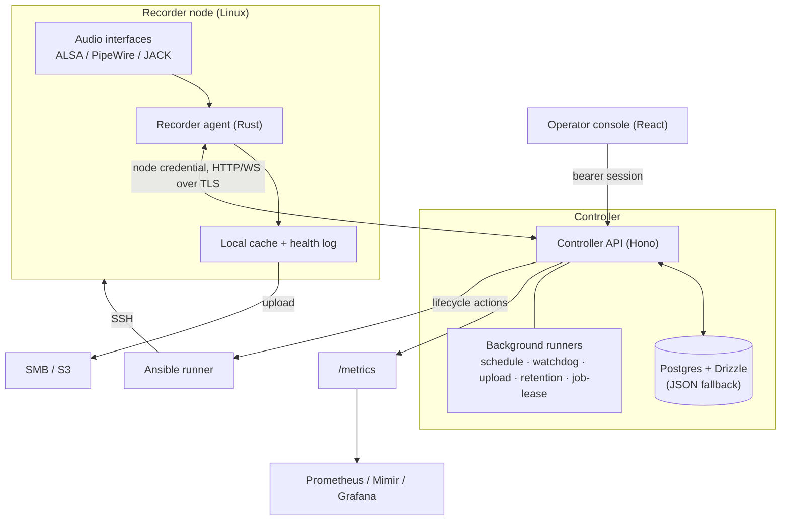

# Architecture overview

Rakkr is a small distributed system: a central **controller** coordinates a fleet
of **recorder agents**, an **operator console** drives the controller, and
everything privileged is authorized and audited at the controller.

## Components

| Component                                            | Tech                                         | Lives in                | Responsibility                                                                                                             |
| ---------------------------------------------------- | -------------------------------------------- | ----------------------- | -------------------------------------------------------------------------------------------------------------------------- |
| [Controller API](controller-api.md)                  | Hono, Node, Zod                              | `apps/api`              | Auth, RBAC, audit, inventory, recordings, jobs, schedules, settings, health, uploads, metrics, and the background runners. |
| [Operator console](web-console.md)                   | React, Vite, TanStack Router/Query, Tailwind | `apps/web`              | The operator UI. State via TanStack Query; permission-aware everywhere.                                                    |
| [Recorder agent](recorder-agent.md)                  | Rust                                         | `crates/recorder-agent` | On-node capture, metering, quality scoring, health evidence, cache, and controller sync.                                   |
| [Shared contracts](data-model.md#shared-contracts)   | TypeScript + Zod                             | `packages/shared`       | The single source of truth for domain shapes, permissions, and roles, imported by both API and console.                    |
| [Database](data-model.md)                            | Postgres, Drizzle                            | `packages/db`           | Schema, migrations, and the migration verifier.                                                                            |
| [Node lifecycle runner](../guides/node-lifecycle.md) | Python + Ansible                             | `deploy/ansible`        | Optional SSH-based provisioning/updates of recorder hosts.                                                                 |

## Two clients, one API

Everything talks to the same `/api/v1` surface, but with two different
credentials:

- **Operator console → user session tokens.** Login issues a bearer token; every
  request carries it. The API gates each route with `requirePermission(...)`,
  which authenticates, checks the permission _and_ resource scope, and writes an
  audit event before allowing or denying.
- **Recorder agent → node credential tokens.** Issued at node enrollment, scoped
  to a single node's resources. Agent ("service") routes authenticate the node
  credential directly and audit with the node as actor.

Because both share `/api/v1/nodes/...` and `/api/v1/recording-jobs/...`, the
distinction is at the handler (which credential type it accepts), not the path.
See [Controller API](controller-api.md) for the route families and the gating
pattern.

## The recording control loop

The core loop is a lease-based job queue between controller and agent:

1. **Queue.** A schedule due-run or an ad-hoc start creates a _recording job_
   (queued), pinning the capture target, profile, and channel map.
2. **Claim.** An agent polls `claim-next` and atomically leases the job.
3. **Capture.** The agent runs the capture process, monitors output growth,
   recovers from device loss / disk shortfall, and **heartbeats** the job while
   polling for controller-driven stop/cancel.
4. **Render & upload.** It applies the channel map, re-encodes to the profile's
   codec, and uploads the file as the recording's cache.
5. **Finalize.** The controller marks the job terminal, syncs recording health,
   and (per policy) auto-queues an upload to SMB/S3.
6. **Sweep.** Once uploads are confirmed, cache-retention policies clean up.

A controller-side **job-lease runner** fails orphaned jobs whose lease expires, so
a crashed agent never strands a recording in "running" forever.

## Telemetry and evidence

Two parallel evidence channels run continuously:

- **Metering & health.** The agent posts meter frames and health events every
  heartbeat tick; the controller's **watchdog runner** turns sustained quality
  problems into health events and resolves them on recovery.
- **Audit.** Every privileged route — including denied attempts and automated
  service actions — writes an audit event with actor, permission, target,
  outcome, reason, and before/after values.

Both surface through the console and through `/metrics` for Prometheus. See the
[Health watchdog](../guides/health-watchdog.md) and
[Observability](../observability/README.md) docs.

## Resilience choices

- **Runs without a database.** Each controller store has a Postgres backend and a
  JSON/in-memory fallback; absent `DATABASE_URL`, the controller still serves many
  features from seeded data, and Postgres stores degrade to the fallback on DB
  errors. See the [data model](data-model.md).
- **ALSA-first capture.** The dependable hardware path is the default; PipeWire and
  JACK are first-class presets; a synthetic meter backend keeps dev hosts working.
- **Local-first recording.** The on-node cache is the reliable source of record;
  uploads and cleanup are downstream and never block capture.

Continue into each component: [Controller API](controller-api.md) ·
[Recorder agent](recorder-agent.md) · [Web console](web-console.md) ·
[Data model](data-model.md).
