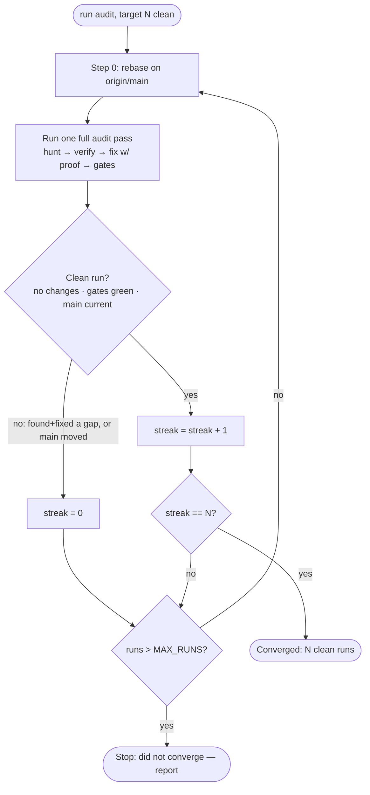

# Audit & gap-hunt workflow

This is the repeatable procedure for **adversarially auditing Rakkr**: hunting for
real gaps (correctness bugs, security/authz holes, silent-regression coverage
holes), fixing them with proof, staying current with `main`, and **iterating until
the codebase is quiet** — defined precisely as _N consecutive clean audit runs_.

It has two layers:

1. **A single audit run** ([Part 1](#part-1--a-single-audit-run)) — one full pass:
   sync → hunt → verify → fix-with-proof → gate → ledger.
2. **The iteration loop** ([Part 3](#part-3--the-iteration-loop)) — run audits
   **strictly sequentially** until `N` of them in a row come back clean.

> **Operator contract.** Point an agent at this doc and say _"run this audit and
> achieve 5 clean runs."_ The agent reads `N = 5`, then executes the loop in
> [Part 3](#part-3--the-iteration-loop) — sequential runs, fixing with proof,
> rebasing on `main` each run, resetting the streak whenever the tree changes —
> and stops only at 5 consecutive clean runs (or the safety cap). See
> [Part 4](#part-4--operator-contract).

## When to run this

- Before a release, or after a burst of feature work, to flush latent gaps.
- After a risky merge (the audit re-reads new code on `main` — see the
  [chunked-upload regression](#why-iterate) for why this matters).
- On demand, whenever you want a confidence pass that isn't a single
  non-deterministic shot.

This complements — it does not replace — the
[machine-checked baselines](baselines.md). Baselines pin _known_ invariants;
this workflow goes looking for _unknown_ ones.

## Core principles (non-negotiable)

These hold for every run. They are what make the result trustworthy.

- **Verify before you trust.** A hunter's claim is a _lead_, not a finding.
  Re-read the actual source and reproduce it before it counts. Classify every
  lead as `CONFIRMED` / `COVERAGE GAP` / `SUSPECTED`.
- **Proof = red → green.** A fix is only "landed" when a test **fails before the
  fix and passes after**. No proof, no claim of "fixed". If a confirmed bug
  cannot be given a failing test in the available harness (e.g. it needs Postgres
  or hardware), it is **catalogued, not fixed** — with the precise fix written
  down for a follow-up slice.
- **Read-only fan-out, single-writer fixes.** Hunters run **in parallel** but are
  **read-only**. Only the main loop edits files, and it fixes **one finding at a
  time**. Never let two agents write in parallel.
- **Runs are sequential.** Audit _runs_ are never parallel — see
  [Part 3](#sequential-only). (The parallel hunters _inside_ a run are fine; the
  rule is about runs.)
- **`main` is always in scope.** Sync at the start of every run. New code that
  landed on `main` gets audited like everything else — fixed code can be
  re-broken by an unrelated merge.
- **Honest ledger.** Every run appends to a findings ledger — an ISO-dated file
  under `docs/internal/audits/` (e.g. `docs/internal/audits/2026-07-02-gap-hunt.md`).
  Status labels are truthful: `FIXED` only with a red→green test; everything else
  is `CATALOGUED` or `SUSPECTED`.

## Part 1 — A single audit run

A run is one full pass of the steps below. Do them in order. Work in an isolated
git worktree so the audit never disturbs the primary checkout.

### Step 0 — Sync with `main`

```sh
git fetch origin
git log --oneline HEAD..origin/main      # what landed since this branch's base
git diff --stat origin/main...HEAD        # which files moved
git rebase origin/main                    # bring the branch current
```

If `packages/shared`, `packages/db`, or generated migrations changed, rebuild
before testing:

```sh
pnpm --filter @rakkr/shared --filter @rakkr/db run build
```

Note **which files `main` touched** — those are priority surface for this run's
hunt (recently-changed code is where fresh gaps hide). See
[Part 2](#part-2--tracking-main).

### Step 1 — Scope & focus areas

Pick the dimensions to sweep. The default set is **broad triage**; weight it
toward whatever `main` just changed and whatever prior runs flagged as
`SUSPECTED`. Typical dimensions:

- **Authz / RBAC enforcement logic** — resource-scope/IDOR holes, deny-precedence,
  token-auth routes, audit gaps. (Structural verifiers can't catch logic holes.)
- **Core correctness** — the recording control loop, lease/orphan handling,
  capture-once/split-many, upload fan-out reconciliation, retention-vs-upload
  ordering, data-loss paths.
- **Thin coverage behind "done"** — features marked complete but least
  machine-checked (enhancement, watchdog). Silent-regression surface.
- **Cross-cutting** — input validation (pagination bounds, formula/CSV
  injection), crypto correctness, date/time invariants (UTC/DST), swallowed
  errors, concurrency.

### Step 2 — Fan-out hunt (parallel, read-only)

Launch **one read-only hunter per dimension, in parallel** (independent agents).
Each hunter must:

- read the **actual source**, cite `file:line`, and confirm against the relevant
  tests before reporting;
- distinguish `CONFIRMED BUG` / `COVERAGE GAP` / `SUSPECTED`;
- return, per finding: title, severity, `file:line`, the concrete wrong
  behaviour, **why existing guardrails miss it**, a repro / failing-test sketch,
  and a minimal fix;
- be told what is **already known** (feed them the current ledger) so they push
  into new ground instead of rediscovering catalogued items.

Hunters never edit. Their output is leads for the main loop to verify.

### Step 3 — Triage & independent verification

For each lead, **the main loop re-reads the code and reproduces it**. Discard
anything that doesn't hold up rather than padding the ledger. De-duplicate leads
that multiple hunters found (corroboration raises confidence). Rank by severity.

### Step 4 — Proof + fix loop (one finding at a time)

For each confirmed finding, in severity order:

1. Write a test that **encodes the correct behaviour** and **run it — confirm it
   fails (red)** against current code.
2. Apply the **minimal** fix, matching surrounding code style.
3. Run the test — **confirm it passes (green)** — and run the finding's
   neighbouring suite to confirm no regression.
4. Record it in the ledger as `FIXED` with the test name.

If a confirmed finding can't get a failing test here (needs Postgres / Rust
HTTP+ffmpeg seam / real hardware), **catalogue it** with the precise fix and the
reason it's deferred. Do **not** ship an unproven behaviour change.

### Step 5 — Gates

Before a run can be declared finished, the relevant gates must be green:

```sh
mise run node:check          # tsc --noEmit
pnpm --filter @rakkr/api test # (or the suites touched)
mise run node:lint           # oxlint
mise run node:format-check   # oxfmt --check  (run node:format to fix)
```

If Rust changed, add `mise run rust:check rust:clippy rust:fmt-check` (and
`rust:miri` where tests rely on it). Before declaring **final convergence**
(the last clean run), run the full `mise run check` where the environment allows
(it needs Docker/Postgres for the Drizzle replay).

### Step 6 — Update the ledger

Append/refresh the run's ledger under `docs/internal/audits/` (an ISO-dated file
such as `2026-07-02-gap-hunt.md`): every finding with status, `file:line`, repro,
fix, and test name. Keep a "verified clean" section so future runs don't
re-investigate settled ground. The file's structure is **required, not
freeform** — follow [Ledger file format](#ledger-file-format) exactly.

### What makes a run "clean"

A run is **clean** if and only if **all** of these hold:

- **Synced** — the branch was rebased on the latest `origin/main` at the start
  with no unresolved conflicts.
- **Full coverage** — every in-scope dimension was actually swept (no dimension
  skipped or aborted).
- **No new fixes** — the run produced **zero** code/test changes; i.e. no
  `CONFIRMED` bug and no actionable `COVERAGE GAP` required a change. (New
  `SUSPECTED` leads may be logged for human review without breaking cleanliness,
  **provided they are explicitly listed** in the run log.)
- **Gates green** — all relevant gates passed at run end.
- **`main` still current** — no newer `origin/main` commit appeared during the
  run that hasn't been audited.

A run is **dirty** if it changed any file, **or** a gate failed, **or** `main`
advanced with un-audited commits.

## Ledger file format

The ledger is **one Markdown file per audit**, named with the audit's
**completion date** in ISO 8601 plus a short kebab-case slug, under the audits
directory:

```text
docs/internal/audits/<YYYY-MM-DD>-<slug>.md      # e.g. 2026-07-02-gap-hunt.md
```

The structure is **required, not freeform** — every audit ledger has the same
sections, in the same order, so any run (or reader) knows where each thing lives.
[`2026-07-02-gap-hunt.md`](../internal/audits/2026-07-02-gap-hunt.md) is the worked
reference.

### Required sections, in order

1. **Title + intro** — `# <Project> — <Audit name> Findings`, then one paragraph:
   what was audited and the method (read-only fan-out hunters + adversary passes,
   red→green proof).
2. **Header metadata table** — a two-column key/value table:

   | Field | Content |
   | ----- | ------- |
   | Branch | the audit branch |
   | Base | the `origin/main` SHA it's rebased onto (and the SHA the audit opened at, if different) |
   | Started / Completed | ISO 8601 dates; the **Completed** date is the filename date |
   | Runs | number of audit runs (note any pre-loop batch) |
   | Findings closed | count — each with a red→green test, or resolved by another fix |
   | Result | e.g. `✅ N consecutive clean runs achieved (Runs X–Y)`, or `did not converge` |
   | Gates at close | which gates were green (API/web test counts, tsc, lint, fmt, LOC, baselines, db:verify, Rust) |

3. **Status legend** — define every label used: `FIXED` (red→green test landed),
   `RESOLVED` (closed indirectly by another fix), `CATALOGUED`, `SUSPECTED`,
   `COVERAGE`.
4. **Everything fixed** — one table **per severity** (Critical → High → Medium →
   Low), rows ordered by the run they were found in. Columns:

   | Column | Content |
   | ------ | ------- |
   | ID | finding tag (`G##`, `R13-#`, `Adv-C#`, …) |
   | Run | the run it landed in (`pre` for the pre-loop batch) |
   | Area | subsystem / file family |
   | Fix | one line — the wrong behaviour → the fix |
   | Commit | the branch commit SHA that landed it |

   Every `FIXED`/`RESOLVED` row **must** cite a commit. Findings fixed together in
   one commit may share a row (e.g. `G54/G55`). An optional final **Also fixed
   (gate, not a product finding)** table records fixes that kept a gate green but
   weren't product findings (e.g. a drifted verifier); its columns are
   `Item | Run | Fix | Commit`.
5. **Open work** — everything still open, in three parts:
   - a **Top open item** callout for the highest-severity unresolved work — its
     fix spec + why it's deferred. It may cover a *group* of related findings that
     form one deferred slice (e.g. `RS1 + GH-1 + GH-2`), not just a single ID.
   - a **catalogued / suspected** table, columns `ID | Sev | Kind | Locus | Note`.
     `Sev` uses the same Critical/High/Medium/Low scale as item 4 (hyphenated
     blends like `Med-Low`, or `—` for an undecided/product call, are fine).
     `Kind` is one of: `catalogued`, `suspected`, `open` (needs hardware/Postgres
     to verify), `by-design`, `fail-closed`, `perf`, `product`, `residual`, or
     `coverage`.
   - a short **coverage gaps** list (no bug — missing tests).
6. **Verified clean** — a prose list of areas checked and found sound, so future
   runs don't re-investigate settled ground.
7. **Run log** — the run table (below), **oldest run first**, followed by short
   notes on the dirty runs and how the streak progressed. Each run's note must
   enumerate any new `SUSPECTED` leads that run surfaced (which also get a row in
   the catalogued / suspected table) — the [clean-run rule](#what-makes-a-run-clean)
   requires new suspected leads to be listed explicitly.

### Ordering & size rules

- **Runs ascending.** Oldest first, newest last — scrolling to the end reaches the
  latest run. **Never** insert newest-first; a descending log makes the last
  heading in the file read as an early run.
- **ISO 8601 dates** (`YYYY-MM-DD`) everywhere; store/display UTC.
- **Truthful status** — `FIXED` only with a landed red→green test; otherwise
  `CATALOGUED` / `SUSPECTED`.
- **Stay under the 1000-LOC guard.** As the ledger grows, compact the oldest
  settled runs into a one-line-per-finding archive block (full detail stays in the
  commit messages), as the reference ledger did for its early runs.

### Run log table

Oldest run first. Record each run's date, what it swept, what it surfaced and
fixed, and the resulting streak:

| Run | Date | Focus | New confirmed | Fixed | Clean? | Streak |
| --- | ---- | ----- | ------------- | ----- | ------ | ------ |
| 1 | 2026-07-01 | authz, core, coverage, x-cut | G24, G25, G26 | 3 | no | 0 |
| 2 | 2026-07-01 | core + live-listen (deep) | G4-1, G27, G28 | G4 + 4 | no | 0 |
| … | … | … | … | … | … | … |
| 26 | 2026-07-02 | channel-map plan/apply/rollback | — | — | yes | 4 |
| 27 | 2026-07-02 | audit-store + metrics | — | — | yes | **5 ✅** |

When `main` advances mid-loop, add a `main @` column (or note the new SHA in that
run's note): a new base is un-audited surface and resets the streak (see
[Part 2](#part-2--tracking-main)). If the base is static for the whole audit,
record it once in the header and omit the column, as the reference ledger does.

## Part 2 — Tracking `main`

`main` moves while you work. The audit must compensate, not ignore it.

- **At the start of every run**, sync (Step 0). Rebasing keeps the diff against
  current `main` and pulls new code into scope.
- **A clean streak is anchored to a tree.** If `main` advances, the new commits
  are un-audited surface — so a streak does **not** carry over them untouched.
  The next run audits them, and if they change anything, the streak resets.
- **Conflicts during rebase** are resolved in favour of `main`'s intent; then
  re-verify that this run's earlier fixes still apply (re-run their tests).
- **Why this matters — a real example.** <a id="why-iterate"></a> During the
  first gap hunt, a fix removed a partial-upload cache-deletion data-loss bug
  (`G1`). On the next rebase, a freshly-merged feature (time-based chunked
  recording) had **reintroduced the identical data-loss pattern** in its new
  per-chunk code path (`G1b`) — with no test coverage. The rebase-then-re-audit
  step is what caught it. New code re-breaks old guarantees; iteration plus
  main-tracking is how you stay ahead of it.

## Part 3 — The iteration loop

Because agentic auditing is **non-deterministic**, a single run can miss things a
slightly different pass would catch. Iterating turns many independent stochastic
passes into broad, convergent coverage. The loop runs audits until the codebase
goes quiet for `N` runs in a row.

### Definitions

- **Run** — one full pass of [Part 1](#part-1--a-single-audit-run).
- **Clean run** — a run meeting [every clean condition](#what-makes-a-run-clean).
- **Dirty run** — any run that isn't clean (made a change, failed a gate, or
  found un-audited `main` commits).
- **Clean streak** — the count of consecutive clean runs against the _current_
  tree.
- **`N`** — the target number of consecutive clean runs (the operator's number).

### The algorithm

```text
streak := 0
runs   := 0
while streak < N:
    runs := runs + 1
    if runs > MAX_RUNS:           # safety cap, see below
        stop and report "did not converge"
    result := perform_one_run()   # Part 1, fully, start to finish
    if result is clean:
        streak := streak + 1
    else:
        streak := 0               # the tree changed (or main moved) — start over
report "converged: N clean runs in a row"
```



### Streak reset rules

Reset the streak to **0** whenever a run is dirty:

- it landed a fix (the tree changed, so earlier clean runs audited a different
  tree — their guarantee no longer applies), **or**
- a gate failed, **or**
- `main` advanced with commits this run didn't audit.

Only a run that touches nothing and passes everything increments the streak.

### Sequential only <a id="sequential-only"></a>

**Audit runs MUST run one at a time, never in parallel.** Each run must fully
complete — including its fixes, rebase, gates, and ledger update — before the
next begins. Reasons:

- Each run's fixes **mutate the tree the next run audits**. Overlapping runs would
  audit stale trees.
- The whole guarantee is _"N consecutive clean runs against the current tree."_
  That is only meaningful if runs are **totally ordered**.
- Parallel runs would race on file edits and the worktree.

> This constraint is about **runs**, not hunters. _Within_ a single run, the
> read-only fan-out hunters ([Step 2](#step-2--fan-out-hunt-parallel-read-only))
> run in parallel — that's encouraged. Do not parallelise the runs themselves.

### Diversity across runs

Iteration only adds value if each run explores new ground. Across runs:

- **Rotate emphasis** — let different dimensions get the deepest hunters each run.
- **Reframe the hunters** — vary the angle/wording so stochastic coverage differs.
- **Feed forward** — give each run the current ledger (including `SUSPECTED` and
  `CATALOGUED` items) as "already known", so it pushes outward instead of
  re-finding the same things.

A run that just replays the previous run's prompts verbatim wastes the iteration.

### Termination & the safety cap

- **Success:** `streak == N` → converged. Report the streak, the runs it took,
  and the final `main` SHA.
- **Safety cap:** `MAX_RUNS` (default `max(5 × N, 25)`). If hit without
  convergence, **stop and report** rather than loop forever. Non-convergence
  usually means one of: a churning area that keeps surfacing findings (escalate
  it for design attention), `main` advancing faster than runs converge (freeze or
  coordinate), or a genuinely deep seam worth a dedicated effort.

## Part 4 — Operator contract

**Invocation:** _"Run the audit workflow in
`docs/contributing/audit-workflow.md` and achieve N clean runs."_

**Inputs (with defaults):**

| Input | Default | Meaning |
| ----- | ------- | ------- |
| `N` (clean target) | `3` | Consecutive clean runs required to converge. |
| Focus areas | broad triage | Dimensions to sweep (weighted to recent `main` changes). |
| Change scope | proof + fixes for confirmed; catalogue the rest | What lands vs. what's only recorded. |
| `MAX_RUNS` | `max(5 × N, 25)` | Safety cap before reporting non-convergence. |

**What the agent does:** executes the [loop](#the-algorithm) — sequential runs,
each a full [Part 1](#part-1--a-single-audit-run) pass, rebasing on `main` every
run, fixing confirmed findings with red→green proof, cataloguing the rest, and
resetting the streak on any dirty run — until `N` clean runs in a row (or the cap).

**What the agent reports at the end:** the run log (the ascending table defined in
[Run log table](#run-log-table)), total runs, the final clean streak, the
converged `main` SHA, every `FIXED` finding with its test, and every
`CATALOGUED`/`SUSPECTED` item left for a human call.

The full ledger structure — header, per-severity fix tables, open-work section,
verified-clean list, and the run-log table — is specified once, canonically, in
[Ledger file format](#ledger-file-format). The final report reuses that same run
log.

### Clean-run checklist

A run may be marked **clean** only when every box is true:

- [ ] Rebased on the latest `origin/main`, no conflicts.
- [ ] All in-scope dimensions swept by read-only hunters.
- [ ] Every lead verified; no `CONFIRMED`/actionable `COVERAGE` finding required a change.
- [ ] Any new `SUSPECTED` leads explicitly listed in the run log.
- [ ] `node:check`, tests, `node:lint`, `node:format-check` green (plus Rust gates if Rust changed).
- [ ] No un-audited `origin/main` commits appeared during the run.
- [ ] Ledger updated.

## Related

- [Baselines & verification](baselines.md) — the machine-checked invariants this
  audit complements.
- [Testing](testing.md) — how the test harnesses used for red→green proof work.
- [Development](development.md) — gates, worktrees, and local setup.
