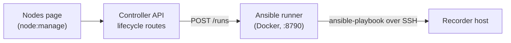

# Node lifecycle

Rakkr can optionally manage the **host** side of recorder nodes — installing
dependencies, deploying the agent binary, managing the systemd service, rotating
CA trust, and running smoke checks — over SSH, driven from the operator console.
The controller records RBAC/audit context; **Ansible owns the host work.**

> This subsystem is optional and currently a scaffold under active development. If
> you don't need remote host management, you can run agents entirely by hand.

## Architecture



The controller never SSHes anywhere itself. It calls the **Ansible runner** — a
small Dockerized HTTP service (`deploy/ansible/runner.py`) — which runs an Ansible
playbook against the target host.

## Supported actions

Five allowlisted actions are supported end to end:

| Action                 | What it does                                                                                                               |
| ---------------------- | -------------------------------------------------------------------------------------------------------------------------- |
| `install_dependencies` | Install the recorder packages (alsa-utils, ffmpeg, PipeWire/JACK, etc.) and create the `rakkr` user/group and directories. |
| `update_binary`        | Download the recorder-agent from a GitHub release (verified by `.sha256`), install it, and (re)deploy the env file + systemd unit. |
| `restart_service`      | Restart the `rakkr-recorder-agent` systemd service.                                                                        |
| `rotate_trust`         | Install/refresh the controller CA in the host trust store.                                                                 |
| `smoke_check`          | Run a node smoke command (default `--print-inventory`) and report its output.                                              |

The same allowlist is enforced at the controller route, the runner, and the
Ansible role, so an unknown action is rejected at every layer.

## Running an action from the console

On the **Nodes** page, the per-node lifecycle menu (visible with `node:manage`)
calls `POST /api/v1/nodes/:nodeId/lifecycle/:action`. The controller validates the
action, confirms the node is in your scope, runs it via the runner, and audits the
result with the runner run ID, exit code, target host, status, and output. Recent
runs are listed via `GET /api/v1/nodes/:nodeId/lifecycle-jobs`.

## The Ansible runner

The runner exposes two endpoints:

- `GET /healthz` — liveness.
- `POST /runs` — run an allowlisted action against a target. It builds a
  single-host inventory, runs `ansible-playbook`, and returns
  `{ exitCode, runId, stdout, stderr, targetHost }`.

The role (`deploy/ansible/roles/recorder_node`) is idempotent (package/user/file/
systemd modules, no ad-hoc shell orchestration), branches on distro vars
(Debian/RedHat), escalates privilege via `become`, and rolls out **serially**
across hosts.

## Binary deployment

`update_binary` deploys from a published GitHub release by default. Each target
node downloads the static musl artifact for its architecture
(`x86_64-unknown-linux-musl` / `aarch64-unknown-linux-musl`), verifies it against
the release `.sha256`, and installs it — so nodes need outbound access to GitHub.

| Variable                     | Purpose                                                                                  |
| ---------------------------- | ---------------------------------------------------------------------------------------- |
| `RAKKR_ANSIBLE_AGENT_SOURCE` | `release` (default) pulls a GitHub release; `local` copies a staged file (offline/smoke). |
| `RAKKR_ANSIBLE_AGENT_REPO`   | `owner/repo` releases are pulled from (defaults to `yashau/Rakkr`).                        |
| `RAKKR_ANSIBLE_GITHUB_TOKEN` | Optional token for private repos or higher GitHub API rate limits.                         |

Without a pinned version the role resolves the newest release; the console's
**Update Binary** action does this. To deploy a specific build, forward
`agentVersion` (a full release tag such as `agent-v2026.06.28-1`) through the
lifecycle API. Releases are built by the `Release recorder agent` workflow — see
[Releases & versioning](../operations/releases.md) and the
[recorder-agent versioning notes](https://github.com/yashau/Rakkr/blob/main/crates/recorder-agent/README.md).

## Security model

Lifecycle credentials are kept **out of node metadata**. SSH users, keys, and
become passwords live only in the runner's environment:

| Variable                         | Purpose                                                                                          |
| -------------------------------- | ------------------------------------------------------------------------------------------------ |
| `RAKKR_ANSIBLE_TARGETS`          | Per-node JSON: `host`, `sshUser`, `sshKeyFile`, `sshPassword`, `becomePassword`, `smokeCommand`. |
| `RAKKR_ANSIBLE_SSH_DIR`          | Host directory mounted read-only into the runner for key files.                                  |
| `RAKKR_ANSIBLE_DEFAULT_SSH_USER` | Default SSH user when a target doesn't specify one.                                              |
| `RAKKR_ANSIBLE_HOST_OVERRIDES`   | Map node IDs to hosts without changing node metadata.                                            |
| `RAKKR_ANSIBLE_ROLLOUT_SERIAL`   | Serial rollout batch size.                                                                       |

A mounted private key is copied into a per-run temp dir and `chmod 0600` before
use; password auth is suppressed when a key is present. The controller only knows
`RAKKR_ANSIBLE_RUNNER_URL` (and an optional token/timeout) — never the SSH
secrets.

> **Preferred: controller-managed SSH keys.** When the runner is pointed at the
> controller (`RAKKR_RUNNER_CONTROLLER_URL` + `RAKKR_RUNNER_TOKEN`), it fetches
> each node's SSH key (and, on deploys, a freshly-minted controller token) from
> the controller at run time — so `RAKKR_ANSIBLE_TARGETS` carries **no SSH
> secrets**, just a host map. The `rotate_trust`/install actions also install the
> controller-held public key into the node's `authorized_keys`. See
> [Node onboarding](node-onboarding.md).

## Smoke validation

Two `mise` tasks exercise the path (both call
`scripts/ansible-lifecycle-smoke.mjs`):

```powershell
# Local: the compose runner defaults to AGENT_SOURCE=local and deploys the baked
# test artifact into the Compose test rig (no network), then smokes
docker compose up -d --build ansible-runner recorder-test-rig
mise run ansible:runner-smoke

# Physical X32 rig: safe smoke_check only (no binary deploy)
$env:RAKKR_ANSIBLE_SSH_DIR = "$env:USERPROFILE\.ssh"
$env:RAKKR_ANSIBLE_TARGETS = '{"node_x32_test":{"host":"172.22.145.152","sshUser":"root","sshKeyFile":"/run/rakkr-ssh/id_ed25519","smokeCommand":"/tmp/rakkr-recorder-agent --print-inventory"}}'
docker compose up -d --build ansible-runner
mise run ansible:x32-smoke
```

> `update_binary` pulls the latest release from GitHub by default. For an
> air-gapped rig, set `RAKKR_ANSIBLE_AGENT_SOURCE=local` and point
> `RAKKR_ANSIBLE_BINARY_SRC` at a staged Linux recorder-agent artifact.

Full environment details and the X32 example are in
[Deployment](../operations/deployment.md) and `deploy/ansible/README.md`.
