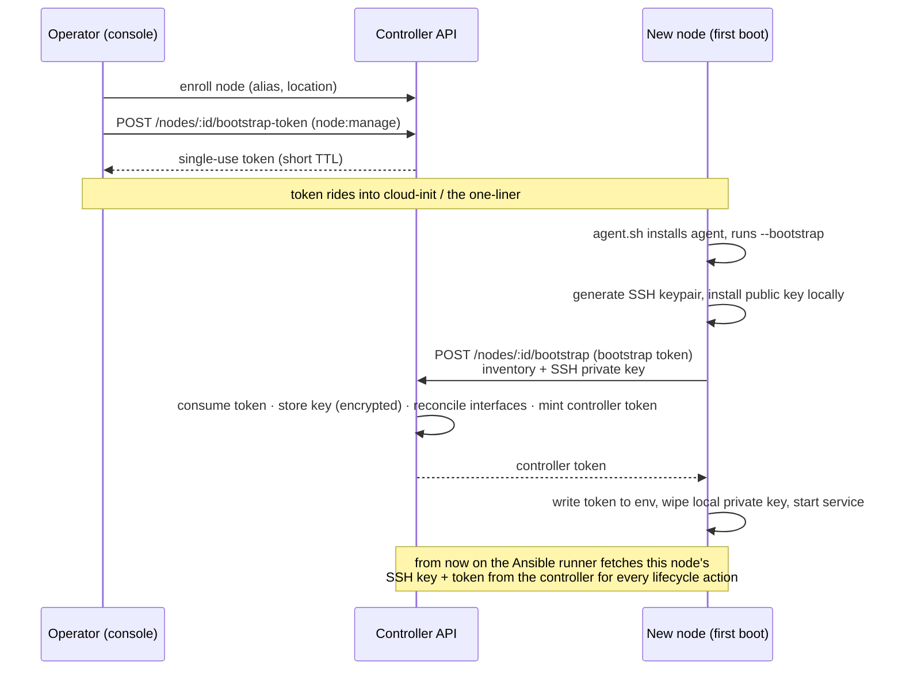

# Node onboarding

This guide takes a **brand-new Linux host** from a bare OS install to a fully
managed recorder node. Onboarding, node credentials (controller token **and**
SSH key), and the controller's own secrets are designed together because they
share one system of record: **the controller**.

The guiding principles:

1. **Low-touch day-0.** A generic node image comes up with exactly one
   short-lived bootstrap token. Everything else is provisioned automatically.
2. **One system of record.** The controller owns each node's controller token
   (hashed) and SSH key (encrypted), issued, rotated, and revoked together,
   RBAC-gated (`node:manage`) and audited.
3. **No SSH keys baked into images.** The node mints its own SSH identity at
   first boot and hands the private key to the controller once, over TLS, gated
   by the single-use token — then wipes it locally.
4. **No standing plaintext secrets.** Nothing sensitive lives in node metadata,
   in `RAKKR_ANSIBLE_TARGETS`, or in committed `values.yaml`.

> **Already running agents by hand?** Onboarding is optional. You can still set
> `RAKKR_CONTROLLER_URL` + `RAKKR_CONTROLLER_TOKEN` on a host yourself; see the
> [Recorder agent CLI reference](../reference/recorder-agent.md). This guide is
> the managed, low-touch path.

## The day-0 flow



## Prerequisites

- A reachable controller URL (HTTPS in production; see
  [Transport security](transport-security.md)).
- `node:manage` permission to enroll and mint bootstrap tokens
  (see [Authentication & RBAC](authentication-and-rbac.md)).
- A node master key configured on the controller —
  `RAKKR_NODE_SSH_MASTER_KEY` (falls back to `RAKKR_SECRET_KEY`). SSH private
  keys are encrypted at rest with it.
- The target node has `openssh-server` (so `ssh-keygen` exists and Ansible can
  connect later) plus `curl`, `ca-certificates`, `tar`, `alsa-utils`, and
  `ffmpeg`. The installer's packages match the
  [Node lifecycle](node-lifecycle.md) `recorder_node` role.

## Step 1 — Enroll the node and mint a bootstrap token

Enroll the node to create its row and identity. **Interfaces are now optional**
at enrollment — the agent reports the real hardware on first startup (see
[Inventory reconcile](#first-contact-inventory-reconcile)), so a hand-entered
interface is only a placeholder until first contact.

```bash
# Enroll (returns a node id). Interfaces may be omitted.
curl -X POST https://controller.example:8787/api/v1/nodes/enroll \
  -H "authorization: Bearer <operator session token>" \
  -H "content-type: application/json" \
  -d '{"alias":"Studio A Rack","hostname":"rakkr-x32-01","location":{"site":"HQ","room":"Studio A"}}'

# Mint a single-use, short-TTL bootstrap token for that node.
curl -X POST https://controller.example:8787/api/v1/nodes/<node-id>/bootstrap-token \
  -H "authorization: Bearer <operator session token>" \
  -H "content-type: application/json" \
  -d '{"ttlSeconds":900}'
# -> { "data": { "token": "rakkr_bs_…", "expiresAt": "…", "nodeId": "node_…" } }
```

The token is shown once. Its default TTL is 15 minutes (`ttlSeconds`, max 24h),
it is single-use, hashed at rest, and consuming it is audited
(`nodes.bootstrap.completed`). Minting requires `node:manage`.

## Step 2 — Provision the node

Both delivery paths run the **same** `rakkr-recorder-agent --bootstrap`; pick
whichever fits your provisioning.

### One-liner installer (`rakkr.org/agent.sh`)

```bash
curl -fsSL https://rakkr.org/agent.sh | sudo sh -s -- \
  --controller-url https://controller.example:8787 \
  --bootstrap-token rakkr_bs_… \
  --node-id node_… --site HQ --room "Studio A" \
  [--version agent-vYYYY.MM.DD-N] [--allow-insecure] [--controller-ca /path/ca.pem]
```

The script (`deploy/bootstrap/agent.sh` in the repo) detects the CPU
architecture, downloads the **checksum-verified** static-musl agent from the
matching GitHub release, creates the `rakkr` user + dirs + systemd unit (the
**same install layout** as the Ansible `recorder_node` role), runs
`--bootstrap`, and enables the service. `--version` pins a full release tag;
omit it for the latest. `--allow-insecure` permits a plaintext/self-signed
controller (dev only); `--controller-ca` trusts a self-signed controller CA.

### Cloud-init / autoinstall (unattended)

Drop the same one-liner into provisioning user-data so first boot is hands-off.
A ready-to-edit example lives at `deploy/bootstrap/cloud-init.yaml`:

```yaml
#cloud-config
packages: [alsa-utils, ca-certificates, curl, ffmpeg, jq, openssh-server]
runcmd:
  - >-
    curl -fsSL https://rakkr.org/agent.sh | sh -s --
    --controller-url https://controller.example:8787
    --bootstrap-token rakkr_bs_REPLACE_WITH_SINGLE_USE_TOKEN
    --node-id node_REPLACE --site HQ --room "Studio A"
```

### What `--bootstrap` does

The agent's one-shot `--bootstrap` mode:

1. **Generates an SSH keypair locally** (`ssh-keygen -t ed25519`).
2. Installs the **public** key into the agent user's `authorized_keys`
   (`/var/lib/rakkr/agent/.ssh/authorized_keys`).
3. POSTs the inventory + SSH **private** key to
   `POST /api/v1/nodes/:id/bootstrap`, authenticated only by the bootstrap
   token.
4. Receives the long-lived controller token and writes it into the agent env
   file (`/etc/rakkr/recorder-agent.env`).
5. **Wipes the local private key.** The node keeps only its public key; Ansible
   later SSHes *in* using the controller-held private key.

The controller, in one transaction: verifies + consumes the single-use token,
stores the SSH key encrypted at rest, reconciles the reported interfaces, mints
the controller token, and audits `nodes.bootstrap.completed`. A malformed
request never burns the token.

## First contact — inventory reconcile

The agent is the **source of truth for hardware**. On every startup (alongside
its first heartbeat) it POSTs its discovered inventory to
`POST /api/v1/nodes/:id/inventory`, and the controller reconciles
`node.interfaces`:

- **Matched by stable identity** (system ref) so the persisted interface id —
  and any channel-map assignment keyed on it — survives across restarts.
- **Agent owns hardware facts** (existence, channel count, sample rates, system
  refs); **operators own labels** (interface alias + per-channel aliases),
  preserved across reconcile.
- **Absent devices are flagged, not deleted** (an `absent` flag), preserving
  channel-map history and surfacing the change in the UI.
- **Idempotent + audited** — no diff is a no-op; a real change emits
  `nodes.inventory.reconciled`.

So a node's interfaces are correct from its first registration, even if you
enrolled it with no interfaces. See [Nodes & inventory](nodes-and-inventory.md).

## Ongoing lifecycle — the runner fetches credentials

Once onboarded, the optional [Ansible runner](node-lifecycle.md) fetches the
node's SSH key (and, for deploy actions, a freshly-minted controller token) from
the controller for **every** lifecycle run, so **no SSH secrets live in
`RAKKR_ANSIBLE_TARGETS`** — it shrinks to a non-secret host map. Point the runner
at the controller:

```sh
RAKKR_RUNNER_CONTROLLER_URL=https://controller.example:8787
RAKKR_RUNNER_TOKEN=<shared with the controller's RAKKR_RUNNER_TOKEN>
RAKKR_RUNNER_CONTROLLER_CA=/run/rakkr/controller-ca.pem   # optional (self-signed)
RAKKR_ANSIBLE_TARGETS={"node_…":{"host":"10.0.0.21"}}      # host only, no secrets
```

The runner writes the fetched private key to a per-run `0600` temp file, uses
it, and deletes it. Deploy/rotate actions install the controller-held public key
into the node's `authorized_keys`. When the runner is not pointed at the
controller (or a node has no managed key yet), it falls back to the
`RAKKR_ANSIBLE_TARGETS`/env key.

## Credential management

The controller is the system of record for both node credentials.

| Action | Endpoint | Auth |
| --- | --- | --- |
| Rotate the SSH key (controller generates a new keypair) | `POST /nodes/:id/ssh-credential/rotate` | `node:manage` |
| Read the active SSH public key + fingerprint | `GET /nodes/:id/ssh-credential` | `node:manage` |
| Rotate the controller token | `POST /nodes/:id/credentials/rotate` | `node:manage` |
| Fetch the SSH private key for a run (+ optional fresh token) | `GET /nodes/:id/ssh-credential/material?mintToken=1` | runner token (`RAKKR_RUNNER_TOKEN`) |

Private keys are **generated controller-side** on rotate (or **node-generated**
at bootstrap), encrypted at rest, and **never returned to operators or logged** —
the rotate/read endpoints return only the public half + SHA256 fingerprint. The
runner-scoped `…/material` fetch is the only path that returns a private key, is
authenticated by the shared runner token, and is audited as
`nodes.ssh_credential.fetch`. Revoking a node disables both credentials.

## Kubernetes secrets

For Helm deployments, every controller secret — including the node SSH master
key (`RAKKR_NODE_SSH_MASTER_KEY`) and the runner token (`RAKKR_RUNNER_TOKEN`) —
is sourced from a single Kubernetes `Secret` via a configurable
`secrets.backend` (`native`, `externalSecrets`, or `sealed`), with
`appSecret.existingSecret` always honored. `values.yaml` ships no plaintext
secret defaults. See [Deployment → Secrets backend](../operations/deployment.md).

## Verifying onboarding

After bootstrap completes:

- The node appears **online** on the Nodes page within a heartbeat interval.
- Its **interfaces** reflect the real hardware (the reconcile ran on startup),
  not the enrollment placeholder.
- The audit log shows `nodes.bootstrap.completed` then `nodes.heartbeat.*`.
- `GET /nodes/:id/ssh-credential` returns a public key + fingerprint.

```bash
# Confirm the SSH credential is registered (public half only).
curl -s https://controller.example:8787/api/v1/nodes/<node-id>/ssh-credential \
  -H "authorization: Bearer <operator session token>"
```

## Migrating an existing or manually-provisioned node

For a node already running (e.g. one wired up before onboarding, or the X32
rig), move it onto a controller-managed SSH credential without re-imaging:

1. Generate and store a managed key: `POST /nodes/:id/ssh-credential/rotate`.
2. Place the returned public key on the node's agent-user `authorized_keys` —
   either by hand, or by running the `rotate_trust` lifecycle action once (it
   installs the controller-held public key).
3. Point the runner at the controller (`RAKKR_RUNNER_CONTROLLER_URL` +
   `RAKKR_RUNNER_TOKEN`) and **remove the SSH key/password** from
   `RAKKR_ANSIBLE_TARGETS`, leaving only the host.
4. Optionally rotate the controller token (`POST /nodes/:id/credentials/rotate`)
   and re-provision the agent env on the next deploy.

## Troubleshooting

| Symptom | Likely cause |
| --- | --- |
| `--bootstrap` exits with `controller rejected node bootstrap with 401` | Token expired, already used, or for a different node — mint a fresh one. |
| `ssh-keygen is required` | Install `openssh-server`/`openssh-client` on the node first. |
| Runner lifecycle fails to authenticate over SSH | The public key isn't in the node's `authorized_keys`, or `StrictModes` rejects ownership/permissions — run `rotate_trust`, or check the `.ssh` dir is `0700` and owned by the agent user. |
| `…/ssh-credential/material` returns 503 `runner_token_unconfigured` | Set `RAKKR_RUNNER_TOKEN` on the controller (matching the runner). |
| Interfaces still show the enrollment placeholder | The agent hasn't reached the controller yet, or has no token — check the agent's env and heartbeat. |
| SSH key decryption fails after a key change | `RAKKR_NODE_SSH_MASTER_KEY`/`RAKKR_SECRET_KEY` changed; re-rotate node SSH credentials. |

## Security model

- **Private-key transit (node → controller):** one-time, over TLS, gated by a
  single-use short-TTL bootstrap token, then wiped from the node.
- **Encryption at rest:** SSH private keys are encrypted (AES-256-GCM) with the
  controller master key; controller tokens stay hashed (SHA-256).
- **Runner authority:** the runner holds a scoped token that can fetch SSH
  credentials for a lifecycle run; fetches are audited.
- **Bootstrap token:** short TTL, single-use, `node:manage` to mint, audited on
  consume, replay-safe (atomic consume).

## Related

- [Nodes & inventory](nodes-and-inventory.md) — inventory, interfaces, channel aliases.
- [Node lifecycle](node-lifecycle.md) — the Ansible runner and host management.
- [Transport security](transport-security.md) — controller TLS and agent transport guard.
- [Deployment](../operations/deployment.md) — Helm secrets backends.
- [Recorder agent CLI reference](../reference/recorder-agent.md) — every flag and `RAKKR_*` variable.
- [API endpoints](../reference/api.md) — full route + permission reference.
