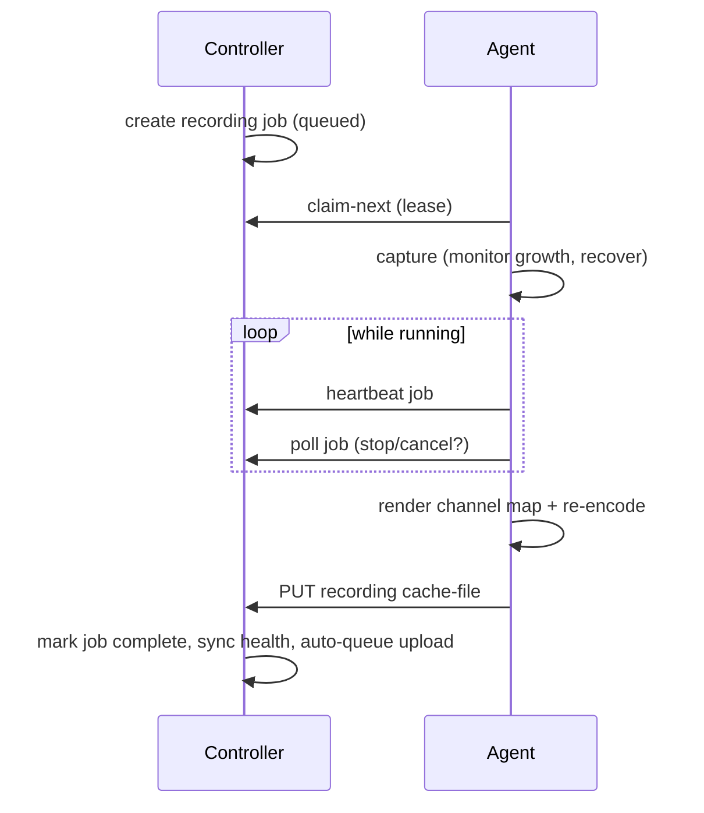

# Recording

Recordings are produced by **recording jobs** — the lease-based unit of work that
coordinates the controller and a recorder agent. This guide covers how a recording
starts, how the job lifecycle runs, and how finished recordings are managed in the
library.

## Two ways to start

**Ad-hoc** (`recording:create`) — start on demand from the console (the Record
quick-action, the Dashboard, or the Recordings page). You pick a node, a recording
profile, an optional upload policy, and optionally pin a capture backend and
interface; you can set name, folder, and tags up front. Ad-hoc starts only target
nodes you're scoped to, and respect node recording capacity.

When you pin a specific interface you can also pick **channels**: select a subset
of that interface's channels and an output mode (stereo pair, mono, mono-to-stereo
mix, or multichannel) instead of recording the whole device. Selecting no channels
records the whole interface, as before. This lets several recordings share one
device — for example 16 separate stereo recordings, each on its own channel pair of
a 32-channel interface. The controller rejects a start whose channels are already in
use by another recording on that interface ("channels busy"); recordings on
**disjoint** channels run at the same time and the recorder captures the device once
and splits it per recording.

**Scheduled** — a [schedule](scheduling.md) creates jobs automatically at due
times. Scheduled recordings inherit schedule-owned name, folder, tags, profile,
watchdog policy, retention, and upload policy. Long windows are split into ordered
track jobs when the profile sets a maximum track length.

## The job lifecycle

1. **Queue.** The job pins the capture target, profile/codec, and channel map at
   creation.
2. **Claim.** An agent atomically leases the job (`claim-next`). Multiple nodes
   claim independently; one node runs up to its capacity.
3. **Capture.** The agent records, enforcing a minimum output size and a
   growth-stall guard, recovering from runtime device loss and disk shortfall with
   segment stitching.
4. **Control plane.** The agent heartbeats and polls; a controller **stop**
   request is honored even mid-capture and the partial is finalized as a completed
   recording.
5. **Render & upload.** It applies the channel map, renders to the profile's codec
   (MP3 VBR / FLAC / WAV — captured as raw WAV first, then encoded), and uploads
   the file as the recording's cache.
6. **Finalize.** The controller marks the job terminal, computes a SHA-256
   checksum and WAV waveform preview, syncs recording health (failed → critical,
   unexpected cancel → warning, controller stop → healthy), and auto-queues an
   upload when the policy trigger is `on_recording_cached`.

A controller-side **job-lease runner** fails orphaned "running" jobs whose lease
expired and syncs their recording health, so a crashed agent never strands a
recording.

## Recording profiles

Profiles (in [Settings](../reference/configuration.md)) define the encode preset:
codec, bitrate, channel mode, VBR, optional silence handling, and a maximum track
length used for scheduled auto-splitting. The built-in default is a voice
MP3-VBR profile (~128 kbps). Defaults are configuration, never hard-coded engine
behavior.

Profiles also carry the [voice-enhancement chain](audio-enhancement.md) — in-process
noise suppression (DeepFilterNet3 or RNNoise) plus high-pass, loudness
normalization, and more — which produces an enhanced rendition alongside the
preserved raw master.

## The recording library

The **Recordings** page (`recording:read`) is the operational library:

- **Browse & filter** by folder, tags, node, profile, upload policy, track group,
  cache state, and date range; clickable facets show counts; active-filter chips
  show what's applied; sort and paginate (10/25/50/100).
- **Per-recording** — relationship badges (node, schedule, profile, upload policy,
  track group) resolved to friendly names where RBAC allows; a waveform preview;
  checksum; operator notes and transcript snippets (searchable; generation
  deferred); jobs and upload-queue items; and a **quality timeline** of health
  events across the recording's duration.
- **Actions** mirror RBAC: stop (`recording:control`), play
  (`recording:playback`), download (`recording:download`), edit metadata
  (`recording:edit`), delete (`recording:delete`, terminal recordings only), and
  queue uploads.
- **Bulk** — select visible recordings to organize (folder/tag), delete, or
  queue for upload; export filtered or selected manifests as audited CSV.

## Recording jobs workbench

The **Jobs** page (`recording:read`) shows the job side: status tiles
(active/queued/completed/failed) and filters (status, backend, created-date, node,
interface, search), per-job capture settings, leases, heartbeats, and failure
reasons. With `recording:control` you can stop active jobs and retry
failed/cancelled ones, individually or in bulk, with audited CSV export.

The checked contracts here are the `FIRST_RELIABLE_RECORDING_BASELINE` (start →
claim → capture → cache → playback/download lifecycle, including recovery
scenarios) and the `RECORDING_LIBRARY_BASELINE` (organization, playback, manifest,
waveform, cache/upload status).
