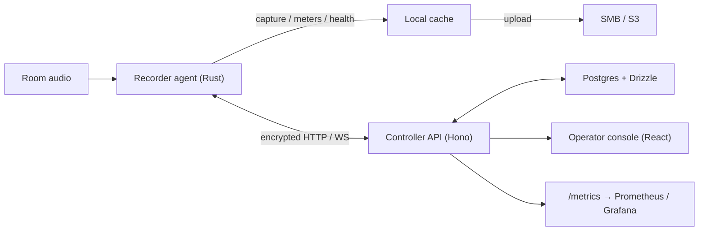

# Rakkr Documentation

**Rakkr** is a centrally managed Linux audio recording platform for reliable room
recording. It captures audio on managed Linux nodes, watches the audio while it
is being recorded, and gives operators a single console to start, schedule,
monitor, and ship every recording — with an audit trail behind every privileged
action.

Rakkr is built around one idea: **a recording failure should become visible
while the session can still be saved**, not after the meeting is over.

## The system in one picture

Rakkr has four parts:

- a **controller API** (Hono/Node) for auth, RBAC, audit, inventory, recordings,
  jobs, schedules, settings, health, uploads, and metrics;
- a **React operator console** for day-to-day operations;
- a **Rust recorder agent** that runs on each Linux audio node — it captures
  audio, samples meters, scores quality, manages local cache, and syncs with the
  controller;
- **Postgres + Drizzle** for controller persistence, with JSON/in-memory
  fallback stores so the controller can run without a database.

An optional **Dockerized Ansible runner** provisions and updates recorder nodes
over SSH.

## Where to start

| If you want to…                                              | Read                                              |
| ------------------------------------------------------------ | ------------------------------------------------- |
| Understand what Rakkr is and why it exists                   | [Introduction](getting-started/introduction.md)   |
| Run it locally in a few minutes                              | [Quick start](getting-started/quick-start.md)     |
| Learn the vocabulary (nodes, jobs, schedules, channel maps…) | [Core concepts](getting-started/concepts.md)      |
| Understand how the pieces fit together                       | [Architecture overview](architecture/overview.md) |
| Operate a specific feature                                   | The [Guides](guides/recording.md)                 |
| Look up an env var, endpoint, or permission                  | The [Reference](reference/configuration.md)       |
| Deploy or monitor a controller                               | [Operations](operations/deployment.md)            |
| Contribute code                                              | [Contributing](contributing/development.md)       |

## Documentation map

- **Getting started** — [Introduction](getting-started/introduction.md) ·
  [Quick start](getting-started/quick-start.md) ·
  [Core concepts](getting-started/concepts.md)
- **Architecture** — [Overview](architecture/overview.md) ·
  [Controller API](architecture/controller-api.md) ·
  [Recorder agent](architecture/recorder-agent.md) ·
  [Web console](architecture/web-console.md) ·
  [Data model](architecture/data-model.md)
- **Guides** — [Authentication & RBAC](guides/authentication-and-rbac.md) ·
  [Nodes & inventory](guides/nodes-and-inventory.md) ·
  [Node onboarding](guides/node-onboarding.md) ·
  [Recording](guides/recording.md) · [Scheduling](guides/scheduling.md) ·
  [Health watchdog](guides/health-watchdog.md) ·
  [Storage & uploads](guides/storage-and-uploads.md) ·
  [Transport security](guides/transport-security.md) ·
  [Node lifecycle](guides/node-lifecycle.md)
- **Reference** — [Configuration](reference/configuration.md) ·
  [Recorder agent CLI](reference/recorder-agent.md) ·
  [API endpoints](reference/api.md) · [Permissions](reference/permissions.md) ·
  [Metrics](reference/metrics.md) · [Tasks](reference/tasks.md)
- **Operations** — [Deployment](operations/deployment.md) ·
  [Observability](observability/README.md)
- **Contributing** — [Development](contributing/development.md) ·
  [Testing](contributing/testing.md) ·
  [Baselines & verification](contributing/baselines.md)

## Source of truth

The product contract, status ledger, and promotion record live in
[RAKKR_SOURCE_OF_TRUTH.md](RAKKR_SOURCE_OF_TRUTH.md). When code, docs, and the
ledger disagree, investigate before changing behavior.
